

#《精通Linux 2》

**Brian Ward**

------

#评语

“A great resource. In roughly 350 pages, the book covers all the basics.”
—EWEEK
“I would definitely recommend this book to those who are interested in Linux, but have not had the experience
to know the inner workings of the OS.”
—O’REILLYNET
“One of the best basic books on learning Linux, written with the power user in mind. Five stars.” —OPENSOURCE-BOOK-REVIEWS.COM
“Succeeds admirably because of the way in which it’s organized and the level of technical detail it offers.” —KICKSTART NEWS
“This is a very different introduction to Linux. It’s unflashy, concentrates on the command line, and digs around in the internals rather than on GUI frontends that take the place of more familiar MS Windows tools.”
—TECHBOOKREPORT.COM
“This book does a good job of explaining the nuts and bolts of how Linux operates.” —HOSTING RESOLVE

------

#前言

写这本书的原因是想让你了解你使用的计算机。让你能够在有限的计算资源下让你的软件工作起来。其中的关键是你必须了解软件的基本工作原理，这也是本书的内容。这样你对着计算机就不会抓狂了。

如果你要学习这方面的知识，Linux是一个很好的平台，因为它是一个透明的系统。特别是大多数系统配置都存放在文本文件中，查看起来很容易。难点在于找到想找的组件，以及理解系统作为一个整体如何工作。

#本书适合哪些读者？

你学习Linux的原因可能各不相同。对于IT从业者，如系统运维人员来说，他们需要了解本书中的几乎所有内容。对于Linux软件架构和开发人员来说，他们同样需要了解这些内容，以便发挥操作系统的最大功效。对于研究人员和学生来说，本书能够让他们理解为什么我们要这样设置系统。

还有一些读者，出于兴趣或其他原因，他们喜欢摆弄计算机，喜欢探究事情的根源，喜欢尝试不同的可能性，我们称为醒客（thinkerers）。或许你就是。

#前提

虽然开发人员热爱Linux，不过阅读本书并不需要你成为一个开发人员，只需要你有一些基础的计算机知识即可。也就是说，你需要知道如何操作图形界面（GUI），特别是Linux上的那些安装和配置程序。你还需要对文件和目录有所了解，以及如何查看系统和Internet提供的文档。当然最重要的是你学习的热情。

#怎样阅读本书

在处理技术问题时，掌握所需的相关知识并非易事。软件系统的工作原理不是一言两语能讲清楚的。有时候面对大量的技术细节，读者会难以抓住重点（因为人类的脑容量有限，无法同时处理太多新的信息），但是如果解释得不够透彻又会让读者一知半解，不利于后面的学习。

------

#感谢

------

#第一章 概述

Linux这样的现代操作系统乍看起来非常复杂，内部有多得令人眼花缭乱的各种组件在同步运行和相互通讯。比如：Web服务器可以连接到数据库服务器，还有可能用到很多其他程序也在使用的公共组件。这整个系统是怎样运作的呢？

理解操作系统工作原理最好的方法是“抽象思维”，你可以暂时忽略大部分细节。就像坐车一样，通常你不会去在意车内固定发动机的装配螺栓，也不会关心你走的路是谁修筑的。如果你是一个乘客的话，你可能只关心车要去哪、如何打开车门、怎样系好安全带。

但如果你在开车的话，就需要了解更多的细节，比如：如何控制油门，怎样换挡，还有如何处理意外情况。

如果我们觉得开车这个事情太复杂，就可以运用“抽象思维”来帮助理解。首先你可以将“一辆汽车在路上行驶”抽象为三个部分：汽车，道路，以及驾驶操作。这样有助于将复杂的问题分解开来。如
果道路颠簸，你不会去埋怨车辆本身和你的驾驶技术。相反，你可能会问为什么这条路这么烂，或者如果这是条新修的路的话，那么筑路工人的活干得可真够差劲的。

软件开发人员运用抽象思维来开发操作系统和应用程序。在计算机领域有许多术语来描述抽象的子系统，如：“子系统”，“模块”和“包”等。本书中我们使用“组件”这个相对简单的词。在软件开发过程中，开发人员通常不用太关心他们需要使用的组件的内部结构，他们只关心能使用哪些组件？怎么个用法？

本章概述了Linux操作系统涉及的主要组件。虽然每一个组件包含纷繁复杂的技术细节，我们将暂时忽略这些细节，而专注于这些组件在系统中发挥的功能。

##1.1 Linux 操作系统中的抽象级别和层次

在组织得当的前提下，通过抽象将系统分解为组件有助于我们了解其工作机制。我们将组件划分为层（layers或者级别levels）。组件的层(或者级别)代表它在用户和硬件系统之间所处的位置。Web浏览器、游戏这些应用处于最高层，底层则是计算机硬件系统，如：内存。操作系统处于这两层之间。

Linux操作系统主要分为三层。如图1-1所示，最底层是硬件系统，包括内存和中央处理器（用于计算和从内存中读写数据），此外硬盘和网络接口也是硬件系统的一部分。

硬件系统之上是内核，它是操作系统的核心。内核运行在内存中，向中央处理器发送指令。内核管理硬件系统，是硬件系统和应用程序之间通讯的接口。

**进程** － 计算机中运行的所有进程（确切地说是用户进程，无论用户是否和它们有直接的交互）由内核统一管理，它们组成了最顶层，称为用户空间（user space）。（另一个更确切的术语是用户进程，user process，无论它们是否直接和用户交互。例如：Web服务器就是以用户进程的形式运行的。）

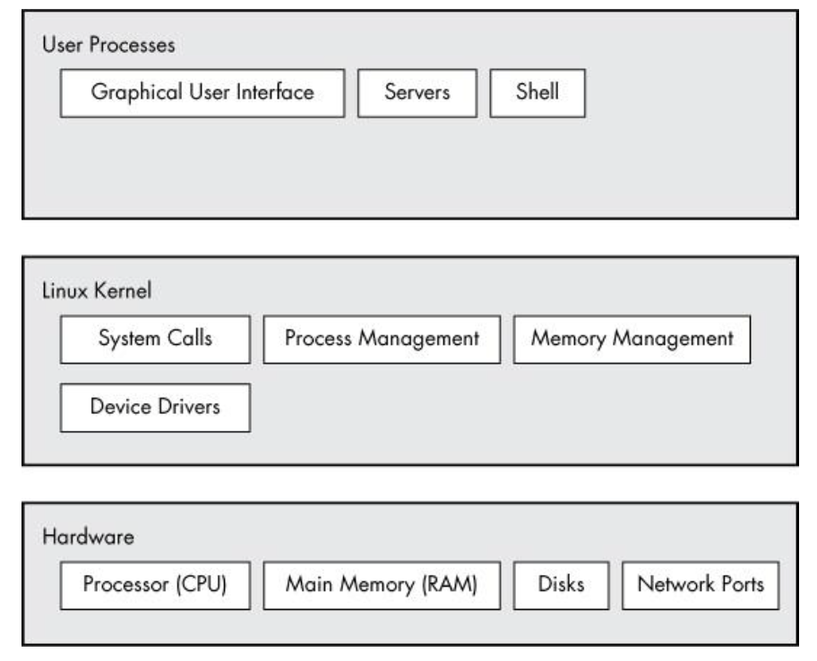

图1-1. Linux系统的基本组成

内核和用户进程之间最主要的区别是：内核运行在内核模式（kernel mode）中，而用户进程运行在用户模式（user mode）中。在内核模式中运行的代码可以不受限地访问中央处理器和内存，这种模式功能强大，但也非常危险，因为内核进程可以轻而易举地使整个系统崩溃。那些只有内核可以访问的空间我们称为内核空间（kernel space）。

相对于内核模式，用户模式对内存和中央处理器的访问有一定程度的限制，可访问的内存空间通常很小，对CPU的操作也很安全。用户空间指的是那些用户进程能够访问的内存空间。如果一个用户进程出错并崩溃的话，其导致的后果也相对有限，并且能够被内核清理掉。例如：如果你的Web浏览器崩溃了，不会影响到你正在运行的其他程序。

理论上来说，一个用户进程出问题并不会对整个系统造成严重的影响。当然这取决于我们如何定义“严重的影响”，并且还取决于该进程拥有的权限。因为不同的进程拥有的权限可能不同，一些进程能够执行一些别的进程无权执行的操作。举个例子，如果拥有足够的权限，用户进程可以将硬盘上的数据全部清除，也许你会觉得这样太危险。操作系统提供了一些相关的安全措施，不过大多数用户进程并没有这个权限。

##1.2 硬件系统：理解主内存

主内存（main memory）或许是所有硬件系统中最为重要的部分，主内存存储0和1这样的数据，我们将每个0和1称为一个比特（或字位，bit）。内核和进程就在主内存中运行，它们由一系列0和1组成。所有外围设备的数据输入和输出都通过主内存完成，同样是以一系列0和1的形式。中央处理器像一个操作员一样处理内存中的数据，它从内存读取指令和数据，然后将运算结果写回内存。

在我们谈论内存、进程、内核和其他内容时你会经常看到“状态”（state）这个词。严格说来，一个状态就是一组比特值。例如：内存中0110，0001和1011这三组比特值即表示三个不同的状态。

进程动辄由几百万个比特值组成，因而使用抽象词汇来描述状态可能比使用比特值更简单一些。我们可以使用进程已经完成的任务或者当前正在执行的任务来描述其状态，如：“进程正在等待用户输入”或者“进程正在执行启动任务的第二个阶段”。

**注解**

*我们通常使用抽象词汇而非比特值来描述状态，映像（image）这个词用来表示比特值在内存中的物理排列。*

##1.3 内核

我们之所以介绍主内存和状态，是因为内核的几乎所有操作都和主内存相关。其中之一是将内存划分为很多区块（subdivisions），并且一直维护着这些区块的状态信息。每一个进程拥有自己的内存区块，内核必须确保每个进程只使用它自己的内存区块。

内核负责管理以下四个方面：

* **进程** 内核决定哪个进程可以使用CPU。
* **内存** 内核管理所有的内存，为进程分配内存，管理进程间的共享内存，以及空闲内存。
* **设备驱动程序** 作为硬件系统和进程之间的接口，内核负责操控硬件设备。
* **系统调用和支持** 进程通常使用系统调用和内核进行通讯。

下面我们详细介绍这四个方面。

**注解**

*如果你对内核的详细工作原理感兴趣，可以参考《Operating System Concepts》, 9th edition, by Abraham Silberschalz, Peter B. Galvin, and Greg Gagne（Wiley, 2012），和《Moden Operating Systems》, 4th edition, by Andrew S. Tanenbaum and Herbert Bos（Prentice Hall, 2014）这两本书。*

###1.3.1 进程管理

进程管理涉及进程的启动、暂停、恢复和终止。启动和终止进程比较直观，但是要解释清楚进程在执行过程中如何使用CPU则相对复杂一些。

在现代操作系统中，进程都是同时运行的。例如：你可以同时在桌面打开Web浏览器和电子表格应用程序。虽然它们看上去是同时运行，实际上这些应用程序后面的进程并不是同时运行的。

我们设想一下在只有一个CPU的计算机系统中，可能会有很多进程使用CPU，但是在任何一个特定的时间段内只能有一个进程可以使用CPU。所以实际上是多个进程轮流使用CPU，每个进程使用一段时间后就暂停，然后让另一个进程使用，依次轮流，时间单位是毫秒级。一个进程让出CPU使用权给另一个进程称为上下文切换（context switch）。

进程在其时间段内有足够的时间完成主要的计算工作，进程通常在第一个时间段内就能完成它的工作。由于时间段非常短，以至于我们根本察觉不到，所以在我们看来系统是在同时运行多个进程。

内核负责上下文切换，我们来看看下面的场景，以便理解它的工作原理：

1. CPU为每个进程计时，到时即停止进程，并切换至内核模式，由内核接管CPU控制权。
2. 内核记录下当前CPU和内存的状态信息，这些信息在恢复被停止的进程时需要用到。
3. 内核执行上一个时间段内的任务（如：从输入输出设备获得数据，磁盘读写操作等）。
4. 内核准备执行下一个进程。内核从准备就绪的进程中选择一个执行。
5. 内核为新进程准备CPU和内存。
6. 内核将新进程执行的时间段通知CPU。
7. 内核将CPU切换至用户模式，将CPU控制权移交给新进程。

从以上步骤我们可以看出，内核是在进程的时间段间隙、上下文切换的时候运行的。

在多CPU系统中，情况要稍微复杂一些。如果新进程将在另一个CPU上运行，内核就不需要让出当前CPU的使用权。不过为了最大化所有CPU的使用效率，内核会使用一些其他的方式来获取CPU控制权。

###1.3.2 内存管理

内核在上下文切换过程中管理内存，这个过程十分复杂，因为内核要保证以下所有条件：

* 内核需要自己的专有内存空间，其他的用户进程无法访问。
* 每个用户进程有自己的专有内存空间。
* 一个进程不能访问另一个进程的专有内存空间。
* 用户进程之间可以共享内存。
* 用户进程的某些内存空间可以是只读的。
* 通过使用磁盘交换，系统可以使用比实际内存容量更多的“内存”空间。

新型的CPU提供了内存管理工具（memory management unit，MMU），MMU使用了一种叫做虚拟内存(virtual memory)的内存访问机制，即进程不是直接访问内存的实际物理地址，而是通过内核使得进程看起来可以使用整个系统的内存。当进程访问内存的时候，MMU截获访问请求，然后通过内存映射表将要访问的内存地址转换为实际的物理地址。内核需要初始化、维护和更新这个地址映射表。例如：在上下文切换时，内核将内存映射表从被移出进程转给被移入进程使用。

**注解**

*内存地址映射通过内存页面表（page table）来实现。*

关于内存性能，我们将在**第八章**详细介绍。

###1.3.3 设备驱动程序和设备管理

对于设备来说，内核的角色比较简单。通常设备只能在内核模式中被访问（例如用户进程请求内核关闭系统电源），因为设备访问不当有可能让系统崩溃。另一个原因是不同设备之间没有一个统一的编程接口，即使同类设别也如此，比如：网卡。所以设备驱动程序曾经是内核的一部分，它们尽可能为用户进程提供统一的接口，以简化开发人员的工作。

###1.3.4 系统调用和系统支持

内核还对用户进程提供其他功能。例如：系统调用（system calls或syscalls）为进程执行一些它们不擅长或无法完成的工作。打开、读取和写文件这些操作都涉及系统调用。

fork()和exec()这两个系统调用对于我们了解进程如何启动很重要：

* **fork()** 当进程调用fork()时，内核创建一个和该进程几乎一模一样的拷贝。
* **exec()** 当进程调用exec(program)时，内核启动program来替换当前的进程。

除了init（参见**第六章**）以外，Linux中的所有用户进程都是通过fork()来启动的，除了创建现有进程的拷贝外，大多数情况下你还可以使用exec()来启动新的进程。一个简单的例子是你在命令行运行ls命令来显示目录内容。当你在终端窗口中输入ls时，终端窗口中的shell（命令行）调用fork()创建一个shell的拷贝，然后该拷贝调用exec(ls)来运行ls。图1-2显示启动ls这样的命令时进程和系统调用的流程。

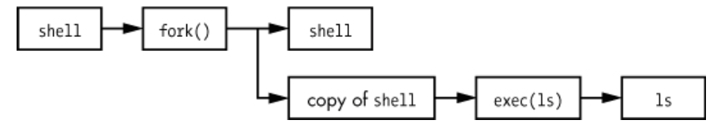

图1-2. 启动新进程

**注解**

*系统调用通常使用括号来标记。图1-2中，进程请求内核使用fork()系统调用创建一个新的进程。这样的标记来源于C编程语言。阅读本书你不需要有C语言的知识，只需要记住系统调用是进程和内核之间的交互方式。此外，本书中我们简化了很多系统调用。例如exec()实际上是一系列具有相似功能的系统调用，只是代码实现有所不同。*

除了传统的系统调用，内核还为用户进程提供其他很多功能，最为常见的是虚拟设备。虚拟设备对于用户进程而言是物理设备，但是其实它们都是通过软件实现的。因此从技术角度来说，它们并不需要存在于内核中，但是实际上它们很多
都存在于内核中。例如：内核的随机数生成器(/dev/random)这样的虚拟设备，如果由用户进程来实现难度要大很多。

##1.4 用户空间

前面提到过，内核分配给用户进程的内存我们称为用户空间。因为一个进程简单说就是内存中的一个状态。用户空间也可以指所有用户进程占用的所有内存。(用户空间还有一个不太正式的名称，叫userland)

Linux中大部分的操作都发生在用户空间中。虽然从内核的角度来说所有进程都是一样的，但是实际上它们执行的是不同的任务。相对于系统组件，用户进程位于一个基础服务层中。图1-3中最底层是基础服务层，工具服务在中间，用户使用的应用程序在最上层。图1-3是一个简化版本，你可以看到顶层距离用户最近（如：用户接口和Web浏览器）。中间一层中有邮件服务器这样的组件供Web浏览器使用。最下层是一些更小的服务组件。

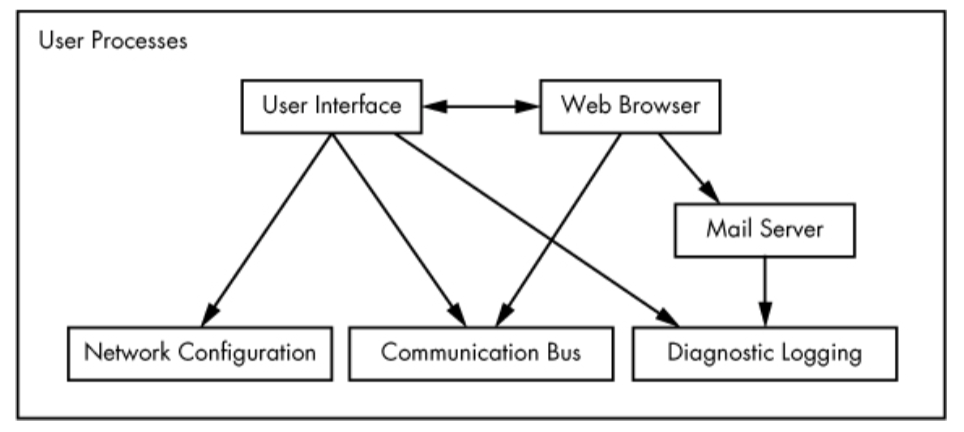

图1-3. 进程类型和交互

最下层通常是由一些小的组件组成，它们比较精巧，专注完成某一个特定功能。中间层的组件比较大一些，如：邮件，打印和数据库服务。顶层组件完成用户交互和复杂的功能。组件之间也可以相互调用。如果组件A调用了组件B的功能，我们可以视为组件A和B在同一层级，或者B在A之下。

图示1-3只是一个粗略图，实际上用户空间里没有很明显的界限。例如许多应用程序和服务会将系统诊断信息写入日志，大部分程序使用标准的syslog服务来完成，但也有一些程序是自己实现日志功能。

此外很多用户空间组件比较难分类，象Web服务器和数据库服务器这样的服务组件，你可以认为它们是高级别组件，因为它们复杂度很高。然而用户应用程序也会经常调用它们的功能，所以你也可以将它们归入中级别组件。

##1.5 用户

Linux内核支持用户（user）这一Unix的传统概念。一个用户代表一个实体，它有权限运行用户进程，对文件拥有所有权。每个用户都有一个用户名，如：billyjoe。然而内核是通过用户ID来管理用户的，用户ID是一串数字标识。（详见**第七章**）

用户机制主要用于权限管理。每一个用户进程都有一个用户作为所有者（owner），我们称其为以该用户运行的进程（run as the owner）。在一定限制条件下，用户可以终止和改变他的进程的行为。但是对其他用户的进程无权干预。此外，用户可以决定是否将属于自己的文件和其他用户共享。

Linux操作系统的用户包括系统自带用户和供人使用的用户。详情见**第三章**。其中最关键的用户是超级用户（root）。Root用户不受前面提到的种种权限的限制，它可以终止其他用户的进程，读取系统中的任何文件。因此root也被称作超级用户。Unix的系统管理员拥有超级用户权限。

**注解**

*使用root权限操作系统是一件很危险的事情，因为用户拥有最高权限，身份难以识别，如果出错很难恢复。因此系统设计者通常尽量避免使用root权限。而且，root用户虽然权限很高，但是还是运行在用户模式中，而非内核模式。*

##1.6 前瞻

到目前为止我们对Linux系统的组成有了一个大致的了解。用户和用户进程交互，内核管理进程和硬件系统。内核和进程都在内存中运行。

有了这些基础知识，如果想要了解更多的细节，你需要做一些实际的操作。下一章你会了解到一些用户空间的基础知识，还有本章没有提及的永久存储（硬盘，文件等），就是存放应用程序和数据的地方。

------

#第二章 基础命令和目录结构

本章我们将介绍Unix系统的命令和工具，它们在本书中经常会被用到。你可能已经对这些基本知识有所了解，不过我还是建议花些时间再阅读一遍，特别是**2.19 Linux目录结构基础**一节中关于目录结构的部分。

你也许会问，为什么要介绍Unix命令？这本书不是关于Linux的吗？没错，Linux其实是Unix的一个变种，它的本质还是Unix。Unix这个词在本章中出现的频率甚至高于Linux，并且你可以将本章的知识直接应用到其他基于Unix的操作系统，如：Solaris和BSD。我们尽量避免介绍太多Linux特有的内容，一方面可以让你多了解一点其他的Unix系统，另一方面也因为那些只对Linux适用的扩展功能往往不太稳定可靠。掌握核心命令能够让你很快上手任何新的基于Unix的操作系统。

**注解**

*Unix初学者可以参考这几本书：《The Linux Command Line》，No Starch Press，2012， 《UNIX for the Impatient》，Addison-Wesley Professional，1995，和《Learning the UNIX Operating System》，5th edition，O'Reilly，2001。*

##2.1 The Bourne Shell: /bin/sh

命令行界面（shell）是Unix操作系统中最为重要的部分之一。Shell是运行命令行的应用程序，命令行就是用户输入的那些命令。同时它为Unix程序员提供了一个编程环境，在这里Unix程序员可以将通用的任务分解为一些小的组件，然后使用shell来管理和组织它们。

Unix操作系统中很多重要的部分其实都是命令行脚本（shell scripts），它们是包含一系列shell命令的文本文件。如果你用过MS-DOS，你可以将命令行脚本理解为功能强大的.bat批处理文件。我们将在**第十一章**详细地介绍命令行脚本。

通过本书的阅读和练习，你将会逐渐熟练地使用命令行界面来运行各种命令。它的一个好处是一旦出现了误操作，你可以清楚地看到你的输入和错误，然后进行修正。

命令行界面有很多种，它们都基于Bourne shell(/bin/sh)这个贝尔实验室开发的标准命令行界面，其运行在早期的Unix系统上。所有基于Unix的操作系统都需要Bourne shell才能正常工作。

Linux使用了一个增强版本的Bourne shell，我们叫做bash或者Bourne-again shell。大部分Linux系统的默认shell是bash，其通常有一个符号链接/bin/sh。你需要使用bash来运行本书中的例子。

**注解**

*你的Unix系统管理员为你设置的默认shell可能不是bash，你可以使用chsh命令来更改，或者请他为你更改。*

##2.2 Shell的使用

安装Linux时，除了默认的root账号外，你还需要为自己创建至少一个用户账号。本章中你需要使用常规用户账号。

###2.2.1 Shell窗口

登录系统后，打开一个shell窗口（也叫做终端，terminal）。打开shell窗口最简单的方法是，在Gnome或者Ubuntu Unity这样的图形界面（GUI）中运行终端程序，它在窗口内运行shell。通常在窗口的顶端你能看到一个$提示符。在Ubuntu上，提示符是这样：name@host:path$（用户名@主机名:路径$）。在Fedora上，提示符是这样：[name@host path]$。Shell窗口类似Windows上的DOS，OS X系统上的终端程序（Terminal application）本质上和Linux中的shell窗口一样。

本书中的很多命令都可以在shell上运行，例如你可以输入以下命令行（不用输入前面的$），然后按回车键（ENTER）：

$ echo Hello there.

**注解**

*本书中许多shell命令都以#开头，需要以超级用户（root）的身份来运行，运行时需要格外小心。*

现在试试下面这个命令：

$ cat /etc/passwd

这个命令是将文件/etc/passwd中的内容显示到shell窗口中。有关这个文件我们会在**第七章**详细介绍。

###2.2.2 cat命令

cat命令很简单，它显示一个或者多个文件的内容，命令语法如下：

$ cat file1 file2 ...

上面这个cat命令会显示file1和file2等文件的内容，然后退出。之所以叫cat是因为如果有多个文件的话，它会吧这些文件的内容拼接起来显示。

###2.2.3 标准输入输出

我们将使用cat命令来学习Unix的输入和输出（I/O）。Unix进程使用输入输出流（I/O streams）来读写数据。进程从输入流中读取数据，向输出流写出数据。数据流非常灵活，比如，输入流可以是文件，设备，终端，甚至还可以是来自其他进程的输出流。

想知道输入流的工作原理，只需要输入cat命令并回车，这时候你看到屏幕上没有显示任何结果，因为cat命令仍在运行中。现在你输入几个字符然后回车，你会看到cat命令在屏幕上显示出你刚刚输入的字符。最后你可以按CTRL-D终止cat命令的执行并回到shell提示符。

你刚刚和cat命令进行的一系列交互就是通过数据流机制来实现的。因为你没有指定文件名，cat命令就从Linux内核提供的默认标准输入流中获得输入数据，这时运行cat命令的终端就成为标准输入。

**注解**

*按CTRL-D终止当前终端的标准输入并终止命令。和CTRL-C不一样，CTRL-C终止当前进程的运行，无论是否有输入和输出。*

标准输出也类似，内核为每个进程提供一个标准输出流供它们输出数据。cat命令在终端运行的时候，标准输出就和该终端建立连接，cat命令将数据输出到标准输出，就是你在屏幕上看到的结果。

标准输入和输出通常简写为stdin和stdout。很多命令和cat一样，如果你不为它们指定输入文件，他们就从标准输入获得数据。输出则有点不同，一部分命令（如：cat）将数据输出到标准输出，另一部分命令可以将数据直接输出到文件。

除了标准输入和输出外，还有标准错误信息流，我们将在**2.14.1 标准错误**一节中介绍。

标准流的一个优点是你可以随心所欲地指定数据的输入输出来源，在**2.14 Shell输入输出**一节中我们会介绍如何将流连接到文件和其他进程。

##2.3 基础命令

本节将介绍更多的Unix命令。它们大都需要输入参数，同时支持可选项和格式（由于数量太多在此不一一列出）。下面是一些基础命令的简单介绍，我们暂不深入细节。

###2.3.1 ls

ls命令显示指定目录的内容，缺省参数为当前目录。ls -l 显示详细的列表，ls -F显示文件类型信息（关于文件类型和权限，我们将在**2.17 文件模式和权限**一节中介绍）。下面是文件详细列表的 一个示例，第三列是文件的所有者（owner）,第四列是用户组，第五列是文件大小，后面是文件更改的时间和日期，以及文件名。

$ ls -l
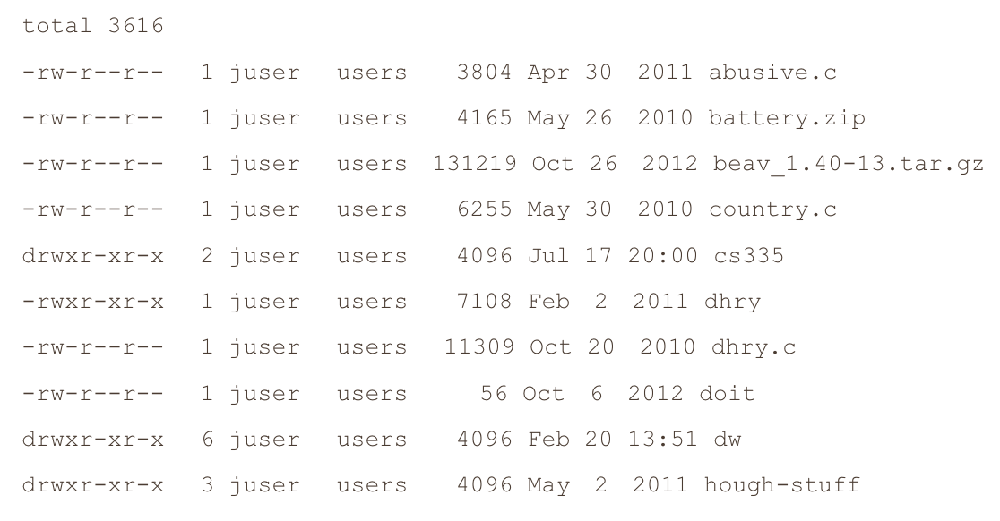

第一列中的d我们将在**2.17 文件模式和权限**一节中详细介绍。

###2.3.2 cp

cp命令用来拷贝文件。下面的命令将文件file1拷贝到文件file2：

$ cp file1 file2

下面的命令将多个文件（file1 ... fileN）拷贝到目录dir：

$ cp file1 ... fileN dir

###2.3.3 mv

mv命令有点类似cp，用来重命名文件。下面的命令将文件名从file1重命名为file2：

$ mv file1 file2

你也可以使用mv将多个文件移动到某个目录：

$ mv file1 ... fileN dir

###2.3.4 touch

touch命令用来创建文件，如果文件已经存在，则该命令会更新文件的时间戳，就是我们在ls -l命令的执行结果中看到的文件更新时间和日期。下面的命令创建一个新的文件，内容为空：

$ touch file

如果我们对文件执行ls -l，你将会看到下面的显示结果，其中➊就是文件被创建的时间和日期。

$ ls -l file

-rw-r--r-- 1 juser users 0 May 21 18:32➊ file

###2.3.5 rm

rm命令用来删除文件，文件一旦被删除通常无法恢复。

$ rm file

###2.3.6 echo

echo命令将它的参数显示到标准输出，例如：

$ echo Hello again.

Hello again.

我们在查看shell通配符展开（如：*这样的通配符）和环境变量（如：$HOME）的时候经常使用echo命令，本章稍后会详细介绍。

##2.4 浏览目录

Unix的目录结构从根目录/开始（root directory）。目录之间使用/分隔，而不是Windows中的\。根目录/下有子目录，如：/usr，详情见**2.19 Linux目录结构基础**。

我们通过路径（path或pathname）来访问文件。以/开头的路径叫绝对路径（absolute path）。

..代表一个目录的上层目录（parent）。如果你当前在目录/usr/lib中，那..就代表/usr目录，../bin则代表/usr/bin。

.代表当前目录。如果你当前在/usr/lib目录中，.就代表/usr/lib，./X11则代表/usr/lib/X11。通常我们不需要使用.，而是直接使用目录名来访问当前目录下的子目录，如：X11，效果和./X11一样。

不以/开头的路径叫相对路径（relative path），我们大部分时候都基于当前所在目录使用相对路径。下面介绍一些和目录操作相关的命令。

###2.4.1 cd

cd命令用来设置当前的工作目录，当前工作目录是指你的进程和shell当前所在的目录。

$ cd dir

如果不带dir参数，cd命令会返回你的个人主目录（home direcotry），个人主目录是你登录系统后进入的目录。

###2.4.2 mkdir

mkdir命令用来创建新目录，例如，下面的命令创建一个名为dir的新目录：

$ mkdir dir

###2.4.3 rmdir

rmdir命令用来删除目录

$ rmdir dir

如果要删除的目录里面有内容（文件和其他目录），上面的命令会执行失败。因为rmdir只能删除空目录，你可以使用rm -rf来删除一个目录以及其中的所有内容。使用这个命令的时候要非常小心，特别当你是超级用户（root或superuser）的时候。因为-r（recursive delete）选项会依次删除dir中的所有文件和子目录，
-f选项代表强制删除。所以使用-rf时尽量不要在参数里使用通配符（如：\*），并且执行命令前最好检查参数是否正确。

###2.4.4 Shell通配符 (Shell Globbing，Wildcasts）

Shell可以使用通配符来匹配文件名和目录名，我们称之为globbing，其他的操作系统也有通配符这个概念。比如：\*代表任意字符和数字，下面的命令列出当前目录中的所有文件：

$ echo \*

Shell根据参数中的通配符来匹配文件名，shell将命令中的参数替换为实际的文件名，这个过程我们称为展开（expansion）。比如：

- at\*展开为所有以at开头的文件名
- \*at展开为所有以at结尾的文件名
- \*at\*展开为所有包含at的文件名

如果通配符没有匹配的文件名，shell就不做任何的展开，参数按照原样来执行，比如：echo *dfkdsafh.

**注解**

*如果你使用过MS-DOS，你可能会下意识地使用\*.\*来匹配所有文件。在Unix系统中，\*.\*只匹配那些包含.的文件名和目录名，而Unix系统中很多文件名是没有.的。*

如果不想让shell展开通配符，你可以使用单引号（''）。如：运行echo '\*'将会显示一个\*。在一些命令如grep和find中，这样做非常有用（''我们将在**11.2 Quoting and Literals**一节中详细介绍）。

**注解**

*需要注意的是，shell是先展开通配符，然后执行命令行。如果\*传递到命令行的时候仍然未能展开，shell则对此无能为力，一切都取决于命令本身如何处理。**

##2.5 中间命令（Intermediate Commands）

下面我们介绍一些基本的Unix中间指令。

###2.5.1 grep

grep命令显示文件和输入流中和参数匹配的行。如：下面的命令显示文件/etc/passwd中包含文本root的所有行：

$ grep root /etc/passwd

在对多个文件进行批量操作的时候，grep命令非常好用，它显示文件名和匹配的内容。如果你想查看目录/etc中所有包含root的文件，可以执行以下命令：

$ grep root /etc/*

grep命令有两个比较重要的选项，一个是-i（不区分大小写），一个是-v（反转匹配，就是显示所有不匹配的行）。grep还有一个功能强大的变种egrep（实际上是grep -E）。

grep命令能够识别正则表达式（regular expression）。正则表达式比通配符功能更强大，下面是两个例子：

- .\*匹配任意多个字符（类似\*通配符）
- .匹配任意一个字符

**注解**

*帮助手册grep(1)中（man 1 grep）有关于正则表达式的详细说明，不过对于读者来说可能比较不方便阅读。你可以参考《Mastering Regular Expression》，3rd edition，O'Reilly，2006，或者 《Programming Perl》，4th edition，O'Reilly，2012中的the regular expression一章。如果你对数学和正则表达式的历史感兴趣，可以参阅《Introduction to Automata Theory, Language, and Computation》，3rd edition，Prentice Hall，2006。*

###2.5.2 less

当要查看的文件过大或者内容多得需要滚动屏幕的时候，less命令可以将内容分屏显示，按空格键查看下一屏，b键查看上一屏，q键退出。

**注解**

*less命令实际上是more命令的增强版本。绝大多数Linux系统中都有这个命令，但是一些Unix系统和嵌入式系统中没有这个命令，这时你可以使用more命令。*

你可以在less命令的输出结果中进行搜索。例如：使用/word从当前位置向前搜索word这个词，使用?word从当前位置向后搜索。当找到一个匹配的时候，按n键可以跳到下一个匹配。

你可以将几乎所有进程的输出作为另一个进程的输入，我们将在**2.14 Shell输入输出**一节中详细介绍，当你执行的命令涉及到很多输出或者你想使用less来查看输出结果的时候，这个方法非常管用。如：

$ grep ie /usr/share/dict/words | less

###2.5.3 pwd

pwd命令显示当前目录名，这个命令看上去不是那么有用，其实不然，它有两个用处：

首先，并不是所有的提示符都显示当前目录名，这时候需要使用pwd来获得当前目录名。

其次，使用符号链接（Symbolic Links，我们将在**2.17.2 符号链接**一节中介绍）的时候通常很难获知当前目录信息，这时我们可以使用pwd -P来查看。

###2.5.4 diff

查看两个文件之间的不同，例如：

$ diff file1 file2

该命令有几个选项可以让你设置输出结果的格式，不过缺省的格式对于我们来说已经足够清晰易读了。很多开发人员喜欢用diff -u格式，因为这个格式能被许多工具程序很好地识别。

###2.5.5 file

如果你想知道一个文件的格式信息，可以使用：

$ file file

这个命令会提供给你很多有用的信息。

###2.5.6 find和locate

你有没有碰到过一种让人抓狂的情况，就是你知道有那么一个文件，但是就是不知道它在哪个目录。使用find命令可以帮你在目录中寻找文件：

$ find dir -name file -print

find命令能做很多事情，但是在你确定你了解-name和-print选项之前，不要尝试诸如-exec这样的选项。find命令可以使用模式匹配参数（如：\*），但是必须加引号（'\*'），以免shell自动将它们展开。（参见**2.4.4 Shell通配符**）

另外一个查找文件的命令是locate，和find不同的是，locate在系统创建的文件索引中查找文件。这个索引由操作系统周期性地进行更新，查找速度比find更快。但是locate对于查找新创建的文件可能会无能为力，因为它们有可能还没有被加入索引。

###2.5.7 head和tail

head命令显示文件的前10行内容（例如：head /etc/passwd），tail命令显示文件的最后10行内容（如：tail /etc/passwd）。

你可以使用-n选项来设置显示的行数（例如：head -5 /etc/passwd）。如果要从第n行开始显示所有内容，使用：tail +n。

###2.5.8 sort

sort命令将文件内的所有行按照字母顺序排序，你可以使用-n选项按照数字顺序排序那些以数字开头的行。使用-r选项反转排序。

##2.6 更改密码和shell

你可以使用passwd命令来更改密码，你需要输入一遍你的当前密码，和两遍新密码。密码最好复杂一些，不要使用简单的词句，最好使用数字、大小写字母和特殊字符的混合。

设置密码的一个好方法是选择一个你能记住的短句，将其中的某些字符替换为数字和标点。

你可以用chsh命令更改shell（如：改为ksh或tcsh），本书默认使用的shell是bash。

##2.7 配置文件（Dot Files）

现在跳转到你的个人主目录，分别运行ls和ls -a两个命令，你应该能够注意到一些区别。如果没有-a选项，你无法看到配置文件，这些文件以.开头。常见的配置文件有.bashrc和.login，还有以.开头的目录，如：.ssh。

这些配置文件没有什么特别之处。有些命令不显示它们是为了让你的个人主目录显得更简洁。例如，除非使用-a选项，否则ls命令不显示配置文件。此外，shell通配符不匹配配置文件，除非明确指定.\*。

**注解**

*在通配符中使用.\*可能会导致一些问题，因为.\*匹配.和..（当前目录和上级目录）。你可以使用正则表达式.[^.]\*和.??\*来排除这两个目录。*

##2.8 环境变量和shell变量

Shell中可以保存一些临时变量，称作shell变量（shell variables），它们是一些字符值。Shell变量可以保存脚本执行过程中的数据，一些shell变量用来控制shell的运行方式（例如：bash shell在显示提示符前会读取变量PS1的值，如果PS1变量中有内容，则将它做为提示符）。

我们使用=号为shell变量赋值，例如：

$ STUFF=blah

以上命令将值blah赋值给变量STUFF，我们使用$STUFF来获得该变量的值（如：echo $STUFF）。我们将在**第十一章**介绍更多的shell变量。

环境变量（environment variables）和shell变量类似，但是其不仅仅针对shell。Unix系统中所有的进程都能够访问环境变量。两者最大的区别是shell变量只能被当前的shell访问，在shell中运行的命令无法访问。而环境变量能够被shell中运行的所有进程访问。

环境变量可以通过export命令来设置，如你想将shell变量STUFF变成环境变量，可以执行：

$ STUFF=blah

$ export STUFF

许多程序使用环境变量作为配置和选项信息。例如，你可以使用LESS这个环境变量来配置less命令的参数（许多命令的帮助手册里都有ENVIRONMENT这一节，教你如何使用环境变量来设置该命令的参数和选项）。

##2.9 命令路径

PATH是一个特殊的环境变量，它定义了命令路径（command path）。命令路径是一个系统目录列表，shell在执行一个命令的时候，会去这些目录中查找这个命令。比如：运行ls命令时，shell会在PATH中定义的所有目录里查找ls，如果ls出现在多个目录中，shell会运行第一个。

如果你运行echo $PATH，你会看到所有的路径，它们之间以冒号分隔（:）。例如：

$ echo $PATH

/usr/local/bin:/usr/bin:/bin

你可以设置PATH变量，为shell查找命令加入更多的路径。使用以下命令可以将路径dir加入到PATH的最前面：

$ PATH=dir:$PATH

你也可以将路径加入到PATH变量的最后面，如：

$ PATH=$PATH:dir

**注解**

*在更改PATH时需要特别小心，因为你有可能会不小心将PATH中所有的路径删除掉。不过也不用太担心，你只需要启动一个新的shell就可以找回原来的PATH。*

##2.10 特殊字符

在谈论Linux的时候，我们需要了解一些术语。如果你有兴趣了解，可参考[“Jargon File”](http://www.catb.org/jargon/html/)或者它的印刷版本《The New Hacker’s Dictionary》 ，MIT Press，1996。

**表2-1**列出了一些特殊字符，很多本章已经介绍过。一些工具，比如Perl编程语言用到几乎所有这些特殊字符！（请注意这里使用的字符名称是美国英语名称）

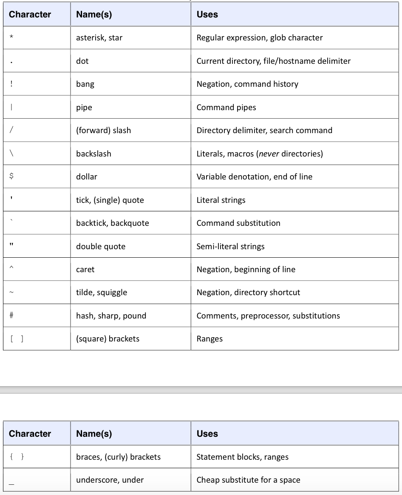

表2-1. 特殊字符

**注解**

*控制键我们通常用^来表示，如：^C代表ctrl-c。*

##2.11 命令行编辑

在使用shell时，你应该能注意到可以使用左右箭头来编辑命令行，并且通过上下箭头来回滚到之前的命令。这是Linux系统的标准操作。

如果你掌握了**表2-2**中的命令，它们是Unix系统的文本编辑标准命令，你就可以很方便地在任何Unix系统中编辑文本。

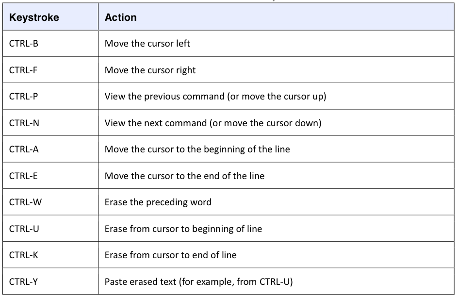

表2-2. 命令行键

##2.12 文本编辑器

说到文本编辑不得不提文本编辑器。要用好Unix，你必须能够编辑文本文件并且不造成损坏。Unix系统使用纯文本文件来保存配置信息（如目录/etc中的文件）。由于需要经常性地编辑这些文件，你需要一个强大的文本编辑器。

你需要掌握vi和Emacs二者之一，它们是Unix系统中事实上的标准编辑器。很多Unix的配置向导对编辑器的选择很挑剔，但是没关系，你可以自己选择，选择标准就是它对你而言合不合适：

- 如果你想要一个万能的编辑器，功能强大，有在线帮助，不过需要一些额外的手工操作，你可以试试Emacs。
- 如果想要高效快速，那么vi比较适合你。

有关vi的详细知识可以参考《Learning the vi and Vim Editors: Unix Text Processing》，7th edition，O’Reilly，2008。关于Emacs你可以参考在线文档Start Emacs：打开Emacs，按CTRL-H，然后按T。 或者参考《GNU Emacs Manual》，Free Software Foundation，2011。

其他的编辑器如Pico和myriad GUI editor可能界面会更加友好一些，但是你一旦习惯了vi和Emacs以后，也许就再也不会想使用它们了。

**注解**

*你在进行文本编辑的时候，可能第一次注意到了终端界面和GUI图形界面的区别。vi这样的编辑器运行在终端窗口中，使用标准输入输出界面。GUI图形编辑器有它们自己的窗口界面。Emacs既有终端界面也有图形界面。*

##2.13 在线帮助

Linux系统的帮助文档非常丰富。帮助手册（manual pages，或man pages）提供命令的使用说明。比如你想了解ls命令的用法，只需运行：

$ man ls

帮助手册旨在提供基础知识和参考信息，有时会有一些实例和交叉索引，但是基本没有那种教程式的文档。

帮助手册会列出命令的所有选项，但是不会突出重点（比如那些经常被使用的选项）。如果你有足够的耐性，可以逐个尝试，或者可以问别人。

下面的命令可以在帮助手册中查找关键字keyword：

$ man -k keyword

如果你只知道某个功能，但是不知道命令名，你可以很方便地通过关键词来查找。比如你想使用排序功能，就可以运行下面的命令来列出所有和排序有关的命令：

$ man -k sort

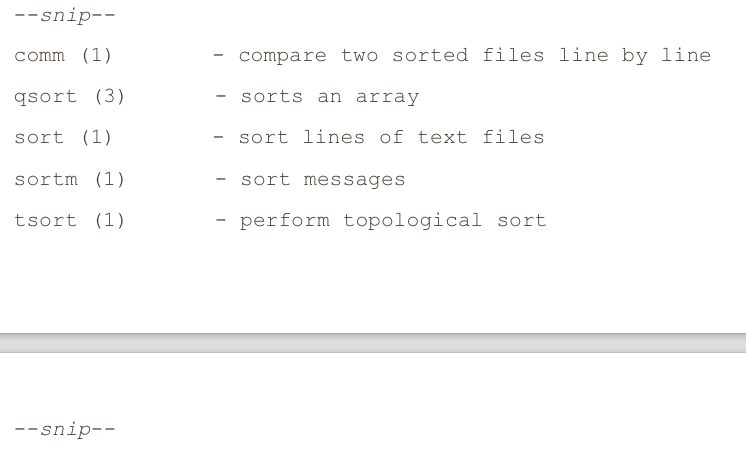

**注解**

*如果你对本书目前介绍的命令有疑问，可以使用man命令查阅它们的帮助手册。**

帮助手册按照命令类型被组织为很多个章节，章节编号在章节名后面的括号中，例如：ping(8)。表2-3中列出了各章节和它们的编号。

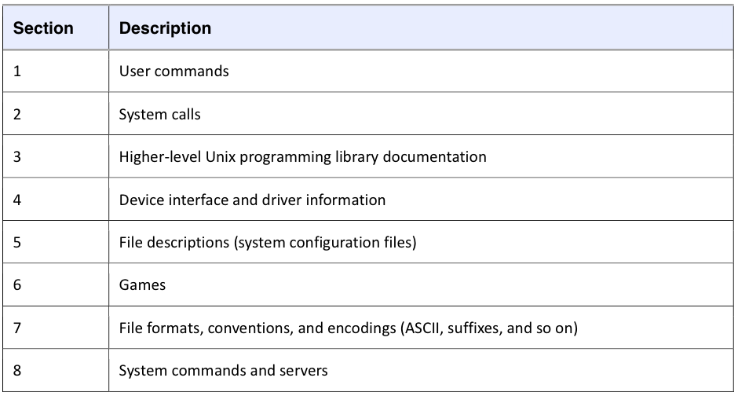

表2-3. 在线帮助手册章节列表

章节1，5，7和8对本书的内容是一个很好的补充参考。章节4用到的不多，章节6的内容可以再丰富一些。章节3主要是供开发人员参考。在阅读完本书有关系统调用的部分后，你能对章节2的内容有更好的理解。

你可以按序号来选择章节，这会让搜索结果更加精确，比如：你要搜索有关passwd的信息，可以使用：

$ man 5 passwd

帮助手册基本上涵盖了所有的基本内容，你还可以使用--help或者-h选项来获得帮助信息。如：ls --help。

GNU项目因为不喜欢帮助手册这种方式，引入了info（或者texinfo）。info文档的内容更加丰富，同时也更复杂一些。可以使用以下的命令查看command命令的文档：

$ info command

有一些程序将它们的文档放到目录/usr/share/doc中，而不是man和info里。你可以在这里搜索需要的文档，当然别忘了还有互联网。

##2.14 Shell输入输出

至此你已经了解了Unix的基本命令，文件和目录，现在我们可以介绍输入输出的重定向了。让我们从标准输出开始。

如果想将命令的执行结果输出到文件（默认是终端屏幕），可以使用>重定向字符：

$ command > file

如果文件file不存在，shell会创建一个新文件file。如果file文件已经存在，shell会清空（clobbers）文件的内容。一些shell可以通过设置参数来防止文件被清空，如：bash中的set -C。

你还可以使用>>将命令的输出结果加入到文件末尾：

$ command >> file

这个方法在收集多个命令的执行结果时非常有用。

你还可以使用管道字符（|）将一个命令的执行结果输出到另一个命令。例如：

$ head /proc/cpuinfo

$ head /proc/cpuinfo | tr a-z A-Z

你可以使用任意多个管道字符。

###2.14.1 标准错误输出

有的时候你会发现，即使重定向了标准输出以后，终端屏幕上还是会显示一些信息，其实这是标准错误输出（stderr），用来显示系统错误和调试信息。比如，运行下面的命令后，f文件仍然为空：

$ ls /fffffffff > f

但是终端屏幕上会出现错误信息：

ls: cannot access /fffffffff: No such file or directory

如果有必要，你可以使用2>重定向标准错误输出，例如：

$ ls /fffffffff > f 2> e

这里的2是流ID，1是标准输出，2是标准错误输出。

你也可以使用>&将标准输出和标准错误输出重定向到同一个地方，例如：

$ ls /fffffffff > f 2>&1

###2.14.2 标准输入重定向

使用<操作符将文件内容重定向为命令的标准输入：

$ head < /proc/cpuinfo

因为很多Unix命令可以使用文件名作为参数，所以不太常需要使用<重定向文件。例如，head /proc/cpuinfo。

##2.15 了解错误信息

在Linux这样的基于Unix的操作系统中，程序运行出错时你要做的第一件事情就是查看错误信息，因为大多数情况下出错的具体原因都能在错误信息里找到。这一点Unix系统做得比某些操作系统好得多。

###2.15.1 解析Unix的错误信息

绝大部分Unix上的应用程序都使用相同的方式处理错误信息，虽然会有些许差别。例如，你可能会经常遇到这种情况：

$ ls /dsafsda
ls: cannot access /dsafsda: No such file or directory

该信息分为三部分：

- 命令文件名：ls。一些程序不显示命令文件名，这对于脚本调试来说很不方便。
- 文件路径：/dsafsda。问题出在文件路径这里。
- 错误信息：No such file or directory。告诉我们错误出在文件路径上。

将以上的信息综合起来看，你就能得出结论：ls想要访问文件/dsafsda，但是文件不存在。在这个例子里，错误信息很易懂，但是如果你运行的是执行很多命令的脚本，出错信息会变得复杂难懂。

在排错时，务必从第一个错误开始入手。程序报告错误时总是先告诉你它无法完成某一个操作，接下来告诉你一些其他的相关问题。例如我们虚构这样一个场景：

scumd: cannot access /etc/scumd/config: No such file or directory

后面跟着一大串的错误信息，看起来问题很严重。首先不要受它们的影响，专注于第一个错误信息你就知道，要解决的问题只不过是创建一个文件/etc/scumd/config而已。

**注解**

*不要把错需信息和警告信息混为一谈。警告信息看起来像是错误信息，但是它只是告诉我们程序出了问题，但是还能够继续运行。要解决警告信息里面的问题，你可能需要终止当前进程。（有关查看和终止进程，我们将在**2.16 查看和操纵进程**一节中介绍）*

###2.15.2 常见错误

Unix程序的很多错误与文件和进程有关。下面我们列举一些常见的错误。

####No such file or directory

这可能是我们最常遇到的错误：访问一个不存在的文件或目录。由于Unix的I/O系统对文件和目录不做区分，所以当你试图访问一个不存在的文件，进入一个不存在的目录，将文件写入一个不存在的目录时，都会出现这个错误。

####File exists

如果新建文件的名称和现有的文件或者目录重名，就会出现这个错误。

####Not a directory, Is a directory

这个错误出现在当你把文件当作目录或者反之，把目录当作文件。例如：

$ touch a
$ touch a/b
touch: a/b: Not a directory

错误出在第二个命令这里，将文件a当作了目录，很多时候你可能需要花点时间来检查文件路径。

####No space left on device

硬盘空间不足。

####Permission denied

当你试图读或写一个没有访问权限的文件或目录时，会遇到这个错误。当你试图执行一个你无权执行（即使你有读的权限）的文件时也会出现这个错误。我们会在**2.17 文件模式和权限**一节中详细介绍。

####Operation not permitted

当你试图终止一个你无权终止的进程时，会出现这个错误。

####Segmentation fault, Bus error

分段故障，总线繁忙。这个错误通常是告诉你你运行的程序出了问题。可能你的程序试图访问它无权访问的内存空间，这时操作系统就会将其终止。总线繁忙说明你的程序访问内存的方式有问题。遇到这类错误通常是因为程序的输入数据有问题。

##2.16 查看和操纵进程

我们在**第一章**介绍过，进程就是运行在内存中的程序，每个进程都有一个数字ID，叫进程ID（process ID或PID）。可以使用ps命令列出所有正在运行的进程：

$ ps
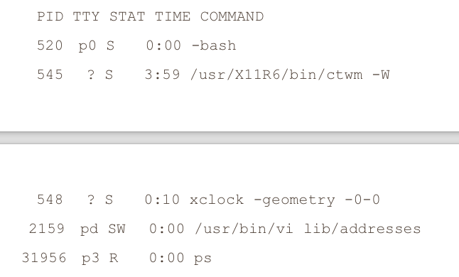

各列依次为：
- **PID**，进程ID。
- **TTY**，进程所在的终端设备，稍后详述。
- **STAT**，进程状态，就是进程在内存中的状态。例如，S表示进程正在休眠，R表示进程正在运行。（完整的状态列表请参阅帮助手册ps(1)）
- **TIME**，进程目前为止所用CPU时长（格式：mm:ss），就是进程占用CPU的总时长。
- **COMMAND**，命令名，请注意进程有可能将其由初始值改为其他。

###2.16.1 命令选项

ps命令有很多选项，你可以使用三种方式来设置选项：Unix方式，BSD方式和GNU方式。BSD方式被认为是比较好的一种，因为它相对简单一些。下面是一些比较实用的选项组合：

和对其他程序一样，你可以对ps使用选项组合，如：ps aux和ps auxw。你可以将进程ID作为ps命令的一个参数，用来查看该特定进程的信息，如：ps u $$，$$是一个shell变量，表示当前的shell进程。（在**第八章**我们将会介绍top和lsof管理员命令，它们能够帮助我们找到进程所在的位置。）

###2.16.2 终止进程

要终止一个进程，可以使用kill命令向其发送一个信号（signal）。当kill命令运行时，它请求内核发送一个信号给进程。大多数情况下，你可以执行下面的命令：

$ kill pid

信号的种类有很多，缺省是TERM（或者terminate）。你可以设置选项来发送不同类型的信号。例如，发送STOP信号可以让进程暂停，而不是终止：

$ kill -STOP pid

被暂停的进程仍然驻留在内存，等待被继续执行。使用CONT信号可以继续执行进程：

$ kill -CONT pid

**注解**

*你可以使用ctrl-c来终止当前运行的进程，效果和kill -INT命令一样。*

终止进程最粗鲁的一种方式是使用KILL信号。和其他信号不同，KILL会强行终止进程，并将其移出内存，不会给进程清理和收尾的机会。不到万不得已最好不要使用该信号。

不要随便终止一个你不知道的进程，不然很有可能遇到麻烦。

你还可以使用数字来代替信号名，例如：kill -9等同于kill -KILL。因为内核使用数字来代表不同的信号。

###2.16.3 任务控制

Shell也支持任务控制（Job Control），即通过不同的按键和命令向进程发送TSTP（类似STOP）和CONT信号的一种方式。例如，你可以使用CTRL-Z发送TSTP信号来停止进程，然后键入fg（将进程置于前台）或者bg（将进程移入后台）继续运行进程。对初学者来说这些可能不太好理解，不过对于很多高级用户来说它们是很好用的命令。如果使用CTRL-Z而不是CTRL-c，然后置之不理，最终会形成大量处于暂停（suspended）状态的进程。

**提示**

*你可以使用jobs命令来查看你暂停了哪些进程。*

如果你想要运行多个shell，在每个终端窗口中运行一个程序，将非交互性质的程序运行在后台（后面将会介绍），或者了解一下screen的使用方法。

###2.16.4 后台进程

当你在shell上运行命令时，命令行提示符会暂时消失，命令结束时又重新显示。你可以使用&操作符将进程设置为后台运行，这样提示符会一直显示，你在进程运行过程中可以继续其他操作。例如，如果你要解压缩一个很大的文件（我们将在**2.18 文件压缩和解压缩**一节介绍），同时不想干等执行结果，你就可以使用下面的命令：

$ gunzip file.gz &

Shell会显示后台进程的PID，然后直接将命令行提示符显示回来交给你继续其他操作。后台进程在你登出系统后仍会一直运行，这比较适用于那些耗时很长的进程。（你可以设置shell让进程在结束时发送通知。）

后台进程的一个缺点是没法和用户交互（比如：从终端获得输入）。它们可以暂停（freeze，用fg恢复运行）或终止（terminate）以便从标准输入获得数据，也可以将数据输出到标准输出和标准错误，这些数据显示在终端屏幕上，有时会和其他正在运行的进程的输出数据混在一起显示，让人难以辨别。

最好的方式是将输出重定向（输入也可以），比如重定向到文件或别的地方（我们已经在**2.14 Shell输入输出**中介绍过），这样屏幕上就不会出现杂乱无章的输出数据。

如果后台进程的输出结果杂乱无章，你需要知道如何整理你的终端窗口内容。Bash shell和大多数有全屏交互的程序支持CTRL-L命令，它会清空你的屏幕。进程在从标准输入读取数据之前，经常先使用CTRL-R清空当前行，在错误的时间按了错误的键会让情况更糟。如果不小心在bash提示符下按了CTRL-R，你会被切换到一个让人不知所云的反转搜索模式（reverse-i-search
），这时你可以按ESC退出。

###2.17 文件模式和权限

Unix系统中的每一个文件都有一组权限值，用来控制你是否能读、写和运行文件。可以使用命令ls -l来查看这些信息。例如：

-rw-r--r--➊ 1 juser somegroup 7041 Mar 26 19:34 endnotes.html

➊是文件模式，显示权限及其他附加信息。文件模式由四部分组成，如**图2-1**。

本例中第一个字符-是文件类型，-代表常规文件，常规文件是最常见的一种文件类型，另一种常见类型是目录，用d代表。（**3.1 设备文件**一节中会介绍其余的文件类型）

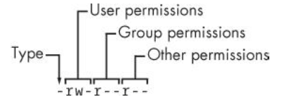

图2-1. 文件模式信息

本例中的其余部分是文件权限信息，由三部分组成：用户，用户组和其他。例如，rw-是用户权限，后面的r--是用户组权限，最后的r--是其他权限。

权限信息由四个字符组成：
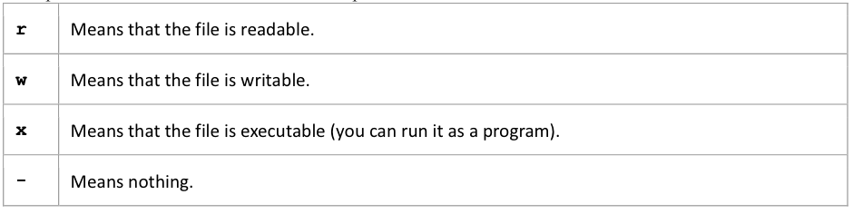

用户权限部分（第一组）是针对文件的拥有者，本例中是juser。用户组权限部分是针对somegroup这个用户组中的所有用户（命令groups可以显示你所在的用户组，详细内容在**7.3.5 用户组**中介绍）.

其他权限部分是针对系统中的所有其他用户，又称为全局权限（world permission）。

**注解**

*权限信息中代表读、写、执行的这三个部分我们称为权限位（permission bit），如：读位（the read bits）指的是所有三个代表读的部分。*

有些可执行文件的执行位是s（setuid）而不是x，表示你将以文件拥有者的身份运行该文件，而不是你自己。很多程序使用s，如passwd命令，因为该命令需要更新/etc/passwd文件，所以必须以文件拥有者（即root用户）的身份运行。

###2.17.1 更改文件权限

使用chmod命令更改文件权限。例如，对文件file，要为用户组（g）和其他用户(o)加上可读权限（r），运行以下命令：

$ chmod g+r file
$ chmod o+r file

也可以使用：

$ chmod go+r file

如果要取消权限，则使用go-r。

**注解**

*不要讲全局权限设置为可写，因为这样任何人都能够修改文件。但是这样会让Internet上的人更改你的文件吗？恐怕不能，除非你的系统由网络安全漏洞。果真是这样的话，文件权限也无能为力。*

有时你会看到下面这样的命令，使用数字来代表权限：

$ chmod 644 file

这个命令会设置所有的权限位，我们称为绝对权限设置。要知道每一个数字（八进制）代表的权限，可以参考该命令的使用手册。请参考下面的表格：

表2-4. 绝对权限模式

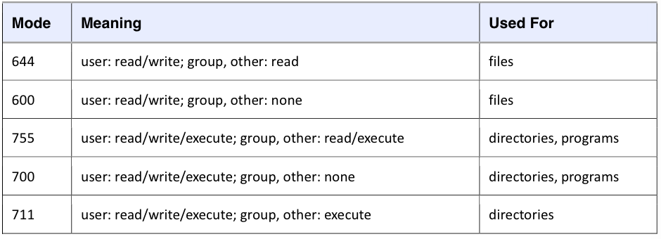

和文件一样，目录也有权限。如果你对目录由读的权限，你就可以列出目录中的内容，但是如果要访问目录中的某个文件，你就必须对目录有可执行的权限（使用绝对值设置权限的时候，目录的可执行权限常常会被不小心取消）。

你还可以使用umask命令来为文件设置预定义的缺省权限。例如，如果你想让任何人对文件和目录有读的权限，使用umask 022，反之，如果不想让你的文件和目录可读，使用umask 077（在**第十三章**中我们将详细介绍如何在启动文件中使用umask命令）。

###2.17.2 符号连接

符号链接（Symbolic Links）是指向文件或者目录的文件，相当于文件的别名（类似Windows中的快捷方式）。符号链接为复杂的目录提供了便捷快速的访问方式。

符号链接如下例所示（请注意文件类型是l）：

lrwxrwxrwx 1 ruser users 11 Feb 27 13:52 somedir -> /home/origdir

如果你访问somedir，实际访问的是home/origdir目录，符号链接仅仅是指向另一个名字的名字，所以/home/origdir这个目录即使不存在也没有关系。

如果/home/origdir不存在的话，访问somedir的时候系统会报错称somedir不存在。

符号链接不提供其目标路径的详细信息，你只能自己打开这个链接，看看它指向的究竟是文件还是目录。有时候一个符号链接还可以指向另一个符号链接，我们称为链式符号链接。

###2.17.3 创建符号链接

使用以下命令创建符号链接：

$ ln -s target linkname

linkname参数是符号链接名称，target参数是要指向的目标路径，-s选项表示这是一个符号链接（请见稍后的警告部分）。

运行这个命令之前请反复确认，如果你不小心调换了target和linkname这两个参数的位置，命令变成了：ln -s linkname target，如果linkname这个路径已经存在，一些有趣的事情就会发生。ln会在linkname目录中创建一个名为target的符号链接，如果linkname不是绝对路径，target就会指向它自己。当你使用ln命令遇到问题的时候，请注意检查此类情况。

你还有可能无意中将符号链接文件当作普通文件进行编辑。

**警告**

*创建符号链接的时候，请注意不要忘记-s选项。没有此选项的话，ln命令会创建一个硬链接（hard link），为文件创建一个新的名字。新文件拥有老文件的所有状态信息，和符号链接一样，打开这个新文件会直接打开文件内容（请参见**4.5 深入传统文件系统**节深入文件系统）。*

符号链接能方便我们管理、组织、共享文件，所以即使有这么多“缺点”，我们还是会用到它。

##2.18 归档和压缩文件

了解了文件，权限，和相关错误信息之后，让我们来了解一下gzip和tar。

###2.18.1 gzip

gzip（GNU Zip）命令是Unix上众多压缩命令中的一个。GNU Zip生成的压缩文件带有后缀名.gz。解压缩.gz文件使用gunzip file.gz命令，压缩文件使用gzip file命令。

###2.18.2 tar

gzip命令只压缩单个文件，要压缩和归档多个文件和目录，可以使用tar命令：

$ tar cvf archive.tar file1 file2 ...

tar命令生成的文件带有后缀名.tar，archive.tar参数是生成的归档文件名，file1 file2 ...是要归档的文件和目录列表。

选项c代表创建文件，选项v用来显示详细的命令执行信息（比如：正在归档的文件和目录名），再加一个v选项可以显示文件大小和权限等信息。如果你不想看到这些信息，可以不用加v选项。

选项f代表文件，后面需要指定一个归档文件名（如：archive.tar）。如果不指定归档文件名，则归档到磁带设备，如果文件名为－,则是归档到标准输入或者输出。

####解压缩tar文件

使用下面的命令解压缩tar文件：

$ tar xvf archive.tar

选项x代表解压模式。你还可以只解压归档文件中的某几个文件，只需要在命令后面加上这些文件的文件名即可。

**注解**

*tar命令解压后并不会删除归档文件。*

####内容预览表模式

在解压一个归档文件之前，通常建议使用选项t来查看归档文件中的内容，t代表内容预览表模式，它会显示归档的文件列表，并且验证归档信息的完整性。如果你不做检查直接解压归档文件，有时会解压出一些很难清理的垃圾内容。

你需要检查压缩包中的文件是否在同一目录下，你可以创建以额临时目录，在其中试着解压一下看看。

解压缩时，你可以使用选项p来保留被归档文件的权限信息。当你使用超级用户运行解压命令时，选项p默认开启。如果你在执行过程中遇到这样那样的问题，请确保你等到tar命令执行完毕并显示提示符。tar命令每次都处理整个归档文件，无论你是解压整个文件或者只是文件中的某部分，所以命令执行过程中请不要中断，因为有些操作是在文件检查之后才开始的，比如权限设置。

###2.18.3 压缩归档文件

许多初学者对被压缩后的归档文件（后缀为.tar.gz）比较费解。我们可以按照从右到左的顺序来解压和打开此类文件。例如，使用以下命令首先解压缩，然后校验及释放归档文件包：

$ gunzip file.tar.gz 

$ tar xvf file.tar

如果需要归档并压缩，则按照相反顺序，先运行tar命令归档，然后运行gzip命令压缩。你可能会逐渐觉得这两个步骤很麻烦，下面我们介绍一些更简便的方法。

###2.18.4 zcat

上面的命令缺点是执行效率不高，并且会占用很多硬盘空间。管道命令是一个更好的选择，例如：

$ zcat file.tar.gz | tar xvf -

zcat命令等同于gunzip -dc命令。选项d代表解压缩，选项c代表将运行结果输出到标准输出（本例中是输出到tar命令）。

tar命令很常用，它的Linux版本有这样几个选项值得注意。选项z对归档文件自动运行gzip，对创建归档包和释放归档包均适用。例如：

$ tar ztvf file.tar.gz

**注解**

*.tgz文件和.tar.gz文件没有区别，后缀.tgz主要是针对MS-DOS的FAT文件系统。*

###2.18.5 其他的压缩命令

Unix中的另一个压缩命令是bzip2，生成后缀名为.bz2的文件。该命令执行效率比gzip稍慢，主要用来压缩文本文件，因而在压缩源代码文件的时候比较常用。相应的解压缩命令是bunzip2，可用选项和gzip相同，其中选项j是针对tar命令的压缩和解压缩。

此外xz是另外一个渐受欢迎的压缩命令，对应的解压缩命令是unxz，可用选项和gzip一样。

Linux上的zip和unzip和Windows上的.zip文件格式兼容，包括.zip和.exe自解压文件。有一个很古老的Unix命令compress支持.Z格式，gunzip命令能够解压缩.Z文件，但是gzip不支持此格式文件的创建。

##2.19 Linux目录结构基础

我们前面介绍了文件，目录，和帮助手册，现在来看看文件系统。Linux目录结构的详细详细可以参考文件系统标准结构（FHS, [http://www.pathname.com/fhs/](http://www.pathname.com/fhs/)）。**图2-2**为我们展示了Linux的基本目录结构，包括目录/，/usr和/var下的子目录。请注意/usr下的子目录有些和/下的子目录一样。

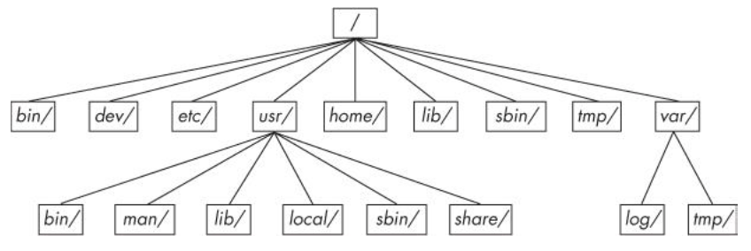

图2-2. Linux目录结构

下面这几个目录需要重点介绍：

- /bin目录中存放的是可执行文件，包括大部分的Unix命令（如ls和cp）。该目录中的大部分是由C编译器创建的二进制文件，还有一些脚本文件。
- /dev目录中是设备文件，我们将在第3章详细介绍
- /etc目录（读作EHT-see）存放重要的系统配置文件，如：用户密码文件，启动文件，设备、网络和其他配置文件。许多都是硬件系统的配置文件。例如，/etc/X11目录中是显示卡和视窗系统的配置文件。
- /home目录中是用户的个人目录。大多数Unix系统都遵循这个规范。
- /lib目录中是供可执行程序使用的各种代码库（library）。代码库分为两种：静态库和共享库。/lib目录中一般只有共享库。其他代码库目录，如：/usr/lib中会有静态库和动态库，以及其他的辅助文件（我们将在**第十五章**详细介绍）。
- /proc目录中存放系统相关信息，比如：当前运行的进程和内核的信息。Linux上这个目录的结构相比其他Unix系统特别一些。
- /sys目录类似/proc目录，里面是设备和系统的信息（我们将在**第三章**介绍）。
- /sbin目录中是可执行的系统文件，这些可执行文件用来管理系统，普通用户一般不需要使用，许多命令只能由root用户运行。
- /tmp目录存放临时文件。所有用户对该目录都有读和写的权限，不过可能对别人的文件没有权限。许多程序会使用这个目录作为保存数据的地方，如果数据很重要的话请不要存放在/tmp目录中，因为很多系统会在启动时清空/tmp目录，甚至是经常性地清理这个目录里的旧文件。也注意不要让/tmp目录里的垃圾文件占用太多的硬盘空间。
- /usr目录虽然读作user，但是并没有用户文件，而是存放着许多Linux系统文件。/usr目录中的很多目录名和更目录上的相同（如：/usr/bin和/usr/lib），里面的存放的文件类型也相同。（为了让root文件系统占用尽可能少的空间，许多系统文件并没有存放在系统根目录下）
- /var目录是运用程序存放运行时信息的地方，如：系统日志，用户信息，缓存和其他信息。（你可能会注意到这里有一个字目录/var/tmp，和/tmp不同的是系统不会在启动时清空它）

###2.19.1 根目录下的其他目录

根目录下还有一些自目录：

- /boot目录存放内核加载文件。这些文件中存放Linux在第一次启动的信息，之后的信息并不保存在这里。详情见**第五章**。
- /media目录是加载可移除设备的地方，比如：可移动硬盘。
- /opt目录一般存放第三方软件，许多系统并没有这个目录。

###2.19.2 /usr目录

/usr目录中内容比它的名字多得多，你看一看/usr/bin和/usr/lib的内容就会知道，/usr目录存放那些运行在用户空间中的进程和数据。除了/usr/bin，/usr/sbin1和/usr/lib，还包括以下内容：

－ /include目录存放C编译器需要使用的头文件。
－ /info目录存放GNU帮助手册（参考**2.13 在线帮助**）。
－ /local目录是管理员安装软件的地方，它的结构和/以及/usr类似。
－ /man存放用户手册。
－ /share目录存放Unix系统间的共享文件。过去这个目录通常在网络中被共享，现在使用得越来越少，因为硬盘空间不再是一个大问题，维护/share目录也让人头疼。/share目录中经常包括/man，/info，和其他自目录。

###2.19.3 内核位置

Linux系统的内核通常在/vmlinz或者/boot/vmlinuz中。系统启动时，引导装载程序将这个文件加载到内存并运行（我们将在**第五章**详细介绍）。

引导装载程序执行完毕后，系统就不再需要内核文件了。不过，系统在运行过程中会根据需要加载和卸载许多模块，我们称之为可加载内核模块（loadable kernel modules），它们在/lib/modules目录下可以找到。

##2.20 以超级用户的身份运行命令

继续新内容之前，你需要了解如何以超级用户的身份运行命令。你可能已经知道使用su命令然后输入root用户密码就可以启动root命令行，不过这个方法有以下几个缺点：

- 对更改系统的命令没有记录信息。
- 对运行上述命令的用户身份没有记录信息。
- 无法访问普通Shell环境。
- 必须输入root密码。

###2.20.1 sudo

大部分Linux系统中，管理员可以使用自己的用户账号登录，然后使用sudo来以root用户身份执行命令。例如，在**第七章**中，我们会介绍如何使用vipw命令编辑/etc/passwd文件。例如：

$ sudo vipw

执行sudo命令时，它会使用local2中的syslog服务将操作写入日志。我们将在**第七章**详细介绍。

###2.20.2 /etc/sudoers

系统当然不会允许任何用户都能够以超级用户身份运行命令，你需要在/etc/sudoers文件中加入指定的用户。sudo命令有很多选项，使用起来比较复杂。例如，下面的设置允许用户user1和user2不用输入密码即可以超级用户身份运行命令：

User_Alias ADMINS = user1, user2 ADMINS 

ALL = NOPASSWD: ALL

root ALL=(ALL) ALL

第一行为user1和user2指定一个ADMINS别名，第二行赋予它们权限。ALL = NOPASSWD： ALL表示有ADMINS别名的用户可以运行sudo命令。该行中第二个ALL代表允许执行任何命令，第一个ALL表示允许在任何主机运行命令（如果你有多个主机，你可以针对某个主机或者某一组主机设置，这个我们在这里不做介绍）。

root ALL=(ALL) ALL表示root用户能够在任何主机上执行任何命令。(ALL)表示root用户可以以任何用户的身份运行命令。你可以通过以下方式将(ALL)权限赋予有ADMINS别名的用户，将(ALL)加入到/etc/sudoers行，如➊所示：

ADMINS ALL = (ALL)➊ NOPASSWD: ALL

**注解**

*可以使用visudo命令编辑/etc/sudoers文件，该命令在保存文件时会做语法检查。*

sudo命令我们现在就介绍到这里，详细的使用方法请参考sudoers和sudo命令的帮助手册。（用户切换的详细内容我们将在**第七章**介绍）

##2.21 前瞻

目前为止你对以下这些命令已经有所了解：运行程序，重定向输出，文件和目录操作，查看进程，查看帮助手册，用户空间。你应该能够以超级用户身份运行命令。在下面的章节中，我们会介绍如何使用这些命令来操作内核和用户空间。



------

#第三章 设备管理

本章我们介绍Linux系统内核提供的设备相关基础设施。纵观Linux发展史，内核向用户呈现设备的方式发生了很大变化。我们将从传统的设备管理开始，介绍内核如何通过sysfs来提供设备配置信息。目的是能够通过收集设备信息来了解一些基本操作。后面的章节将进一步介绍一些具体设备的管理。

理解内核怎样在用户空间呈现新设备很关键。udev系统让用户空间进程能够自动配置和使用新设备。我们将介绍内核如何通过udev向用户空间进程发送消息，以及进程如何处理这些消息。

##3.1 设备文件

Unix系统中大部分输入输出设备都是以文件的形式由内核呈现给用户的，我们称为设备文件（device files），有时又叫做设备节点（device node）。开发人员可以象操作文件一样来操作设备，一些Unix标准命令（如：cat）也可以访问设备，所以不仅仅开发人员，普通用户也能够访问设备。然而并不是所有设备都能够通过文件方式来访问。

设备文件存放在/dev目录中，可以使用ls /dev命令来查看。

我们从下面这个命令开始：

$ echo blah blah > /dev/null

这个命令将执行结果从标准输出重定向到一个文件，这个文件是/dev/null，它是一个设备，内核决定如何处理设备的数据写入，对/dev/null来说，内核直接忽略输入数据。

你可以使用ls -l来查看设备及其权限：

例3-1. 设备文件

$ ls -l
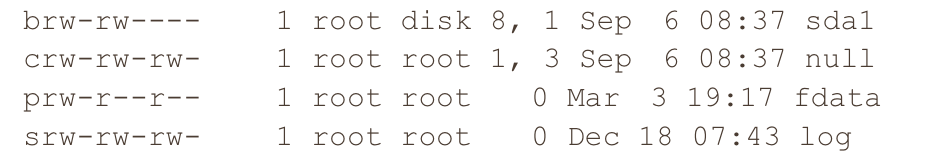

请注意上面每一行的第一个字符（代表文件模式），字符b（block），c（character），p（pipe）和s（socket）代表设备文件。

####块设备（Block device）

- 程序从块设备中按固定的块大小读取数据。前面的例子中，sda1是一个磁盘文件，它是块设备的一种。我们能够轻松地将磁盘划分成数据区块。因为磁盘的容量是固定的，索引起来也很方便，进程能够通过内核访问磁盘上的任意区块。

####字符设备（Character device）

- 字符设备处理流数据，你只能对字符设备读取和写入字符数据，如前面例子中的/dev/null。字符设备没有固定容量，当你对字符设备进行读写时，内核对相应的设备进行读写操作。字符设备的一个例子是打印机，值得注意的是，内核在流数据送达设备和进程后不会备份和再次验证。

####管道设备（Pipe device）

- 和字符设备类似，不同的是输入输出端不是内核驱动程序，而是另外一个进程。

###套接字设备（Socket device）

- 套接字是夸进程通讯经常用到的特殊接口。它们经常会存放于/dev目录之外。套接字文件代表Unix域套接字，我们将在**第十章**详细介绍。

在**例3-1**的第1、2行中，日期前的两个数字代表主次设备号，它们是内核用来识别设备的数字。相同类型的设备一般有相同的主设备号，比如：sda3和sdb1（它们都是磁盘分区）。

**注解**

*并不是所有的设备都有对应的设备文件，因为块设备和字符设备在一些场合中比较特殊。例如，网络接口没有设备文件，虽然其理论上可以使用字符设备来代表，但是实现起来实在很困难，所以内核采用了其他的I/O接口。*

##3.2 sysfs设备路径

Unix系统中的/dev目录为用户进程使用内核支持的设备提供了便利，但是它过于简单。/dev目录中的文件名包含有关设备的一些信息，但是不是很详尽。另一个问题是内核根据其找到设备的顺序为设备文件命名，所以系统每次重新启动后，设备文件名有可能不同。

Linux内核提供sysfs界面，旨在统一显示硬件相关信息。它是一个文件和目录系统，以/sys/devices为根路径。例如，/dev/sda代表的SATA硬盘在sysfs中的路径是：

/sys/devices/pci0000:00/0000:00:1f.2/host0/target0:0:0/0:0:0:0/block/s
da

你可以看到，这个路径比/dev/sda长很多，它们的作用不一样。/dev目录中的文件是供用户进程使用的，而/sys/devices中的文件是用来查看设备信息和管理设备用的。如果你打开文件就能够看到类似下面的内容：

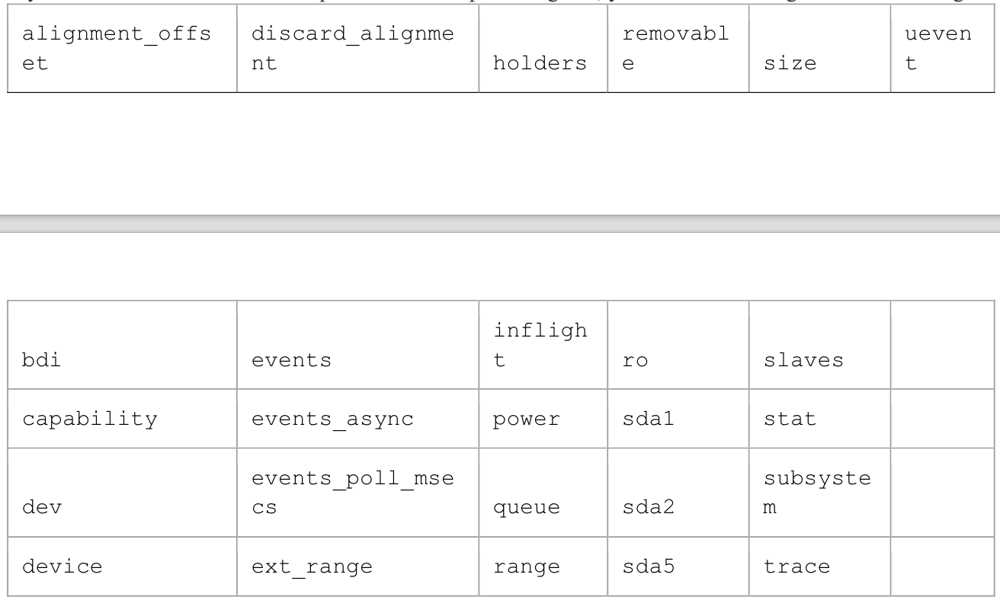

这些目录和文件一般都是供程序而不是用户访问的。运行命令cat dev会显示数字8:0，即/dev/sda设备的主要和次要编号。

/sys目录下有几个快捷方式。例如，/sys/block目录中包含所有块设备文件，不过它们都是符号链接。运行命令ls -l /sys/block可以显示指向sysfs的实际路径。

在/dev目录中查看设备文件的sysfs路径不太方便，可以使用udevadm命令来查看：

$ udevadm info --query=all --name=/dev/sda

**注解**

*udevadm命令在/sbin目录下，你可以将该目录加到你的路径中。*

udevadm我们将在**3.5 udev**中详细介绍。

##3.3 dd命令和设备

dd命令对于块设备和字符设备非常有用，它的主要功能是从输入文件和输入流读取数据然后写入输出文件和输出流，在此过程中可能涉及到编码转换。

dd命令拷贝固定大小的数据块，例如：

$ dd if=/dev/zero of=new_file bs=1024 count=1

dd命令的格式选项和大多数其他Unix命令不同，它沿袭了从前的IBM Job Control Language（JCL）的风格。它使用=号而不是-来设定选项和参数值。上面的例子是从/dev/zero拷贝一个大小为1024字节的数据块到文件new_file。

以下是dd命令的一些重要选项：

- if=file，代表输入文件。默认是标准输出。
- of=file，代表输出文件。默认是标准输入。
- bs=size，代表数据块大小。dd命令一次读取或者写入数据的大小。对于海量数据，你可以在数字后设置b和k来分别代表512字节和1024字节。如：bs=1k和bs=1024一样。
- ibs=size，obs=size，代表输入和输出块大小。如果输入输出块大小相同你可以使用bs选项，如果不相同的话，可以使用ibs和obs分别指定。
- count=num，代表拷贝块的数量。在处理大文件或者无限数据流（/dev/zero）的时候，你可能会需要在某个地方停止dd拷贝，不然的话将会消耗大量硬盘空间和CPU时间。这时你可以使用count和skip选项从大文件和设备中拷贝一小部分数据。
- skip=num，代表跳过前面的num个块，不将它们拷贝到输出。

**警告**

*dd命令功能非常强大，你需要先对其充分了解再使用，否则很容易损坏文件和设备上的数据。dd命令通常用来将输出数据写入到新文件。*

##3.4 设备名总结

有时候查找设备的名称不是很方便（比如在为硬盘分区的时候），下面我们介绍一些简便的方法：

- 使用udevadm命令来查询udevd（见**3.5 udev**）。
- 在/sys目录下查找设备。
- 从dmesg（它显示最新的内核消息，见**7.2 系统日志**）命令的输出或者内核系统日志中查获设备名。这些地方通常会有系统设备的描述信息。
- 对系统已经找到的硬盘设备，可以使用mount命令查看结果。
- 运行cat /proc/devices查看系统上的块设备和字符设备。输出结果中的每一行包含设备的主要编号和名称（见**3.1 设备文件**）。你可以根据主要编号到/dev目录中查找对应的块设备和字符设备文件。

这些方法中第一个方法比较可靠，但是它需要udev。如果你的系统中没有udev的话，你可以尝试其他的方法，尽管有时候内核并没有一个设备文件来对应你要找的设备。

下面我们列出一些Linux系统中设备的命名规范。

###3.4.1 硬盘：/dev/sd*

Linux系统中的硬盘设备大部分都以sd为前缀来命名，如：/dev/sda，/dev/sdb等。这些设备代表整块硬盘，内核使用单独的设备文件名来代表硬盘上的分区，如：/dev/sda1，/dev/sda2。

这里需要进一步解释一下命名规范。sd代表SCSI disk。精简指令计算机（Small Computer System Inteface，SCSI）最初是作为设备之间通讯的硬件协议标准而开发的，虽然现在的计算机并没有使用传统的SCSI硬件，但是SCSI协议的运用却非常广泛。例如，USB存储设备使用SCSI协议进行通讯。SATA硬盘的情况相对复杂一些，但是Linux内核仍然在某些场合使用SCSI命令和它们通讯。

我们可以使用sysfs系统提供的命令来查看系统中的SCSI设备。最常用的命令之一是：lsscsi。运行结果如下例所示：

$ lsscsi

[0:0:0:0]➊	disk➋ ATA WDC WD3200AAJS-2 01.0 /dev/sda➌

[1:0:0:0]	cd/dvd Slimtype DVD A DS8A5SH XA15 /dev/sr0

[2:0:0:0]	disk FLASH Drive UT_USB20 0.00 /dev/sdb

第1列➊是设备在系统中的地址，第2列➋是设备的描述信息，最后一列➌是设备文件的路径。其余的是设备提供商的相关信息。

Linux按照设备驱动程序检测到设备的顺序来分配设备文件。在前面的例子中，内核先检测到disk，然后是cd/dvd，最后是flash drive。

悲剧的是这种方式在重新配置硬件时会导致一些问题。比如说你的系统有三块硬盘：/dev/sda，/dev/sdb和/dev/sdc。如果/dev/sdb损坏了，你必须将其移除才能使系统正常工作，然而/dev/sdc已经不存在了，之前的/dev/sdc现在成了/dev/sdb。如果你在fstab文件（见**4.2.8 /etc/fstab文件系统表**）中引用了/dev/sdc，你就必须更新此文件。为了解决这个问题，大部分现代的Linux系统使用通用唯一标识符（Universally Unique Identifier，缩写UUID，见**4.2.4 文件系统UUID**）来访问设备。

这里提到的内容不涉及硬盘和其他存储设备的使用细节，相关内容我们将在**第四章**介绍。在本章稍后我们会介绍SCSI如何支持Linux内核的运行。

###3.4.2 CD和DVD：/dev/sr*

Linux系统能够将大多数光学存储（optical storage）设备识别为SCSI设备，如：/dev/sr0，/dev/sr1等。但是如果光驱使用的是老接口的话，可能会被识别为PATA设备。/dev/sr*设备是只读的，它们用于从光盘上读取数据。可读写光盘驱动用/dev/sg0这样的设备文件表示，g代表“generic”。

###3.4.3 PATA硬盘：/dev/hd*

老版本的Linux内核常用设备文件：/dev/hda，/dev/hdb，/dev/hdc和/dev/hdd来代表老的块设备。这是基于主从设备接口0和1的固定设置方式。SATA设备有时候也会被这样识别，这表示SATA设备运行在兼容模式中，会造成性能损失。你可以检查你的BIOS设置，看看能否将SATA控制器切换到它原有的模式。

###3.4.4 终端设备：/dev/tty*，/dev/pts/*，和/dev/tty

终端设备负责在用户进程和输入输出设备之间传送字符，通常是在终端显示屏上显示文字。终端设备接口由来已久，一直可以追溯到手动打字机时代。

伪（pseudoterminal）终端设备模拟终端设备的功能，由内核为程序提供I/O接口，而不是真实的I/O设备，shell窗口就是伪终端。

常见的两个终端设备是/dev/tty1（第一虚拟控制台）和/dev/pts/0（第一虚拟终端），/dev/pts目录中有一个专门的文件系统。

/dev/tty代表当前进程正在使用的终端设备，虽然不是每个进程都连接到一个终端设备。

####显示模式和虚拟控制台

Linux系统有两种显示模式：文本模式和图形模式（X Windows System server，通过图形管理器），通常系统是在文本模式下启动，但是很多Linux版本通过内核参数和内置图形显示机制（如：plymouth）将文本模式完全屏蔽起来，这样系统从始至终是在图形模式下启动。

Linux系统支持虚拟控制台来实现多个终端的显示，虚拟控制台可以在文本模式和图形模式下运行。在文本模式下，你可以使用ALT-Function在控制台之间进行切换，例如ALT-F1切换到/dev/tty1，ALT-F2切换到/dev/tty2等等。这些控制台通常会被getty进程占用以显示登录提示符，详见**7.4 getty和login**。

X server在图形模式下使用的虚拟控制台稍微有些不同，它不是从init配置中获得虚拟控制台，而是由X server来控制一个空闲的虚拟控制台，除非另外指定。例如，如果tty1和tty2上运行着getty进程，X server就会使用tty3。此外，X server将虚拟控制台设置为图形模式后，通常需要按CTRL-ALT-Function而不是ALT-Function来切换到其他虚拟控制台。

如果你想在系统启动后使用文本模式，可以按CTRL-ALT-F1，按ALT-F2，ALT-F3等返回X11 session。

如果在切换控制台的时候遇到问题，你可以尝试chvt命令强制系统切换工作台。例如：使用root运行以下命令切换到tty1：

\# chvt 1

###3.4.5 串行端口：/dev/ttyS*

老式的RS-232和串行端口是特殊的终端设备，串行端口设备在命令行上运用不太广，原因是需要处理诸如波特律和流控制等参数的设置。

Windows上的COM1端口在Linux中表示为/dev/ttyS0，COM2表示为/dev/ttyS1，以此类推。可插拔USB串行适配器在USB和ACM模式下分别表示为：/dev/ttyUSB0，/dev/ttyACM0，/dev/ttyUSB1，/dev/ttyACM1等等。

###3.4.6 并行端口：/dev/lp0和/dev/lp1

单向并行端口设备，目前被USB广泛取代的一种接口类型，表示为：/dev/lp0和/dev/lp1，分别代表Windows中的LPT1:和LPT2:。你可以使用cat命令将整个文件（比如说要打印的文件）发送到并行端口，执行完毕后你可能需要向打印机发送另外的指令（form feed或reset）。象CUPS这样的打印服务相比打印机来说提供了更好的用户交互体验。双向并行端口表示为：/dev/parport0和/dev/parport1。

###3.4.7 音频设备：/dev/snd/*，/dev/dsp，/dev/audio，和其他

Linux系统有两组音频设备，分别是高级Linux声音架构（Advanced Linux Sound Architecture, ALSA）和开放声音系统（Open Sound System, OSS）。ALSA在/dev/snd目录下，要直接使用不太容易。如果Linux系统中加载了OSS内核支持，则ALSA可以向后兼容OSS设备。

OSS dsp和audio设备支持一些基本的操作。例如，可以将WAV文件发送给/dev/dsp来播放。然而如果频率不匹配的话，硬件有可能无法正常工作。并且在大多数系统中，音频设备在你登录时通常处于忙状态。

**注解**

*Linux的音频处理非常复杂，因为涉及很多层细节。我们刚刚介绍的是内核级设备，通常在用户空间中还有puls-audio这样的服务来负责处理不同来源和声音设备的音频处理。*

###3.4.8 创建设备文件

在现代Linux系统中，你不需要创建自己的设备文件，这个工作由devtmpfs和udev（见**3.5 udev**）来完成。不过了解一下这个过程总是有益的，已备不时之需。

mknod命令用来创建设备。你必须知道设备名以及主要和次要编号。例如，可以使用一下命令创建设备/dev/sda1：

\# mknod /dev/sda1 b 8 2

参数b 8 2分别代表快设备，主要编号8，和次要编号2。字符设备使用c，命名管道使用p（主要和次要编号可忽略）。

用mknod命令来创建临时的命名管道很方便，也可以用于在系统恢复的时候创建丢失的设备文件。

在老版本的Unix和Linux系统中，维护/dev目录不是一件容易的事情。内核每次更新和增加新的驱动程序，能支持的设备就更多，同时也意味着一些新的主要和次要编号被指定给设备文件。为了方便维护，系统使用/dev目录下的MAKEDEV程序来创建设备组。在系统升级的时候你可以看看有没有新版本的MAKEDEV，如果有的话可以运行它来创建新设备。

这样的静态管理系统非常不好用，所以出现了一些新的选择。首先是devfs，它是/dev在内核空间的一个实现版本，包含所有内核支持的设备。但是它的种种局限使得人们又开发了udev和devtmpfs。

##3.5 udev

我们已经介绍过，内核中的一些豪无必要的复杂功能会降低系统的稳定性。设备文件管理就是一个很好的例子，如果你可以在用户空间内创建设备文件的话，就不需要在内核空间做。Linux系统内核在检测到新设备的时候（如：发现一个USB存储器），会向用户空间进程发送消息（称为udevd）。用户空间进程会验证新设备的属性，创建设备文件，执行初始化。

理论上是如此，实际上这个方法有一些问题，系统启动前期即需要设备文件，所以udevd需要在其之前启动。udevd不能依赖于任何设备就可以创建设备文件，它必须尽快启动以免拖延整个系统。

###3.5.1 devtmpfs

devtmpfs文件系统正是为了解决上述问题而开发的（详情见**4.2 文件系统**）。它类似老的devfs系统，但是更简单。内核根据需要创建设备文件，并且在新设备可用时通知udevd。udevd在收到通知后并不创建设备文件，而是进行设备初始化以及发送消息通知。此外还在/dev目录中为设备创建符号链接文件。你可以在/dev/disk/by-id目录中找到一些实例，其中每个硬盘对应一个或者多个文件。

例如下面的例子：

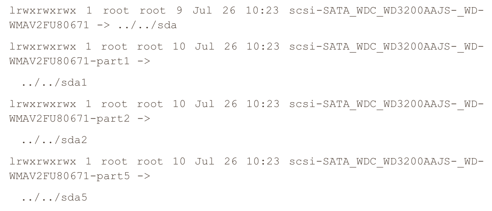

udevd使用接口类型名称、厂商、型号、序列号、分区（如果有的话）的组合来命名符号链接。

下一节介绍udevd是怎样创建符号链接文件的，不过你现在并不需要马上了解。实际上如果你是第一次接触Linux设备管理，你可以直接跳到下一章去了解如何使用硬盘。

###3.5.2 udevd的操作和配置

udevd守护进程（daemon）是这样工作的：

1. 内核通过一个内部网络连接向udevd发送消息（uevent）。
2. udevd加载uevent中的所有属性信息。
3. udevd通过规则解析来决定执行哪些操作和增加哪些属性信息。

呼入uevent是udevd从内核接收到的消息，如下面所示：

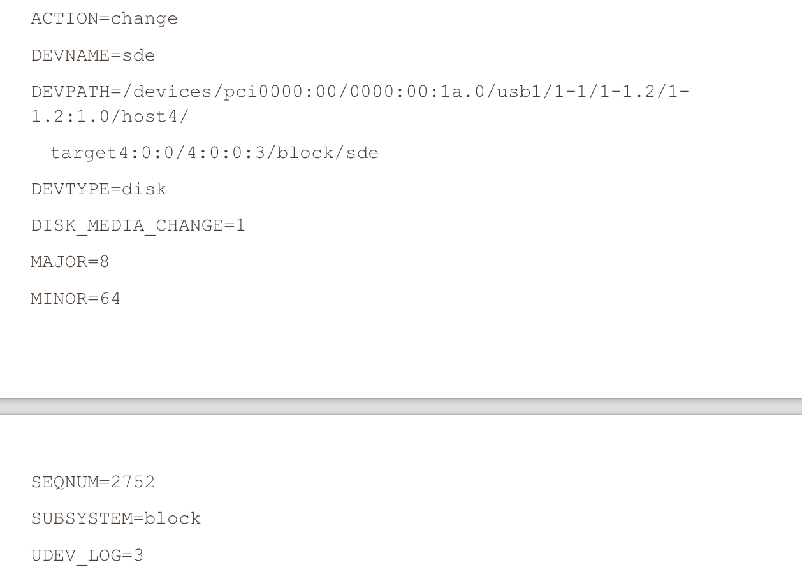

你能够看到上例对设备做了一处修改，接收到uevent以后，udevd获得了sysfs的设备路径和一些属性信息，现在可以执行规则解析了。

规则文件位于/lib/udev/rules.d和/etc/udev/rules.d目录中。缺省规则在/lib目录中，会被/etc中的规则覆盖。有关规则的详细内容非常多，你可以参考udev(7)帮助手册。现在让我们看一下**3.5.1 devtmpfs**中/dev/sda一例中的符号链接。这些链接是在/lib/udev/rules.d/60-persistent-storage.rules中定义的。你能够在其中找到如下内容：

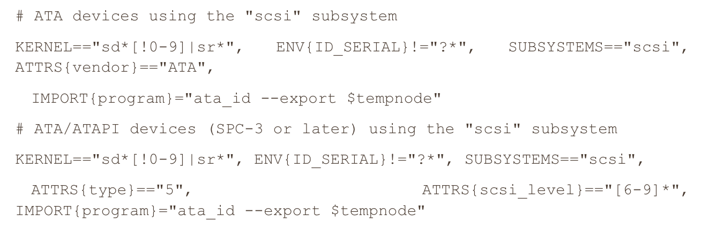

这些规则和内核SCSI子系统呈现的ATA硬盘相匹配（参见**3.6 深入SCSI和Linux内核**）。你可以看到udevd尝试匹配以sd或者sr开头但是不包含数字的设备名（通过表达式：KERNEL=="sd*[!0-9]|sr*"），以及匹配子系统（SUBSYSTEMS=="scsi"）和其他一些属性。如果上述所有条件都满足，则进行下一步：

IMPORT{program}="ata_id --export $tempnode"

这不是一个条件，而是一个指令，它从/lib/udev/ata_id命令导入变量。如果你有匹配的设备，可以试着执行以下命令行：

$ sudo /lib/udev/ata_id --export /dev/sda ID_ATA=1
ID_TYPE=disk
ID_BUS=ata
ID_MODEL=WDC_WD3200AAJS-22L7A0
ID_MODEL_ENC=WDC\x20WD3200AAJS22L7A0\x20\x20\x20\x20\x20\x20\x20\x20\x
20\x20
  \x20\x20\x20\x20\x20\x20\x20\x20\x20
ID_REVISION=01.03E10
ID_SERIAL=WDC_WD3200AAJS-22L7A0_WD-WMAV2FU80671
--snip--

上面所有变量名都被设置了相应的值，ENV{ID_TYPE}的值对后面的规则都为disk。

ID_SERIAL需要特别注意一下，在每一个规则中都有这个条件行：

ENV{ID_SERIAL}!="?*"

意思是如果ID_SERIAL变量没有被设置，条件语句返回true，反之如果变量被设置，则为false，当前规则返回false，udevd继续解析下一规则。

这是什么意思呢？这两条规则的目的是找出硬盘设备的序列号，如果ENV{ID_SERIAL}被设置，udevd就能够解析下面的规则：

KERNEL=="sd*|sr*|cciss*", ENV{DEVTYPE}=="disk", ENV{ID_SERIAL}=="?*",
  SYMLINK+="disk/by-id/$env{ID_BUS}-$env{ID_SERIAL}"

你可以看到这个规则要求ENV{ID_SERIAL}被赋值，它有如下指令：

SYMLINK+="disk/by-id/$env{ID_BUS}-$env{ID_SERIAL}"

执行这个指令时，udevd为新加入的设备创建一个符号链接。现在我们可以知道设备符号链接的来由。

你也许会问如何在指令中判断条件表达式，条件表达式使用==和!=，而指令使用=，+=，或者:=。

###3.5.3 udevadm

udevadmin是udevd的管理工具，你可以使用它来重新加载udevd规则，触发消息，它功能强大之处在于搜寻和浏览系统设备以及监控udevd从内核接收的消息。使用udevadmin需要掌握一些命令行语法。

我们首先来看看如何检验系统设备。回顾一下**3.5.2 udevd操作和配置**中的例子，我们使用以下命令来查看设备（如：/dev/sda）的udev属性和规则：

$ udevadm info --query=all –-name=/dev/sda

运行结果如下：

P:
/devices/pci0000:00/0000:00:1f.2/host0/target0:0:0/0:0:0:0/block/sda
N: sda
S: disk/by-id/ata-WDC_WD3200AAJS-22L7A0_WD-WMAV2FU80671
S: disk/by-id/scsi-SATA_WDC_WD3200AAJS-_WD-WMAV2FU80671
S: disk/by-id/wwn-0x50014ee057faef84 S: disk/by-path/pci-0000:00:1f.2- scsi-0:0:0:0
E: DEVLINKS=/dev/disk/by-id/ata-WDC_WD3200AAJS-22L7A0_WD-WMAV2FU80671 /dev/disk/by-id/scsi
-SATA_WDC_WD3200AAJS-_WD-WMAV2FU80671 /dev/disk/by-id/wwn-
0x50014ee057faef84 /dev/disk/by
  -path/pci-0000:00:1f.2-scsi-0:0:0:0
E: DEVNAME=/dev/sda
E:
DEVPATH=/devices/pci0000:00/0000:00:1f.2/host0/target0:0:0/0:0:0:0/blo
ck/sda
E: DEVTYPE=disk
E: ID_ATA=1
E: ID_ATA_DOWNLOAD_MICROCODE=1 E: ID_ATA_FEATURE_SET_AAM=1 
--snip--

其中每一行的前缀代表设备的属性值，如P:代表sysfs设备路径，N:代表设备节点（/dev下的设备文件名），S:代表指向设备节点的符号链接，由udevd在/dev目录中根据其规则生成，E:代表从udevd规则中获得的额外信息。（另外还有很多其他的信息，你可以自己运行命令看一看。）

###3.5.4 设备监控

在udevadm中监控uevents可以使用monitor命令：

$ udevadm monitor

例如，如果你插入一个闪存盘，该命令执行结果如下：

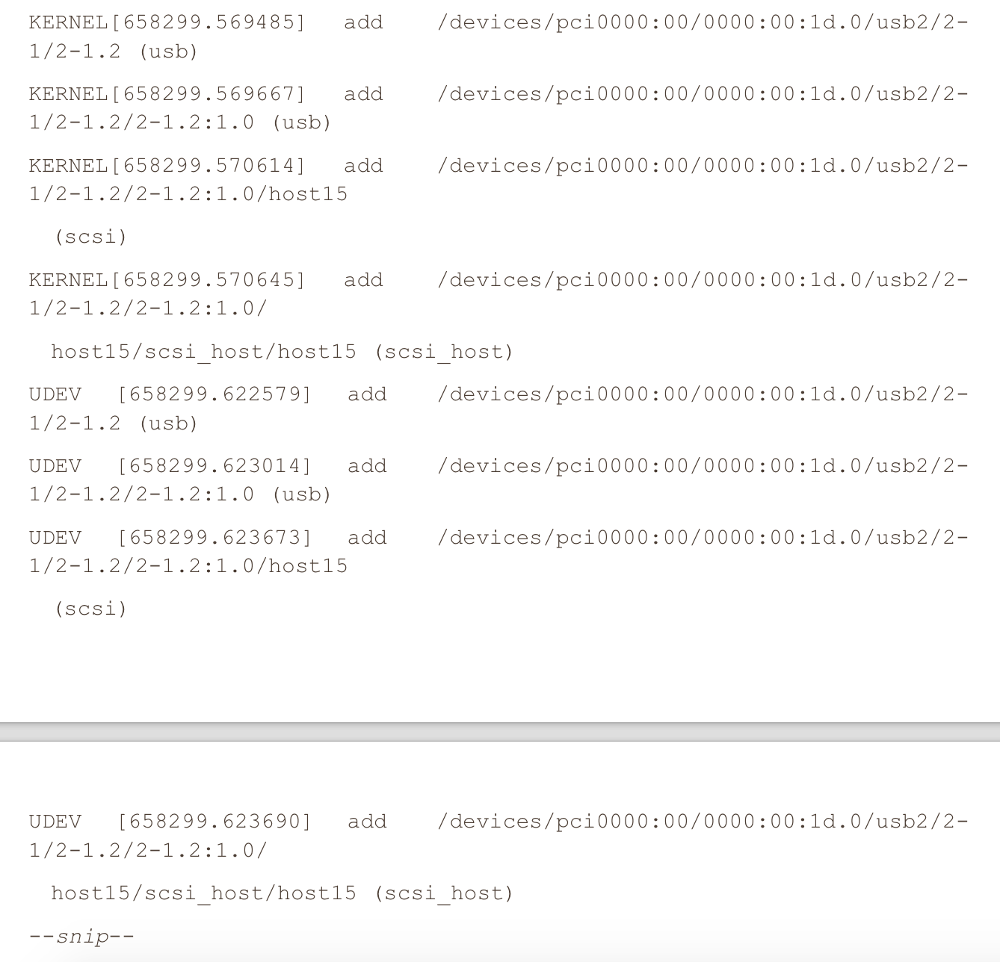

上面结果中，每个消息对应有两行信息，因为命令默认显示从内核接收的呼入消息（用KERNEL标记）和udevd在处理该消息时发送给其他程序的消息。如果只想看内核发送的消息，可以使用--kernel选项，只看udev发送的消息可以用--udev。查看呼入消息的所有属性（见**3.5.2 udevd的操作和配置**）可以使用--property选项。

你还可以使用子系统来过滤消息。例如，如果只想看和SCSI有关的内核消息，可以使用下面的命令：

$ udevadm monitor --kernel --subsystem-match=scsi

udevadm的更多内容可以参考udevadm(8)使用手册。

关于udev还有很多内容，比如处理中间通讯的D-Bus系统有一个守护进程叫做udisks-daemon，它通过监听udevd的呼出消息来自动通知桌面应用系统发现了新的硬盘。

##3.6 深入SCSI和Linux内核

本节我们将介绍Linux内核对SCSI的支持，借此机会了解一下Linux内核的架构。本节的内容偏理论，如果你想急着了解如何使用硬盘，可以直接跳到第4章。

首先我们介绍一下SCSI的背景知识，传统的SCSI硬件设置是通过SCSI总线链接设备到主机适配器，如**图3-1**所示。主机适配器和设备都有一个SCSI ID，每个总线有8到16个ID（不同版本数量不同）。SCSI 目标（SCSI target）指的是设备及其SCSI ID。

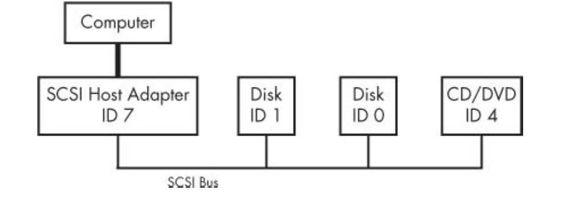

图3-1. 有主机适配器和设备的SCSI总线

计算机并不和设备链直接连接，所以必须通过主机适配器和设备通讯。主机适配器通过SCSI命令集与设备进行一对一通讯，设备向其发送响应消息。

更新版本的SCSI如Serial Attached SCSI （SAS）的性能更出色，不过大部分计算机中并没有真正意义的SCSI设备。更多的是那些使用SCSI命令的USB存储设备。支持ATAPI的设备（如：CD/DVD-ROM）也使用某个版本的SCSI命令集。

SATA硬盘在系统中通常由一个处于libata层（见**3.6.2 SCSI和ATA**）的转换机制呈现为SCSI设备。一些SATA控制器（特别是高性能RAID控制器）使用硬件来实现这个转换。

让我们用下面这个例子将上述内容整合起来：

$ lsscsi

[0:0:0:0] disk ATA WDC WD3200AAJS-2 01.0 /dev/sda 
[1:0:0:0] cd/dvd Slimtype DVD A DS8A5SH XA15 /dev/sr0 
[2:0:0:0] disk USB2.0 CardReader CF 0100 /dev/sdb [2:0:0:1] disk USB2.0 CardReader SM XD 0100 /dev/sdc
[2:0:0:2] disk USB2.0 CardReader MS 0100 /dev/sdd 
[2:0:0:3] disk USB2.0 CardReader SD 0100 /dev/sde 
[3:0:0:0] disk FLASH Drive UT_USB20 0.00 /dev/sdf

方括号中的数字是SCSI主机适配器编号，SCSI总线编号，设备SCSI ID，以及LUN（逻辑元件编号，设备的字设备）。本例中有4个适配器（scsi0，scsi1，scsi2，scsi3），它们都有一个单独的总线（总线编号都是0），每个总线上有一个设备（target编号都是0）。编号为2:0:0的USB读卡器有4个逻辑单元，每个代表一个可插入闪存盘。内核为每个逻辑单元指定一个不同的设备文件。

图3-2显示内核中该部分的驱动和接口程序结构，从单个设备驱动上到快设备驱动，但是不包括SCSI通用驱动。

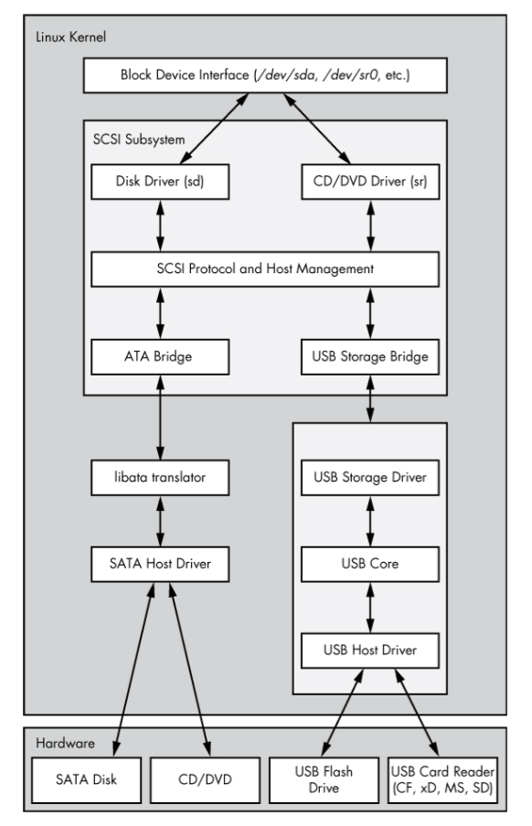

图3-2. Linux SCSI subsystem schematic

上图看起来很复杂，实际上整个结构是非常线性的。我们先从SCSI子系统和它的三层驱动开始：

- 最顶层负责处理某一类设备。例如，sd（SCSI硬盘）驱动就在这一层，它负责将来自内核块设备接口的请求消息翻译为SCSI协议中的硬盘相关命令，反之亦然。
- 中间层在上下层之间调控和分流SCSI消息，并且负责管理系统中的所有SCSI总线和设备。
- 最底层负责处理硬件相关操作。该层中的驱动程序向特定的主机适配器发送SCSI协议消息，并且提取从硬件发送过来的消息。该层和最顶层分开的原因是，虽然SCSI消息对某类设备是统一的，但是不同类型的主机适配器处理同类消息的方式会不一样。

最顶层和最底层中有许多各式各样的驱动程序，但是需要注意，对每一个设备文件，内核都使用一个顶层中的驱动程序和一个底层中的驱动程序。对我们例子中的/dev/sda硬盘来说，内核使用顶层的sd和底层的ATA bridge。

有时候你可能需要使用一个以上的顶层驱动程序（参见**3.6.3 通用SCSI设备**）。对于真正的SCSI设备，如：连接到SCSI主机适配器活着硬件RAID的硬盘，底层驱动程序直接和下方的硬件通讯，这与大部分SCSI子系统中的设备不同。

###3.6.1 USB存储设备和SCSI

如**图3-2**所示，内核需要更多那样的底层SCSI驱动来支持SCSI子系统和USB存储设备硬件的通讯。/dev/sdf代表的USB闪存驱动支持SCSI命令，但是不和驱动通讯，所以由内核来负责和USB系统的通讯。

理论上，USB和SCSI很类似，包括设备类别、总线、主机控制器，所以和SCSI类似，Linux内核也有一个三层USB子系统。最顶层是同类设备驱动，中间层是总线管理，最底层是主机控制驱动。和SCSI类似，USB子系统通过USB消息在其组件之间通讯，它还有一个和lsscsi类似的命名叫lsusb。

最顶层是我们介绍的重点，在这里驱动程序如同一个翻译，它对一方使用SCSI协议通讯，对另一方使用USB协议，并且存储硬件在USB消息中包含了SCSI命令，所以启动程序要做的翻译工作仅仅是重新打包消息数据。

有了SCSI和USB子系统，你就能够和闪存驱动通讯了。还有不要忘了SCSI子系统更底层的驱动程序，因为USB存储驱动是USB子系统的一部分，而非SCSI子系统。（出于某些原因，两个子系统不能共享驱动程序）。如果一个子系统要和其他子系统通讯，需要使用一个简单的底层SCSI桥接驱动来连接USB子系统的存储驱动程序。

###3.6.2 SCSI和ATA

图Figure 3-2中的SATA硬盘和光驱使用的都是SATA接口。和USB驱动一样，内核需要一个桥接驱动来将SATA驱动连接到SCSI子系统，不过使用的是另外的更复杂的方式。光驱使用ATAPI协议通讯，它是使用了ATA协议编码的一种SCSI命令。然而硬盘不使用ATAPI和编码的SCSI命令。

Linux内核使用libata库来协调SATA（以及ATA）驱动和SCSI子系统。对于支持ATAPI的光驱，问题变得很简单，只需要提取和打包往来于ATA协议上的SCSI命令即可。对于硬盘就复杂得多，libata库需要一整套命令翻译机制。

光驱的作用类似于把一本英文书敲入计算机。你不需要了解书的内容，甚至不懂英文也没关系。硬盘的工作则类似把一本德文书翻译成英文并敲入计算机。所以你必须懂两种语言，以及了解书的内容。

libata能够将SCSI子系统连接到ATA/SATA接口和设备。（为了简单起见，图Figure 3-2只包含了一个SATA主机驱动，实际上涉及的不止一个驱动）

###3.6.3 通用SCSI设备

用户空间进程和SCSI子系统的通讯通常是通过块设备层和（或者）在SCSI设备类驱动之上的另一个内核服务（如：sd或者sr）来进行。换句话说，大多数用户进程不需要了解SCSI设备和命令。

然而，用户进程也可以绕过设备类驱动通过通用设备（generic devices）和SCSI设备直接通讯。例如我们在3.6 深入SCSI和Linux内核中介绍过的，我们使用lsscsi的-g选项来显示通用设备，结果如下：

$ lsscsi -g

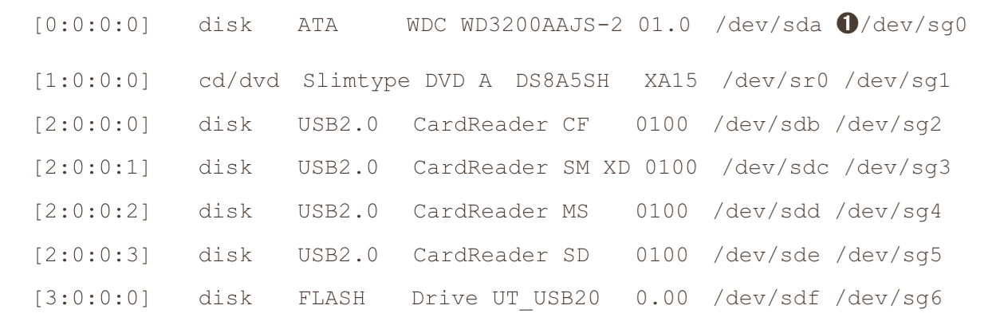

除了常见的块设备文件，上面的每一行还在最后一列➊显示SCSI通用设备文件。例如光驱/dev/sr0的通用设备是/dev/sg1。

那么我们为什么需要SCSI通用设备呢？原因来自内核代码的复杂度。当任务变得越来越复杂的时候，最好是将其从内核移出来。我们可以考虑下CD/DVD的读写操作，写数据操作比读复杂得多，并且没有任何关键的系统服务需要依赖于CD/DVD的写数据操作。使用用户空间进程来写数据也许比使用内核服务要慢，但是却更容易开发和维护，并且如果有bug也不会影响到内核空间。所以在向CD/DVD写数据时，进程就使用象/dev/sg1这样的通用SCSI设备。至于读取数据，虽然很简单，但我们仍然使用内核中一个特制的sr光驱驱动来完成。

###3.6.4 访问设备的多种方法

**图3-3**展示了从用户空间访问光驱的两种方法：sr和sg（图中忽略了在SCSI更下层的驱动）。进程A使用sr驱动来读数据，进程B使用sg驱动。然而，它们之间并不是并行访问的。

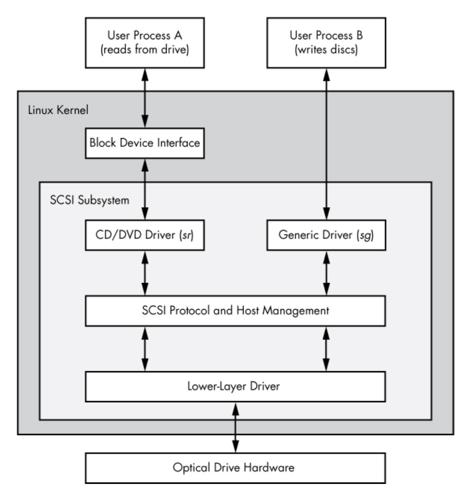

图3-3. 光学设备图解

图中进程A从块设备读取数据，但是通常用户进程不使用这样的方式读取数据，至少不是直接读取。在块设备之上还有很多的层和访问入口，我们将在下一章介绍。

------

#第四章 硬盘和文件系统

在**第三章**中我们讨论了内核提供的顶层磁盘设备。本章我们将详细介绍如何在Linux系统中使用磁盘设备。你将会掌握如何为磁盘分区，在分区中创建和维护文件系统，以及交换空间。

磁盘设备对应/dev/sda这样的设备文件，它代表SCSI子系统中的第一个磁盘。诸如这样的块设备代表整块磁盘，磁盘中又包含很多不同的组件和层。

*图4-1*显示了典型的Linux磁盘的大致结构，本章将逐一介绍其中的各个部分。

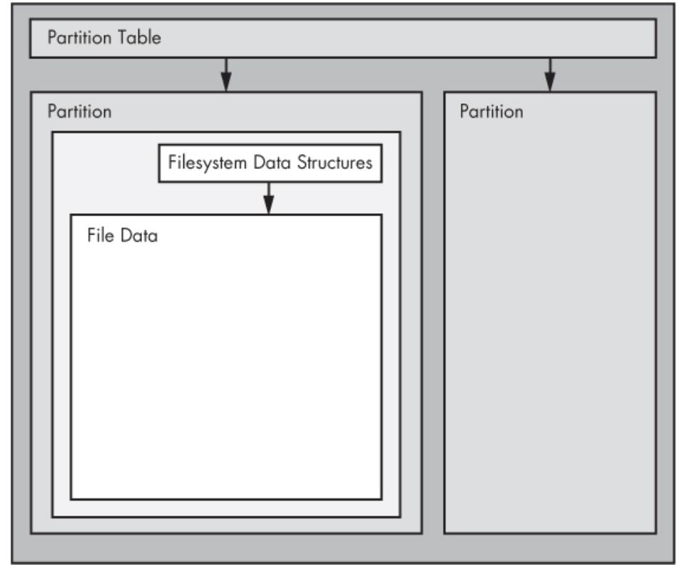

图4-1. Linux磁盘图解

分区是对整块磁盘的进一步划分，在Linux系统中由磁盘名称加数字来表示，比如：/dev/sda1和/dev/sdb3。内核将分区用块设备呈现，如同每个分区是一整块的磁盘。分区数据存放在磁盘上的分区表中（partition table）。

**注解**

*通常我们会在一块大磁盘上划分多个分区，因为老的计算机系统只能使用磁盘上的特定部分来启动。系统管理员也通过分区来为操作系统预留一定的空间。例如，管理员不希望用户用满整个磁盘从而导致系统无法工作。这些做法不只见于Unix，Windows也是这样。此外，大部分的系统还有一个单独的交换分区。*

虽然内核允许你同时访问整块磁盘和某个分区，但是一般不需要这样做，除非你在拷贝整个磁盘。

分区之下的一层是文件系统，文件系统是用户空间中与你日常交互的文件和目录数据库。我们将在**4.2 文件系统**中详细介绍。

如**图4-1**所示，如果你想要访问文件中的数据，你需要从分区表中获得分区所在位置，然后在该分区的文件系统数据库中查找指定文件的数据。

Linux内核使用**图4.2**中的各个层来访问磁盘上的数据。SCSI子系统和我们在**3.5 深入SCSI和Linux内核**中介绍的内容由一个框代表。（请注意，你可以通过文件系统或者磁盘设备来访问磁盘，我们本章都将介绍）

让我们从最底部的分区开始。

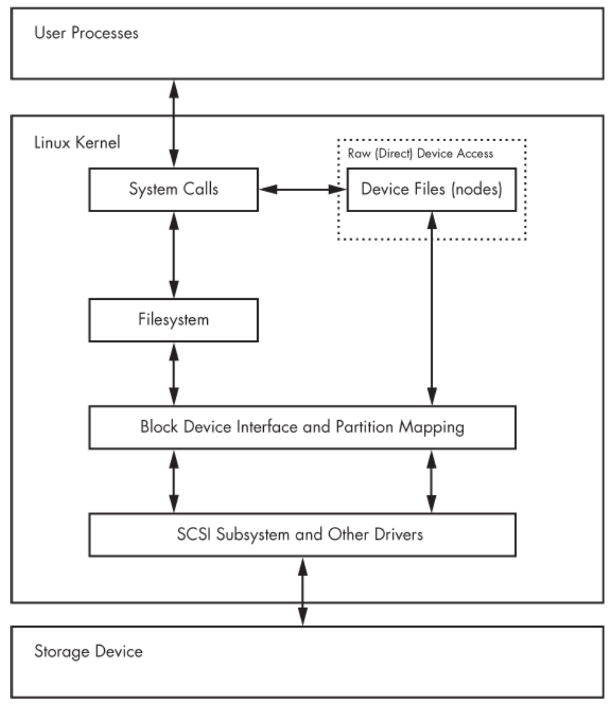

图4-2. 内核磁盘访问图解

##4.1 为磁盘设备分区

分区表有很多种，比较典型的一种叫主引导记录（Master Boot Record，MBR）。另一种逐渐普及的是全局唯一标识符分区表（Globally Unique Identifier Partition Table，GPT）。

下面是Linux系统中的各种分区工具：

- parted，一个文本命令工具，支持MBR和GPT。
- gparted，parted的图形版本。
- fdisk，Linux传统的文本命令分区工具，不支持GPT。
- gdisk，fdisk的另一个版本，支持GPT，但不支持MBR。

虽然很多人喜欢使用fdisk，本书将着重介绍支持MBR和GPT的parted。

**注解**

*parted虽然也能够创建和操作文件系统，但是你最好不要使用它来操作文件系统，因为这样会引发一些混淆。分区操作和文件系统操作还是有本质的不同。分区表划分磁盘的区域，而文件系统侧重数据管理，因此我们使用parted分区，使用另外的工具来创建文件系统（见**4.2.2 创建文件系统**），parted的文档中也是这样建议的。*

###4.1.1 查看分区表

你可以使用命令parted -l查看系统分区表。如下例所示：

\# parted -l

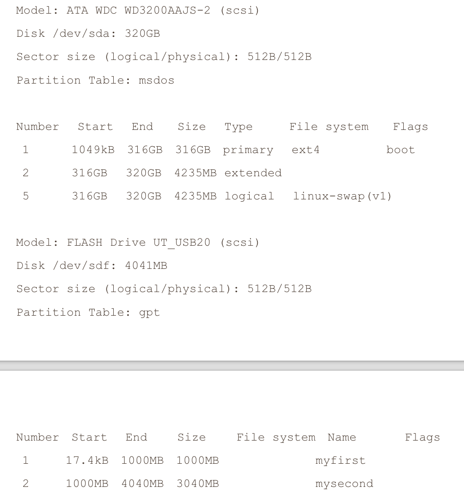

第一个设备/dev/sda使用传统的MBR分区表（parted中称为msdos），第二个设备使用GPT表。请注意由于分区表类型不同，所以它们的参数也不同。MBR表中没有名称（Name）这一列，而GPT表中则有名称列（这里我们随意取了两个myfirst和mysecond）。

上例中的MBR表包含住分区（primary），扩展分区（extended），和逻辑分区（logical）。主分区是磁盘的常规分区（如上例中的1）。MBR最多只能有4个主分区，如果需要更多分区，你要将一个分区设置为扩展分区，然后将该扩展分区划分为数个逻辑分区。上例中的2是扩展分区，在其上有逻辑分区5。

**注解**

*parted命令显示的文件系统不一定是MBR中的系统ID（system ID）。MBR系统ID只是一个数字，例如83是Linux分区，82是Linux交换分区。因而parted自己来决定文件系统。如果你想知道MBR中的系统ID，可以使用命令fdisk -l。*

####内核初始化读取

Linux内核在初始化读取MBR表示，会显示一下的调试信息（使用dmesg命令来查看）：

sda: sda1 sda2 < sda5 >

sda2 < sda5 >表示/dev/sda2是一个扩展分区，它包含一个逻辑分区/dev/sda5。通常你只需要访问逻辑分区，所以扩展分区可以忽略。

###4.1.2 更改分区表

查看分区表相对更改分区表来说比较简单和安全，虽然更改分区表也不是很复杂，但是还是有一定的风险，所以需要特别注意以下几点：

- 删除分区以后，分区上的数据很难被恢复，因为你删除的是该文件系统最基本的信息。所以最好事先对数据做备份。
- 确保你操作的磁盘上没有分区正在被系统使用。因为大多数Linux系统会自动挂载被删除的文件系统（参见**4.2.3 挂载文件系统**）。

切准备就绪后，你可以开始选择使用哪个分区程序了。你可以使用命令行工具parted或者图形界面工具gparted。如果你在使用GPT分区的话，可以使用gdisk。这些工具都有在线帮助，很容易掌握。（如果你的磁盘空间不够，你可以使用闪存盘等设备来尝试使用它们）

fidsk和parted有很大区别。fdisk让你首先设计好分区表，然后在退出fdisk之前才做实际的更改。parted则是在你运行命令的同时直接执行创建、更改和删除操作，你没有机会在做更改之前确认检查。

这样的区别也能够帮助我们了解它们和内核是如何交互的。fdisk和parted都是在用户空间中对分区做更改，所以没有必要为它们提供内核支持。

但是，内核还是必须负责读取分区表并将分区呈现为块设备。fdisk使用了一种相对简单的方式来处理：更改分区表之后，fdisk向内核发送一个磁盘系统调用，告诉内核需要重新读取分区表，内核会显示一些调试信息供你使用dmesg查看。例如，如果你在/dev/sdf上创建了两个分区，你会看到如下信息：

sdf: sdf1 sdf2

parted没有使用磁盘系统调用，而是在分区表被更改的时候向内核发送信号，内核也不显示调试信息。

你可以用以下方式来查看对分区的更改：

- 使用udevadm查看内核消息更改。例如：udevadm monitor --kernel会显示被删除的分区和新创建的分区。
- 在/proc/partitions中查看完整的分区信息。
- 在/sys/block/device中查看更改后的分区系统接口信息，在/dev中查看更改后的分区设备。

如果你想100%确定你是否更改了分区表，你可以使用blockdev命令。例如，要让内核重新加载/dev/sdf上的分区表，可以运行下面的命令：

\# blockdev --rereadpt /dev/sdf

到目前为止，你应该了解了磁盘分区的相关内容，如果你想了解更多有关磁盘的内容，可以继续，你也可以跳到**4.2 文件系统**去了解文件系统的内容。

###4.1.3 磁盘和分区的构造

包含可移动部件的设备会为操作系统带来一定的复杂度，因为抽象起来比较复杂。磁盘就是这样的设备，虽然你可以把它看成是一个块设备，可以随机访问其中的任何地方，但是如果你对磁盘数据规划得不好时，会导致很严重的性能问题。参见**图4-3**。

磁盘中有一个转轴，上面有一个转盘，还有一个覆盖磁盘半径的可以移动杆，上面有一个读写头，磁盘在读写头下旋转，读写头负责读取数据。读写头只能读取移动杆当前所在位置圆周范围内的数据。这个圆周我们称作柱面，大容量的磁盘通常在一个转轴上有多个转盘叠加在一起旋转。每个转盘有一到两个读写头，负责转盘正面和背面的读写。所有读写头都由一个移动杆控制，协同工作。磁盘的柱面从圆心到边缘由小变大。你可以将柱面划分为扇区。磁盘这样的构造我们称为CHS，意指柱面（cylinder）－读写头（head）－扇区（sector）。

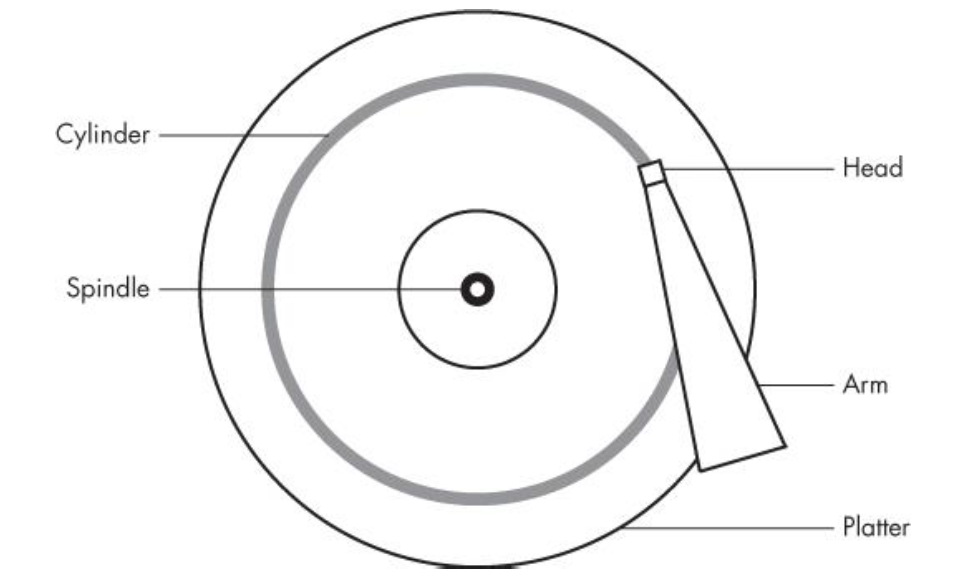

图4-3. 硬盘俯视图

**注解**

*磁盘轨道（track）是读写头访问柱面的那一部分，在**图4-3**中，柱面也是一个轨道。对磁盘轨道你可以不用深究。*

通过内核和各种分区程序你能够知道磁盘的柱面（和扇区）数。然而在现在的硬盘中这些数字并不准确。传统使用CHS的寻址方式无法适应现在的大容量硬盘，也无法处理外道柱面比内道柱面存储更多数据这样的情况。磁盘硬件支持逻辑块寻址（Logical Block Addressing, LBA），通过块编号来寻址，其余部分还是使用CHS。例如，MBR分区表包含CHS信息和对应的LBA信息，虽然一些引导装载程序仍然使用CHS，但大部分都是用LBA。

柱面是一个很重要的概念，用来设置分区边界。从柱面读取数据速度是很快的，因为磁盘的旋转可以让读写头持续地读取数据。将分区放到相邻柱面也可能够加快数据存取，因为这样可以减小读写头移动的距离。

如果你没有将分区精确地置于柱面边界，一些分区程序会提出警告，你可以忽略之，因为现在的硬盘提供的CHS信息不准确。LBA则能够确保你的分区位置正确。

###4.1.4 固态硬盘

固态硬盘(SSDs)这样的存储设备和旋转式硬盘区别很大，因为它们没有可移动的部件。由于不需要读写头在柱面上移动，所以随机存取不成问题，但是也有其他性能方面的影响。

分区布局是影响SSDs性能的一个方面。SSDs通常每次读取4096字节的数据，所以如果要读取的数据没有在同一区块内，就需要两次读取操作。这对于那些经常性的操作（读取目录内容）来说性能会降低。

许多分区工具（如：parted和gparted）能够为新分区设置合理的位置，所以你不需要担心这个问题。不过如果你想知道你的分区所在位置和边界，例如分区/dev/sdf2，你可以使用以下命令查看：

$ cat /sys/block/sdf/sdf2/start 

1953126

该分区从距离磁盘起始位置1,953,126字节的地方开始，由于不是4,096的整数倍，所以该分区在SSD上无法获得最佳性能。

##4.2 文件系统

文件系统通常是内核和用户空间之间联系的最后一环，就是通过ls和cd等命令进行交互的对象。之前介绍过，文件系统是一个数据库，它将简单的块设备映射为用户易于理解的树状文件目录结构。

以前，文件系统位于磁盘和其他类似的存储设备上，只单纯地负责数据存储。然而其树状文件目录结构和I/O接口功能多样，现在文件系统能够处理各式各样的任务，比如目录/sys和/proc中的那些系统接口。从前都是内核负责实现文件系统，Plan 9的9P（[http://plan9.bell-labs.com/sys/doc/9.html](http://plan9.bell-labs.com/sys/doc/9.html)）的出现促进了文件系统在用户空间中实现。用户空间文件系统（File System in User Space，FUSE）特性支持用户空间的文件系统实现。

抽象层虚拟文件系统（Virtual File System，VFS）负责文件系统的具体实现。象SCSI子系统将设备之间和设备与内核之间的通讯标准化一样，VFS为用户空间进程访问不同文件系统提供了标准的接口。VFS使得Linux能够支持很多不同的文件系统。

###4.2.1 文件系统类型

Linux支持其原生的优化过的文件系统，支持Windows FAT，支持ISO 9660这样的通用文件系统，以及很多其他文件系统。下面我们列出了常见的文件系统，Linux能够识别的我们在名称后加上了类型名称和括号。

- 第四扩展文件系统（ext4）是Linux原生文件系统的当前版本。第二扩展文件系统（ext2）作为Linux的默认系统已经存在了很长时间，它源于传统的Unix文件系统（如：Unix File System － UFS和Fast File System - FFS）。第三扩展文件系统（ext3）增加了日志特性（在文件系统数据结构之外的一个小的缓存机制），提高了数据的完整性和启动速度。ext4文件系统在ext2和ext3的基础上不断完善，支持更大的文件尺寸和更多的子目录数。
扩展文件系统的各个版本都向后兼容。例如，你可以将ext2和ext3挂载为ext3和ext2，你也可以将ext2和ext3挂载为ext4，但是你不能将ext4挂载为ext2和ext3。
- ISO 9660（iso9660）是一个CD-ROM标准。大多数CD-ROM都是使用该标准的某个版本。
- FAT文件系统（msdos，vfat，umsdos）是微软的文件系统。msdos很简单，支持最基本的单字符MS-DOS系统。在新版本的Windows中如果要支持Linux你应该使用vfat文件系统。umsdos这个系统很少用到，它在MS-DOS的基础上支持Linux和一些Unix特性，如：符号链接。
- HFS+（hfsplus）是苹果Macintosh计算机的文件系统标准。

虽然扩展文件系统的各个版本已经应用得很好，然而其中也加入了很多高级的功能，ext4由于向后兼容的考虑都无法使用。高级功能主要涉及对大数量文件、大尺寸文件、以及其他类似场景的支持。正在开发中的Btrfs这样的文件系统将来有可能取代扩展文件系统。

###4.2.2 创建文件系统

当完成了**4.1**中介绍的分区操作后，你就可以创建文件系统了。和分区一样，用户空间进程能够访问和操作块设备，所以你可以在用户空间中创建文件系统。mkfs工具可以创建很多种文件系统，例如，你可以使用以下命令在/dev/sdf2上创建ext4分区。

\# mkfs -t ext4 /dev/sdf2

mkfs能够自己决定设备上的块数量并且设置适当的缺省值，除非你确定该什么做并且阅读了详细的文档，否则你不需要更改缺省参数。

mkfs在创建文件系统的过程中会显示诊断信息，其中包括superblock的输出信息。superblock是文件系统数据库上层的一个重要组件，以至于mkfs对其有多个备份以防其损坏。你可以记录下superblock备份编号以防万一磁盘出现故障（参见**4.2.11 检查和修复文件系统**）。

**警告**

*你只需要在增加新磁盘和修复现有磁盘的时候才需要创建文件系统，一般是对没有数据的新分区进行此操作，或者分区已有的数据你不再需要了。如果在已有文件系统上创建新的文件系统，所有已有的数据将会丢失。*

mkfs是一系列文件系统创建程序的前端界面，如：mkfs.fs，fs是一种文件系统类型。当运行mkfs -t ext4时，实际上运行的是mkfs.ext4。

你可以通过查看mkfs.*文件看到更多的相关程序：

$ ls -l /sbin/mkfs.*

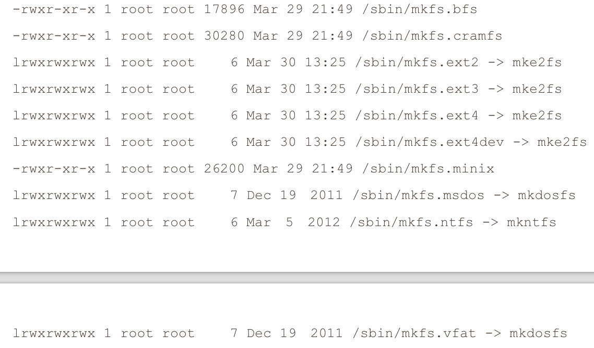

如你所见，mkfs.ext4只是mke2fs的一个符号链接，如果你在系统中没有发现某个特定的mkfs命令，或者你在寻找某个特定的文件系统类型，记住这点很重要。文件系统创建程序都有自己的使用手册，如mke2fs(8)，在大部分情况下运行mkfs.ext4(8)将会重定向到mke2fs(8)。

###4.2.3 挂载文件系统

在Unix系统中挂载文件系统我们称之为mounting。系统启动的时候，内核根据配置信息挂载根目录/。

要挂载文件系统，你需要了解以下几点：

- 文件系统所在设备（磁盘分区，文件系统数据存放的位置）
- 文件系统类型
- 挂载点，也就是当前系统目录结构中挂载文件系统的那个位置。挂载点是一个目录，例如，你可以使用/cdrom目录来挂载CD-ROM。挂载点可以在任何位置，只要不直接在/下即可。

挂载文件系统时我们常这样描述“将x设备挂载到x挂载点”。你可以运行mount命令来查看当前文件系统状态，如：

$ mount

/dev/sda1 on / type ext4 (rw,errors=remount-ro)
proc on /proc type proc (rw,noexec,nosuid,nodev)
sysfs on /sys type sysfs (rw,noexec,nosuid,nodev)
none on /sys/fs/fuse/connections type fusectl (rw)
none on /sys/kernel/debug type debugfs (rw)
none on /sys/kernel/security type securityfs (rw)
udev on /dev type devtmpfs (rw,mode=0755)
devpts on /dev/pts type devpts (rw,noexec,nosuid,gid=5,mode=0620) tmpfs on /run type tmpfs (rw,noexec,nosuid,size=10%,mode=0755) 
--snip--

上面每一行对应一个已挂载的文件系统，每一列如下所示：

- 设备名，如：/dev/sda3。其中有一些不是真实的设备（如：proc），它们代表一些特殊用途的文件系统，不需要实际的设备。
- on
- 挂载点
- type
- 文件系统类型，通常是一个短标识
- 挂载选项（在括号中）（参见**4.2.6 文件系统挂载选项**）

使用mount命令带参数来挂载文件系统，如下所示：

\# mount -t type device mountpoint

例如要挂载/dev/sdf2设备到/home/extra，可以运行下面的命令：

\# mount -t ext4 /dev/sdf2 /home/extra

一般情况下不需要指定-t ext4参数，mount命令可以自行判断。然后有时候需要在类似文件系统中明确指定一个，比如不同的FAT文件系统类型。

在**4.2.6 文件系统挂载选项**中我们将介绍更多选项。你可以使用umount命令来卸载：

\# umount mountpoint

你也可以umount设备而不是挂载点。

###4.2.4 文件系统UUID

上一节介绍的挂载文件系统使用的是设备名。然而设备名会根据内核发现设备的顺序而改变，因此你可以使用文件系统的通用唯一标识（Universally Unique Identifier，UUID）来挂载。UUID是一系列的数字，并且保证每个唯一。mke2fs这些文件系统创建程序在初始化文件系统数据结构时会生成一个UUID。

你可以使用blkid（block ID）命令查看设备和其对应的文件系统及UUID：

\# blkid

/dev/sdf2: UUID="a9011c2b-1c03-4288-b3fe-8ba961ab0898" TYPE="ext4" /dev/sda1: UUID="70ccd6e7-6ae6-44f6-812c-51aab8036d29" TYPE="ext4" /dev/sda5: UUID="592dcfd1-58da-4769-9ea8-5f412a896980" TYPE="swap" /dev/sde1: SEC_TYPE="msdos" UUID="3762-6138" TYPE="vfat"

上例中blkid发现了四个分区，2个ext4，1个交换分区（见**4.3 交换分区**），1个FAT。Linux原生分区都有标准UUID，但是FAT分区没有。FAT分区可以通过FAT volume serial number（本例中是3762-6138）来引用。

使用UUID=来通过UUID挂载文件系统。例如，要挂载上例中的/home/extra，可以运行：

\# mount UUID=a9011c2b-1c03-4288-b3fe-8ba961ab0898 /home/extra

通常你会使用设备名来挂载文件系统，因为这比UUID容易。但是理解UUID也非常重要，因为系统启动时（见**4.2.8 /etc/fstab文件系统表**）倾向使用UUID来挂载文件系统。此外很多Linux系统使用UUID作为可以动媒体的挂载点。上例中的FAT文件系统就是在一个闪存卡上。Ubuntu系统会在该设备插入时将这个分区挂载为/media/3762-6138。udevd守护进程（见**第三章**）负责处理设备插入的初始事件。

必要时你可以更改文件系统的UUID（例如你拷贝一个文件系统后，需要区分原来的和新拷贝时）。有关更改ext2/ext3/ext4的UUID，你可以参阅tune2fs(8)使用手册。

###4.2.5 磁盘缓冲，缓存，和文件系统

Linux和其他Unix系统一样，将写到磁盘的数据先写入缓冲区。这意味着内核在处理更改请求的时候不直接将更改写到文件系统，而是将更改保存到RAM中直到内核能够便捷地将更改写到磁盘为止。这个缓冲机制能够带来性能上的提高，对用户来说是透明的。

当你使用umount来卸载文件系统时，内核自动和磁盘同步。另外你还可以随时使用sync命令强制内核将缓冲区的数据写到磁盘。如果你在关闭系统之前由于种种原因无法卸载文件系统，请务必先运行sync命令。

此外，内核有一系列的机制使用RAM自动缓存从磁盘读取的数据块。因而对重复访问同一个文件的多个进程来说，内核不用反复地读取磁盘，内核只需要从缓存中读取数据来节省时间和资源。

###4.2.6 文件系统挂载选项

mount命令的有很多选项，数量还不少，通常在处理可移动设备的时候需要用到。mount(8)使用手册提供了详细的参考信息，但是你很难从中找出哪些应该掌握哪些可以忽略。本节我们介绍那些比较有用的选项。

这些选项大致可以分为两类：通用类和文件系统相关类。通用选项有-t（指定文件系统类型，之前介绍过）。文件系统相关选项只对特定的文件系统类型适用。

文件系统相关选项使用方法是在-o后加选项。例如，-o norock在ISO 9660文件系统上关闭Rock Ridge扩展，但是该选项对其他文件系统类型无效。

####短选项

以下是一些比较重要的通用选项：

- -r以只读模式挂载文件系统，应用在许多场景，如：写保护和系统启动。在挂载只读设备（如CD-ROM）的时候，可以不需要设置该选项，系统会自动设置（还会提供只读设备状态）。
- -n选项确保mount命令不会更新系统的运行时挂载数据库/etc/mtab。如果无法成功写这个文件，mount命令就会失败。因为系统启动时root分区（存放系统挂载数据库的地方）最开始是只读的，所以这个选项十分重要。在单用户模式下修复系统问题时这个选项也很有用，因为系统挂载数据库也许在那时会不可用。
- -t type选项指定文件系统类型。

####长选项

短选项对越来越多的挂载选项来说明显不够用了，一是26个字母无法容纳所有选项，二是单个字母很难说明选项的功能。很多通用选项和文件系统相关选项都更长，格式也更灵活。

长选项的使用方法是在-o后加关键字，见下例：

\# mount -t vfat /dev/hda1 /dos -o ro,conv=auto

ro和conv=auto是两个长选项。ro和-r一样，设定只读模式。conv=auto告诉内核自动将文本文件从DOS格式转换为Unix格式（稍后详细介绍）。

以下是比较常用的长选项：

- exec，noexec，允许和禁止在文件系统上执行程序。
- suid，nosuid，允许和禁止setuid程序。
- ro，在只读模式下挂载文件系统（同-r）。
- rw，在读写模式下挂载文件系统。
- conv=rule（FAT文件系统）根据rule规则转换文件中的换行符，rule的值为：binary，text，和auto，缺省为binary，binary选项禁止任何自负转换。text选项将所有文件当作文本文件。auto选项根据文件扩展名来进行转换。例如，对.jpg文件不做任何处理，而对.txt文件则进行转换。使用这个选项时需要谨慎，因为它可能对文件造成损坏，可以考虑在只读模式中使用。

###4.2.7 重新挂载文件系统

有时候你可能由于需要更改挂载选项而在同一挂载点重新挂载文件系统。比较常见的情况是在崩溃恢复时你需要将只读文件系统改为可写。

以下命令以可读写模式重新挂载root（你需要-n选项，因为mount命令在root为只读的情况下无法写系统挂载数据库）：

\# mount -n -o remount /

该命令假定/设备在目录/etc/fstab中（下节将会介绍）。否则你需要指定设备。

###4.2.8 /etc/fstab文件系统表

为了在系统启动时挂载文件系统和降低mount命令的使用，Linux系统在/etc/fstab中永久保存了文件系统和选项列表。它是一个纯文本文件，格式很简单，如**表4-1**所示：

表4-1. /etc/fstab中的文件系统和选项列表

proc /proc proc nodev,noexec,nosuid 0 0
UUID=70ccd6e7-6ae6-44f6-812c-51aab8036d29 / ext4 errors=remount-ro 0 1
UUID=592dcfd1-58da-4769-9ea8-5f412a896980 none swap sw 0 0
/dev/sr0 /cdrom iso9660 ro,user,nosuid,noauto 0 0

其中每一行对应一个文件系统，每一行有6列，从左至右分别是：

- 设备或者UUID。最新版本的Linux系统不再使用/etc/fstab中的设备，而是使用UUID。（请注意/proc这一行有一个名为proc的象征性设备）。
- 挂载点。挂载文件系统的位置。
- 文件系统类型。你可能在列表中没发现swap字样，它代表交换（swap）分区（见**4.3 交换空间**）。
- 选项。使用逗号作为长选项的分隔符。
- 提供给dump命令使用的备份信息。你应该总是使用0。
- 文件系统完整性测试顺序。为了确保fsck总是第一个在root上运行，对root文件系统总是将其设置为1，硬盘上的其他文件系统设置为2。使用0来禁止其他启动检查，包括：CD-ROM，交换分区，/proc文件系统（参见**4.2.11 检查和修复文件系统**）。

使用mount时，如果你操作的文件系统在/etc/fstab中的话，你可以使用一些快捷方式。例如，如果你在使用**表4-1**挂载CD-ROM，你可以运行：mount /cdrom。

使用以下命令，你可以挂载/etc/fstab中的所有没有标志为noauto的设备：

\# mount -a

**表4-1**中有一些新选项，如：errors，noauto和user，因为它们只在/etc/fstab文件中适用。另外，你会经常看到defaults选项。它们各自代表的意思如下：

- defaults，使用mount的缺省值：读写模式，启动设备文件，可执行，setuid等等。如果你不想对任何列设置特殊值的话就使用该选项。
- errors，这是ext2相关参数，用来定义内核在系统挂载出现问题的时候的行为。缺省值通常是errors=continue，意指内核应该返回错误代码并且继续运行。errors=remount-ro是告诉内核以只读模式重新挂载。errors=panic使内核在挂载发生问题时停止。
- noauto，该选项让mount -a命令忽略本行设备。可以使用这个选项来防止在系统启动时挂载可移动设备如：CD-ROM和软盘。
- user，这个选项能够让没有权限的用户对某一行设备运行mount命令，对访问CD-ROM这些设备来说比较方便。因为用户可以通过其他系统在移动设备上放置一个setuid-root文件，这个选项也设置nosuid，noexec和nodev（bar special device files）。

###4.2.9 /etc/fstab的替代者

一直以来我们都使用/etc/fstab来管理文件系统和挂载点，也有两种新的方式。一是/etc/fstab.d目录，其中包含了各个文件系统的配置文件（每个文件系统有一个文件）。该目录和本书中你见到的其他配置文件目录非常类似。

另一种方式是为文件系统配置systemd单元（units）。我们将在**第六章**介绍systemd及其单元。不过，systemd单元配置通常是由或者说基于/etc/fstab生成，所以你可能会发现一些重复。

###4.2.10 文件系统容量

你可以使用df命令查看当前挂载的文件系统的容量和使用量，如下例所示：

$ df 
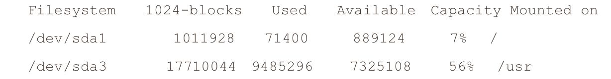

我们来看看df命令输出的各列：

- Filesystem，文件系统设备。
- 1024-blocks，文件系统的总容量，以每块1024字节为单位。
- Used，已经使用的容量。
- Available，剩余的容量。
- Capacity，已经使用容量的百分比。
- Mounted on，挂载点。

上例中显而易见两个文件系统容量分别为1GB和1.75GB。然而容量数据可能看起来有些奇怪，因为71,400加889,124不等于1,011,928，9,485,296也不是17,710,044的56%。这是因为两个文件系统中各有总容量的5%没被计算在内，它们是隐藏的预留块。所以只有超级用户（superuser）在需要时能够使用全部的空间。这个特性使得磁盘空间被占满后系统不会马上崩溃。

如果你的磁盘空间满了，你想查看哪些文件占用了大量空间，可以使用du命令。如果不带任何参数，du将显示当前工作目录下的所有目录的磁盘使用量。（你可以运行cd /; du试试看，如果你看够了可以按ctrl+c）。du -s命令只显示合计数。你可以切换到一个目录运行du -s *来查看结果。

**注解**

*POSIX标准中定义每个块大小是512字节。然而这对于用户来说不容易查看，所以df和du的输出默认以1024字节为单位。如果你想使用POSIX的512字节为单位，可以设置POSIXLY_CORRECT环境变量。也可以使用-k选项来特别制定使用1024字节块（df和du均支持）。df还有一个-m选项，用于以1MB为单位显示容量，-h则是自动判断和使用对用户来说容易理解的单位。*

###4.2.11 检查和修复文件系统

Unix文件系统通过一个复杂的数据库机制来提供性能优化。为了让各种文件系统顺畅地工作，内核必须信任加载的文件系统不会出错。如果出错则会导致数据丢失和系统崩溃。

文件系统错误通常是由于用户强行关闭系统导致（例如直接拔掉电源）。此时文件系统在内存中的缓存与磁盘上的数据有可能会有出入，或者系统有可能正在更改文件系统。虽然新的文件系统支持日志功能来防止数据损坏，你仍然要使用恰当的方式来关闭系统。文件系统检查也是保证数据完整的必要措施。

检查文件系统的工具是fsck。对于mkfs来说，fsck对于每个Linux支持的文件系统类型都有一个对应版本。例如，当你在扩展文件系统（Extended filesystem ext2/ext3/ext4）上运行fsck时，fsck检测到文件系统类型，并且启动e2fsck工具。所以通常你不需要自己指定e2fsck，除非fsck无法识别文件系统类型或者你正在查看e2fsck使用手册。

本节中涉及的信息是针对扩展文件系统和e2fsck。

要在手动交互模式下运行fsck，可以指定设备或者挂载点（/etc/fstab中）作为参数，如：

\# fsck /dev/sdb1

**警告**

*不可以在一个已经挂载的文件系统上使用fsck，因为内核在你执行检查时有可能更新磁盘数据，导致运行时数据不匹配从而导致系统奔溃和文件损坏。只有一个例外，就是你使用单用户只读模式挂载root分区时，可以在其上使用fsck。*

在手动模式下，fsck会输出很多状态信息，如下所示：

Pass 1: Checking inodes, blocks, and sizes
Pass 2: Checking directory structure
Pass 3: Checking directory connectivity
Pass 4: Checking reference counts
Pass 5: Checking group summary information /dev/sdb1: 11/1976 files (0.0% non-contiguous), 265/7891 blocks

fsck在手动模式下发现问题会停止，并且问你如何修复，问题涉及文件系统的内部结构，诸如重新连接inodes，清除blocks（inode是文件系统的基本组成部分，我们将在**4.5 深入传统文件系统**中介绍）等。如果fsck问你是否重新连接inode，说明它发现了一个未命名文件。在重新连接这个文件时，fsck将文件放到lost+found目录中，并使用一个数字作为文件名，因为原来的文件名很可能已经丢失，你需要根据文件内容为文件起个新的名字。

如果你仅仅是非正常关闭了系统，通常不需要运行fsck来修复文件系统，因为fsck可能会产生许多大大小小的报错。还好e2fsck有一个选项-p能够自动修复常见的错误，遇到严重错误时则会终止。实际上很多版本的Linux在启动时会运行各自的fsck -p版本。（你可能还见过fsck -a，它的功能是一样的。）

如果你觉得系统出现了一个严重的问题，比如硬件故障或者设备配置错误，这时就需要仔细斟酌如何采取相应措施，因为fsck有可能会帮倒忙。(如果fsck在手动模式下向你提出许多问题，可能意味系统出现了很严重的问题。)

如果你觉得系统出现了很严重的故障，可以运行fsck -n来检查文件系统，同时不做任何更改。如果问题出在设备配置方面，并且你能够修复（比如分区表中的块数目不正确或者数据线没插稳），那就请在运行fsck之前修复之，否则你有可能丢失很多数据。

如果你认为superblock被损坏了（比如有人在磁盘分区最开始的位置写入了数据），你可以使用mkfs创建的superblock备份来恢复文件系统。你可以运行fsck -b num来使用位于num的块来替换损坏的superblock。

如果你不知道在哪里能找到备份superblock，可以运行mkfs -n来查看备份superblock列表，这不会损失任何数据。（再次强调你必须使用-n选项，否则会损坏文件系统）

####检查ext3和ext4文件系统

一般情况下你不需要手动检查ext3和ext4文件系统，因为日志保证了数据完整性。然而，你可能想要在ext2模式中挂载一个已损坏的ext3或者ext4文件系统，因为内核无法使用非空日志来挂载ext3和ext4文件系统。（如果你没有正常关闭系统的话，日志里有可能会残留数据）。你可以运行以下e2fsck命令来将ext3和ext4文件系统中的日志数据写入到数据库。

\# e2fsck –fy /dev/disk_device

####最坏的情况

面对严重的磁盘故障，你可以有下面的选择：

- 你可以使用dd尝试从磁盘提取出整个文件系统的映像，然后将它转移到另一块磁盘的相同大小的分区中。
- 你可以在只读模式下挂载文件系统，然后再想办法修复。
- 使用debugfs。

对于前两个选项，你必须先修复文件系统，然后才能挂载它，除非你愿意手工遍历磁盘数据。你可以使用fsck -y来回答所有的fsck提示，不过如果不是迫不得已不要使用这个方法，因为它有可能带来更多的问题，还不如你手工处理。

debugfs工具能够让你遍历文件系统中的文件，并将它们拷贝到其他地方。缺省情况下它在只读模式下打开文件系统。如果你要恢复数据的话，最好确保文件的完整性，以免让事情变得更糟。

最坏的情况下，比如磁盘严重损坏并且没有备份，你能做的也只能是向专业的数据修复服务商寻求帮助了。

####4.2.12 特殊用途的文件系统

文件系统并不仅仅用于存储在物理媒介上的数据。很多Unix系统中都有一些作为系统接口来使用的文件系统。也就是说文件系统不仅仅为在存储设备上存储数据提供服务，还能够用来表示系统信息，如进程ID和内核诊断信息。这个思路和/dev类似，即使用文件作为I/O接口。/proc出自research Unix的第八版，由Tom J. Killian实现，在Bell实验室（其中有很多最初的Unix设计者）创造Plan 9的时候得以促进。Plan 9是一个科研用操作系统，它将文件系统的抽象程度提升到了一个新的高度（[http://plan9.bell-labs.com/sys/doc/9.html](http://plan9.bell-labs.com/sys/doc/9.html)）。

Linux中特殊用途的文件系统有以下类型：

- proc，挂载在/proc。proc是进程（process）的缩写。/proc目录中的子目录以系统中的进程ID命名，子目录中的文件代表的是进程的各种状态。文件/proc/self表示当前进程。Linux系统的proc文件系统包括大量的内核和硬件系统信息，保存在象/proc/cpuinfo这样的文件中。（后来有人提出将进程无关的信息从/proc移至/sys）
- sysfs，挂载在/sys（在**第三章**已经介绍过）。
- tmpfs，挂载在/run和其他位置。通过tmpfs，你可以将物理内存和交换空间作为临时存储。例如，你可以将tmpfs挂载到任意位置，使用size和nr_blocks长选项来设置最大容量。但是请注意不要经常随意地将数据存放到tmpfs，这样你很容易占满系统内存，会导致程序奔溃。（多年来，Sun Microsystems公司使用的tmpfs在长时间运行后会导致一系列问题）

##4.3 交换空间

并不是所有磁盘分区都包含文件系统。系统可以通过使用磁盘空间来扩展内存容量。如果出现内存空间不足，Linux虚拟内存系统会自动将内存中的进程移出至磁盘以及从磁盘移入内存。我们称其为交换（swapping），因为空闲的进程
被移出到磁盘，同时被激活的进程从磁盘移入到内存。用来保存内存页面（page）的磁盘空间我们称为交换空间（swap space或简称swap）。

使用free命令可以显示当前交换空间的使用情况：

$ free

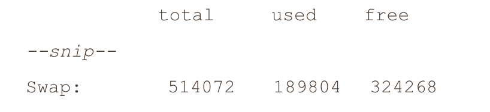

###4.3.1 使用磁盘分区作为交换空间

通过以下步骤来将整个磁盘分区作为交换空间：

1. 确保分区为空。
2. 运行mkswap dev，dev是分区设备。该命令在分区上放置一个交换签名。
3. 运行swapon dev向内核注册。

交换分区创建后，你可以在/etc/fstab文件中创建一个新的交换条目，这样系统在重启之后即可使用该交换空间。以下是一个条目的样例，使用/dev/sda5作为交换分区：

/dev/sda5 none swap sw 0 0

请记住现在很多系统使用的是UUID而非设备名。

###4.3.2 使用文件作为交换空间

如果不想重新分区或者不想新建交换分区的话，你可以使用常规文件作为交换空间，它们的效果是一样的。

具体步骤为创建一个空文件，将其初始化为交换空间，将其加入交换池，如下例所示：

\# dd if=/dev/zero of=swap_file bs=1024k count=num_mb 
\# mkswap swap_file
\# swapon swap_file

这里swap_file是新的交换文件名，num_mb是需要的文件大小，以MB为单位。

可以使用swapoff命令来删除交换分区和交换文件。

###4.3.3 你需要多大的交换空间？

以前Unix系统建议将交换空间大小设置为内存容量的至少两倍。如今内存和磁盘空间都不再是问题，关键看我们怎样使用系统。一方面，海量的磁盘空间让我们可以分配超过两倍内存的交换空间，另一方面，内存大到我们根本不需要交换空间。

“两倍内存容量”这一规则对于多个用户系统来说就显得过时了。由于并不是所有用户都处于活跃状态，最好能够将非活跃用户的内存交换给那些有需要的活跃用户。

对于单用户系统来说，此规则仍适用。如果你在运行多个进程，可以交换不活跃进程，甚至交换活跃进程中的那些不活跃部分都没问题。如果许多活跃进程同时都需要内存，因而必须频繁地使用交换空间，这时你会碰到非常严重的性能问题，因为磁盘I/O速度相对较慢。唯一的解决办法就是增加更多内存，终止一些进程，或者吐槽一下。

有时候Linux内核可能会为了获得磁盘缓冲而交换出一个进程。为了防止这种情况，有些系统管理员将系统设置为不允许交换空间。例如，高性能网络服务器需要尽可能避免磁盘存取和交换空间。

**注解**

*如果系统耗尽了所有的物理内存和交换空间，Linux内核会调用out-of-memory(OOM)来终止一个进程以获得一些内存空间。你应该不希望你的桌面应用程序被这样终止。另一方面，高性能服务器有复杂的监控和负载平衡系统来保证内存不会被完全耗尽。*

我们将在**第八章**详细介绍内存系统。

##4.4 前瞻：磁盘和用户空间

对于Unix系统上那些磁盘相关的组件，我们很难界定用户空间和内核空间的边界。内核处理设备上的基本块I/O，用户空间工具可以通过设备文件来使用块I/O。然而，用户空间通常只使用块I/O做一些初始化操作，比如分区，创建文件系统，和创建交换分区。一般情况下，用户空间只在块I/O的基础上使用内核提供的文件系统支持。类似地，内核在虚拟内存系统中处理交换空间时也负责处理大部分繁琐的细节。

本章后面的内容将简要介绍Linux文件系统的内部结构。这些内容主要针对高级用户，不影响普通读者的阅读，你可以直接跳到下一章学习Linux的启动。

##4.5 深入传统文件系统

传统的Unix文件系统有两个基础组件：一个用来存储数据的数据块池，和一个用来管理数据池的数据库系统。这个数据库是inode数据结构的核心。inode是一组描述文件的数据，包括文件类型，权限，最重要的是文件数据所在的数据池。inodes在inode表中以数字的形式表示。

文件名和目录也是通过inodes来实现的。目录inode包含一个文件名列表以及对应的指向其他inodes的链接。

为了方便举例，我们来创建一个新的文件系统，挂载它，并切换到挂载点目录。然后加入一些文件和目录（你可以在一个闪存盘上来做实验）：

$ mkdir dir_1
$ mkdir dir_2
$ echo a > dir_1/file_1
$ echo b > dir_1/file_2
$ echo c > dir_1/file_3
$ echo d > dir_2/file_4
$ ln dir_1/file_3 dir_2/file_5

这里我们创建了一个硬链接（hard link）dir_2/file_5，指向dir_1/file_3，它们实际上代表的是同一个文件（稍后详述）。

从用户角度而言，该文件系统的目录结构如**图4-4**所示。而**图4-5**更为复杂，显示的是真实的文件系统结构。

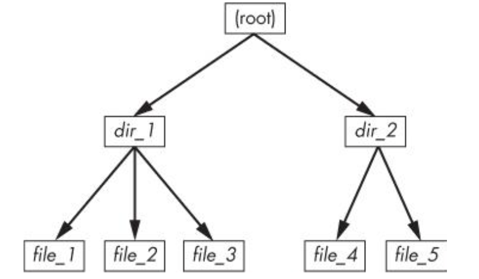

图4-4. 用户眼中的文件系统

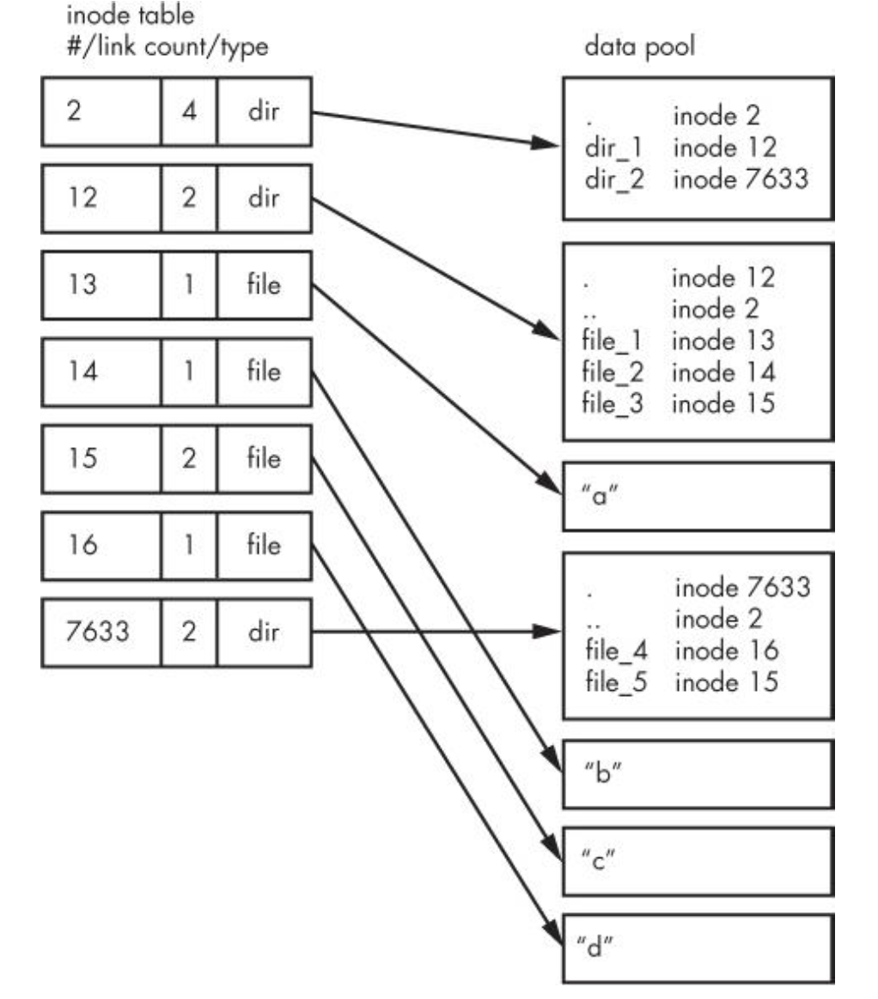

图4-5. 图4-4对应的inode文件系统结构

我们如何来理解这个图呢？对ext2/3/4文件系统来说，编号为2的inode是根（root inode），它是一个目录inode（dir），如果跟随箭头到数据池，我们可以看到跟目录的内容:dir_1和dir_2两个条目分别对应inode12和7633。我们也可以回到inode表查看这两个inode的详细内容。

内核采取以下步骤来对dir_1/file_2做检查：

1. 检查路径部分，即目录dir_1和后面的file_2。
2. 通过根inode找到它的目录信息。
3. 在inode 2的目录信息中找到dir_1，它指向inode 12。
4. 在inode表中查找inode 12，验证它是一个目录。
5. 找到inode 12的目录信息（在数据池中）。
6. 在inode 12的目录信息中找到file_2，它指向inode 14。
7. 在目录表中查找inode 14，它是一个文件inode。

至此内核了解了该文件的属性，可以通过inode 14的数据链接打开它了。通过这种方式，inode指向目录数据结构，目录数据结构也指向inode，这样你可以根据自己的习惯创建文件系统结构。另外请注意目录inode中包含了.和..两个条目（除根目录以外），让你能够轻松地在目录结构中浏览。

###4.5.1 查看inode细节

我们可以使用命令ls -i来查看目录的inode编号。例如上例中的目录inode编号如下（可以使用stat命令来查看更详细的信息）：

$ ls -i
12 dir_1 7633 dir_2

你可能在ls -l命令的结果中见过但忽略了链接计数（link count）这个信息，**图4-5**中文件的链接计数是多少呢，特别是硬链接file_5？链接计数是指向同一个inode的所有目录条目的总数。大多数文件的链接计数是1，因为它们大多在目录条目里只出现一次。这不奇怪，因为通常当你创建一个新文件的时候，你只为其创建一个新的目录条目和一个新的inode。然而inode 15出现了两次：一次是dir_1/file_3，另一次是dir_2/file_5。硬链接是手工创建的、指向一个已有的inode的目录条目。使用ln命令（不带-s选项）可以创建新链接。

这就是为什么我们有时候将删除文件称为取消链接（unlinking）。如果你运行rm dir_1/file_2，内核会在inode 12的目录条目中搜索名为file_2的条目。当发现file_2对应inode 14的时候，内核删除目录条目，同时将inode 14的链接计数减1。这导致inode 14的链接计数为0，内核发现该inode没有任何链接的时候，会将其和与之相关的所有数据删除。

但是如果你运行rm dir_1/file_3，inode 15的链接计数会由2变为1（dir_2/file_5仍然与之链接），这时内核不会删除此inode。

链接计数对于目录来说也是同理。inode 12的链接计数为2，一个是目录条目中的dir_1（inode 2），另一个是它自己的目录条目中的自引用（.）。如果你创建一个新目录dir_1/dir_3，inode 12的链接计数会变为3，因为新目录包含其上级目录（..）条目，链接到inode 12。类似inode 12指向其上级目录inode 2。

有一种情况比较特殊，根目录（root）的inode 2的链接计数为4。而**图4-5**中只显示了3个目录条目链接。另外一个其实是文件系统的超级块（superblock），它知道如何找到根inode。

你完全可以自己做一些尝试，使用ls -i创建文件系统，使用stat来遍历，这些操作都很安全。你也不需要使用root权限（除非你需要挂载和创建新的文件系统）。

有一个地方我们还没有讲到，就是在为新文件分配数据池块的时候，文件系统如何知道哪些块可用哪些已被占用？方法之一是使用块位图（block bitmap）来管理块信息。文件系统保留了一些字节空间，每一位（bit）代表一个数据池中的一个块。0代表块可用，1代表块已经被占用，释放和分配块就变成了0和1之间的切换。

当inode表中的数据和块分配数据不匹配，或者由于你没有正确关闭系统导致链接数目不正确，这些都会导致文件系统出错。所以你在检查文件系统的时候，如**4.1.11 检查和修复文件系统**一节介绍的那样，fsck会遍历inode表和目录结构来生成链接数目和块分配信息，并且会根据磁盘上的文件系统来检查新数据，如果发现数据不匹配的情况，fsck会修复链接数错误，以及inode和其他一些目录结构数据错误。大部分fsck程序会将新创建的文件放到lost+found目录。

###4.5.2 在用户空间中使用文件系统

在用户空间中使用文件和目录时，你不需要太关心底层实现的细节。你只需要能够通过内核系统调用来访问文件和目录的内容。其实你也能够看到一些看似超出用户空间范围的文件系统信息，特别是stat()这个系统调用能够告诉你inode数目和链接计数。

除非你需要维护文件系统，否则你不需要知道inode数目和链接计数，用户模式中的程序之所以能够访问这些信息，主要是因为一些向后兼容的考虑。并且也不是所有Linux的文件系统都提供这些信息。虚拟文件系统（Virtual File System，VFS）接口层能够确保系统调用总是返回inode数目和链接计数，不过这些数据可能没有太大意义。

在传统文件系统上你有可能无法执行一些传统的Unix文件系统的操作。比如，你无法使用ln命令在VFAT文件系统上创建硬链接，因为其目录条目数据结构根本不同。

幸运的是Unix/Linux提供给用户空间的系统调用为用户访问文件提供了足够的抽象和便利，用户不需要关心任何底层的细节。文件命名很灵活，支持大小写混合，并且能很容易地支持其他文件系统结构。

请记住，内核只是作为系统调用的通道，而不会包含对某个特定的文件系统的支持。

###4.5.3 文件系统的演进

你已经看到了，就算一个很简单的文件系统也包括各种各样不同的组件，需要去维护。同时随着新需求、新技术、和存储容量的不断发展，对文件系统的要求也越来越高。如今，性能、数据完整性、安全性等方面的需求大大超出了老式文件系统的功能范围，因而文件系统方面的技术也在日新月异地发展。一个例子就是我们在**4.2.1 文件系统类型**中提到的Btrfs。

文件系统演进的另一个例子是新的文件系统使用不同的数据结构来表示文件和目录，它们使用数据块的方式各不相同，而不是使用本章介绍的inode。此外针对SSD优化的文件系统也在不断演进，无论怎么变化，归根结底它们的最终目的都是一样的。

------

#第五章 Linux内核的启动

目前为止我们介绍了Linux系统的物理结构和逻辑结构，内核，以及进程。本章我们将讨论内核的启动（boot）。即从内核载入内存到启动第一个用户进程的过程。

下面是整个过程的简化：

1. BIOS（基本输入输出系统）或者启动固件加载并运行引导装载程序（boot loader）。
2. 引导装载程序在磁盘上找到内核映像，将其载入内存并启动。
3. 内核初始化设备及其驱动程序。
4. 内核挂载根文件系统。
5. 内核使用进程ID 1来运行init程序，用户空间在此时开始启动。
6. init启动其他的系统进程。
7. init还会启动一个进程，通常在整个过程的尾声，负责用户登录。

本章涉及前4个步骤，主要介绍内核和引导装载程序。在**第六章**我们会介绍用户空间启动。

理解启动过程对将来修复启动相关的问题会大有帮助，也有助于了解整个Linux系统。然而，你很难从Linux系统的默认启动过程中分辨出最前面的几个步骤，通常只有在整个过程完成，你登录系统后才有机会看到。

##5.1 启动消息

传统的Unix系统在启动时会显示很多系统信息，方便你查看启动过程。这些消息一开始来自内核，然后是进程和init执行的初始化程序。然而，这些消息格式不是那么清晰和一致，有时甚至不是那么有用。现在大部分Linux版本都使用启动屏幕、屏幕填充色，和启动选项菜单将它们遮盖住。此外，硬件性能的提升也让启动过程更快，这些消息显示得也更快，快到让人难以捕捉。

有两种方法可以查看内核启动信息和运行时的诊断信息：

- 查看内核系统日志文件。通常存放在/var/log/kern.log中，取决于你的系统配置，也可能和其他系统日志一起存放在/var/log/messages或者别的什么地方。
- 使用dmesg命令，不过记得将结果输出到less，因为信息量会比较大。dmesg命令使用内核环缓冲区，它的容量有限，不过大多数较新的内核能够有足够的空间来容纳足够长的启动日志。

以下是一个dmesg的示例：

$ dmesg

[ 0.000000] Initializing cgroup subsys cpu
[ 0.000000] Linux version 3.2.0-67-generic-pae (buildd@toyol) (gcc version 4.
6.3 (Ubuntu/Linaro 4.6.3-1ubuntu5) ) #101-Ubuntu SMP Tue Jul 15 18:04:54 UTC 2014
(Ubuntu 3.2.0-67.101-generic-pae 3.2.60)
[ 0.000000] KERNEL supported cpus:
--snip--
[ 2.986148] sr0: scsi3-mmc drive: 24x/8x writer dvd-ram cd/rw xa/form2
cdda tray
[ 2.986153] cdrom: Uniform CD-ROM driver Revision: 3.20
[ 2.986316] sr 1:0:0:0: Attached scsi CD-ROM sr0
[ 2.986416] sr 1:0:0:0: Attached scsi generic sg1 type 5
[ 3.007862] sda: sda1 sda2 < sda5 >
[ 3.008658] sd 0:0:0:0: [sda] Attached SCSI disk 
--snip--

内核启动后，用户空间启动程序会产生消息。查看这些消息不是很方便，因为它们分布在很多不同的地方。启动脚本通常会将消息显示到屏幕上，启动完成后就从屏幕上消失了。因为每个脚本都将消息写入它们各自的日志，所以不存在前面的问题。有一些版本的init，比如Upstart和systemd，可以获得那些显示到屏幕的启动和运行时消息。

##5.2 内核初始化和启动选项

Linux内核的启动过程如下：

1. 检查CPU
2. 检查内存
3. 检测设备总线
4. 检测设备
5. 设置附加内核子系统（如：网络等）
6. 挂载根目录
7. 启动用户空间

前面几个步骤很好理解，设备相关的步骤则涉及一些依赖性问题。例如：磁盘设备驱动程序可能需要依赖于总线和SCSI子系统的支持。

在后面的几个步骤中，内核必须在初始化前挂载根文件系统。你可以忽略大部分细节，除了一点，就是一些组件并不是主内核的一部分，它们会以可加载内核模块的方式启动。在一些系统中，你可能需要在挂载根文件系统之前加载这些内核模块。详细内容我们将在**6.8 RAM文件系统初始化**一节介绍。

直到本书写成时，内核在启动第一个用户进程时不会显示任何消息。然而下面的这些内存管理相关消息能够为我们提供一些信息，如下所示，内核将自己的内存空间保护起来以防止用户空间进程使用，下面这些信息预示着用户空间即将启动：

Freeing unused kernel memory: 740k freed
Write protecting the kernel text: 5820k
Write protecting the kernel read-only data: 2376k
NX-protecting the kernel data: 4420k

这时你还可以看到根文件系统的挂载信息。

**注解**

*本章下面的内容涉及内核启动的细节，你可以跳到第六章学习用户空间启动，以及内核初始化第一个用户进程等内容。*

##5.3 内核参数

运行Linux内核的时候，引导装载程序会向内核传递一系列文本形式的内核参数来设定内核的启动方式。这些参数设定了很多不同的行为方式，比如内核显示的诊断信息的多少，和设备驱动程序相关参数。

你可以通过/proc/cmdline文件来查看系统启动时使用的内核参数：

$ cat /proc/cmdline
BOOT_IMAGE=/boot/vmlinuz-3.2.0-67-generic-pae root=UUID=70ccd6e7-6ae6-
44f6-
  812c-51aab8036d29 ro quiet splash vt.handoff=7

这些参数有的是一个单词的长度，诸如：ro，quiet，有的是key=value这样的配对（例如：vt.handoff=7）。它们中大部分都无关紧要，如：splash标志意思是显示一个闪屏（splash screen）。其中root参数很重要，它是根文件系统存放的位置，如果没有这个参数，内核将无法完成初始化工作，从而也就无法启动用户空间。

根文件系统参数值是一个设备文件，例如：

root=/dev/sda1

然而现在的桌面系统中经常使用UUID（见**4.2.4 文件系统UUID**）：

root=UUID=70ccd6e7-6ae6-44f6-812c-51aab8036d29

参数ro告诉内核在用户空间启动时以只读模式挂载根文件系统。（使用只读模式能够让fsck安全地对根文件系统做检查，之后启动进程重新以可读写模式来挂载根文件系统。）

如果遇到无法识别的参数，Linux内核会将其保存，稍后在启动用户空间时传递给init。如果你加入参数-s，内核会将其传递给init，让其以单用户模式启动。

下面我们介绍引导装载程序是如何启动内核的。

##5.4 引导装载程序

在启动过程的最开始，引导装载程序启动内核，然后内核和init启动。引导装载程序的工作看似很简单：将内核加载到内存，然后使用一系列内核参数启动内核。但是引导装载程序需要弄清楚下面几个问题：

- 内核在哪里？
- 内核启动时需要传递哪些参数？

内核及其参数通常在根文件系统中。因为内核此时还没有开始运行，无法遍历文件系统，所以内核参数需要被放到一个容易存取的地方。并且此时用于访问磁盘的内核设备驱动还没有准备好，这听起来有点像“鸡生蛋，蛋生鸡”。

我们先看一下驱动程序。在个人电脑上，引导装载程序使用基本输入输出（BIOS）或者统一可扩展固件接口（Unified
Extensible Firmware Interface，UEFI）来访问磁盘。几乎所有的磁盘设备都有固件系统供BIOS通过线性块寻址来访问硬件（Linear Block Addressing，LBA）。虽然性能不怎么样，但是这种方式可以访问磁盘的任意位置。引导装载程序往往是唯一使用BIOS访问磁盘的程序，内核使用的是它自己的高性能驱动程序。

大多数现在的引导装载程序都能够读取分区表，内建以只读模式访问文件系统的功能，因此它们能够查找和读取文件。这使得动态配置和完善引导装载程序变得非常简单。并不是所有的Linux引导装载程序都有这些功能，配置引导装载程序因而变的困难得多。

###5.4.1 引导装载程序任务

Linux引导装载程序的核心功能如下：

- 从多个内核中选择一个使用。
- 从多个内核参数集中选择一个使用。
- 允许用户手工更改内核映像名和参数（例如使用单用户模式）。
- 支持其他操作系统的启动。

自Linux内核问世以来，引导装载程序的功能得到了极大的增强，加入了历史纪录和菜单界面，不过最基本的需求仍然是能够灵活选择内核映像和参数。有趣的是某些方面的需求逐渐消失了。例如，现在你可以从USB设备上执行紧急启动和恢复，因而你可能不再需要手工设置内核参数和进入单用户模式。不过因为现在引导装载程序强大的功能，更改内核参数、创建定制内核这些事情也变得容易得多。

###5.4.2 引导装载程序概述

以下是一些常见的引导装载程序，按照普及的顺序排列：

- GRUB，近乎于Linux系统标准。
- LILO，最早期的Linux引导装载程序之一，是UEFI的一个版本。
- SYSLINUX，能够在很多不同的文件系统上配置和启动。
- LOADIN，能够从MS-DOS上启动内核。
- efilinux，UEFI引导装载程序的一种，作为其他UEFI引导装载程序的模块和引用。
- coreboot（以前又叫做LinuxBIOS）PC BIOS的高性能替代品，并且能够包含内核。
- Linux Kernel EFISTUB，能够从EFI/UEFI系统分区（ESP）加载内核的一个内核插件。

本书只涉及GRUB，使用其他引导装载程序的原因在于它们更容易配置、更快速。

要设置内核名称和参数，你需要进入启动提示符（boot prompt）。因为很多Linux系统定制了引导装载程序，使得我们有时很难找到进入启动提示符的方法。
下一节我们会介绍如何进入启动提示符来设置内核名称和参数，然后你将了解如何设置和安装引导装载程序。

##5.5 GRUB简介

GRUB意指大一统引导装载程序（Grand Unified Boot Loader）。本节我们将介绍GRUB 2。GRUB有一个较老的版本叫做GRUB Legacy，现在逐步被淘汰了。

GRUB最重要的一个功能是对内核印象和配置的选择更为简便。我们可以通过查看菜单来了解GRUB。GRUB界面易于操作，不过Linux各版本都尽可能将引导装载程序隐藏起来，你可能没机会看到。

你可以在BIOS或者固件启动屏幕出现时按住SHIFT来打开GRUB菜单。图5-1中是GRUB菜单，可以按ESC来取消自动启动计时。

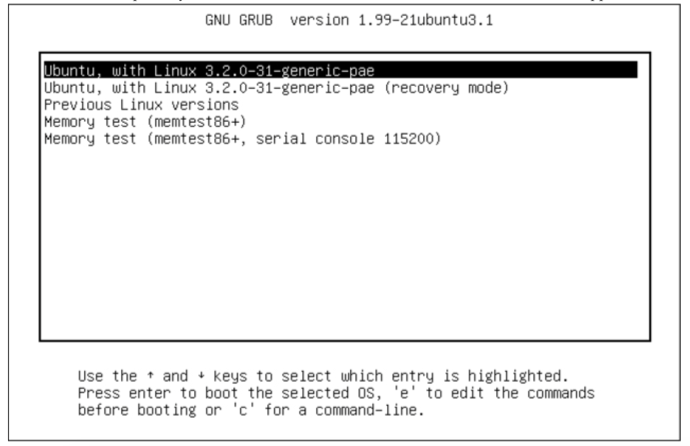

图5-1. GRUB菜单

可以通过以下步骤来查看引导装载程序：

1. 打开或者重启Linux。
2. 在BIOS/固件自检时或者启动屏幕显示时，按住SHIFT显示GRUB菜单。
3. 按e键查看引导装载程序命令的缺省启动选项，如**图5-2**所示：

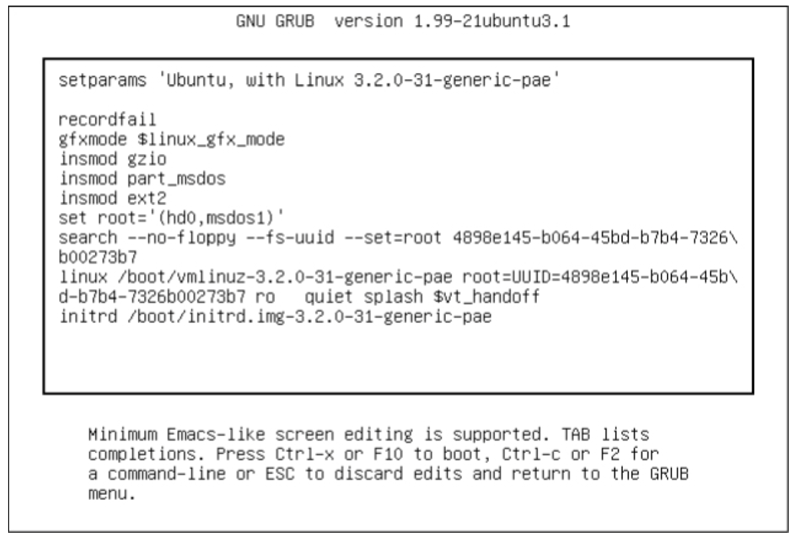

图5-2. GRUB配置编辑器

如图所示，根文件系统被设置为一个UUID，内核映像是/boot/vmlinuz- 3.2.0-31-generic-pae，内核参数包括ro，quiet和splash。初始RAM文件系统是/boot/initrd.img-3.2.0-31-generic-pae。如果你从来没有见过这些配置信息，可能会觉得比较糊涂。你可能会问为什么会有这么多地方涉及root？它们有什么区别？为什么这里会出现insmod？Linux内核不是通常由udevd运行吗？

我一说你就明白了，因为GRUB仅仅是启动内核，而不使用它，你看到的这些配置信息都由GRUB的内部命令构成，GRUB自身另成一个体系。

产生混淆的原因是由于GRUB借用了很多其他地方的术语。GRUB有自己的“内核”和insmod命令来动态加载GRUB模块，这和Linux内核没有任何关系。很多GRUB命令和Unix shell命令很类似，GRUB也有一个ls命令来显示文件列表。

不过最让人糊涂的地方还是root这个词。为了表达得更清楚，只需要遵循一个简单的法则就是：只有root内核参数是指根文件系统。

在GRUB配置中，root这个内核参数在linux命令中的映像文件名后面。其他配置信息中出现root的地方指的都是GRUB root，其只针对GRUB，是GRUB查找内核和RAM文件系统映像时使用的文件系统。

在**图5-2**中，GRUB root一开始被设置为GRUB相关设备（hd0, msdos1）。在随后的命令中，GRUB查找一个特定分区的UUID，如果找到的话就将该分区设置为GRUB root。

总而言之，linux命令的第一个参数（/boot/vmlinuz-...）是Linux内核映像文件的位置。GRUB从GRUB root上加载此文件。类似的，initrd命令指定初始的RAM文件系统文件。

你可以在GRUB内配置这些信息，通常启动错误可以用这种方式来暂时性地修复。如果要永久性地修复启动问题，你需要更改配置信息（见**5.5.2 GRUB配置**），不过目前让我们先深入GRUB内部，看看其命令行界面。

###5.5.1 使用GRUB命令行浏览设备和分区

如**图5-2**所示，GRUB有自己的设备寻址方式。例如，系统检测到的第一个硬盘是hd0，然后是hd1，以此类推。然而设备分配会有变化。还好GRUB能够在所有的分区中通过UUID来查找得内核所在的分区，就像你刚才在search命令看到的那样。

####设备列表

想要了解GRUB如何显示系统中的设备，可以在启动菜单活着配置编辑器中按C键进入GRUB命令行。你将看到以下提示符：

grub>

这里你可以运行任何你在配置信息中看到的命令，我们可以从ls命令开始，不带参数，命令的输出时GRUB能够识别的所有设备的列表：

grub> ls

(hd0) (hd0,msdos1) (hd0,msdos5)

本例中有一个名为hd0的主磁盘设备和分区（hd0, msdos1）及（hd0, msdos5）。前缀msdos表示磁盘包含MBR分区表。如果包含的是GPT分区表则前缀就是gpt。（还可能会有第三个标识符来表示更多可能的组合，如分区包含BSD磁盘标签映射，不过你通常不需要太关注，除非你在一台机器上运行多个操作系统）

使用ls -l查看更详细的信息。此命令能显示磁盘上所有分区的UUID，所以非常有用，例如：

grub> ls -l

Device hd0: Not a known filesystem - Total size 426743808 sectors
Partition hd0,msdos1: Filesystem type ext2 – Last modification
time
2015-09-18 20:45:00 Friday, UUID 4898e145-b064-45bd-b7b4- 7326b00273b7 -
Partition start at 2048 - Total size 424644608 sectors
Partition hd0,msdos5: Not a known filesystem - Partition start at
424648704 - Total size 2093056 sectors

如上所示，磁盘在第一个MBR分区上有一个Linux ext2/3/4文件系统，在分区5上有一个Linux交换区签名，这样的配置很常见。（从输出中可以看到hd0, msdos5是交换分区）

####文件导航

现在我们来看看GRUB的文件系统导航。你可以使用echo命令来查看GRUB根文件系统（这是GRUB寻找内核的地方）：

grub> echo $root 

hd0,msdos1

可以在GRUB的ls命令中的分区后面加上/来显示根文件系统下文件和目录：

grub> ls (hd0,msdos1)/

不过要记住的键入分区名是件麻烦事，这时你可以使用root变量：

grub> ls ($root)/

输出结果是该分区上的文件系统中的目录和文件名列表，诸如：etc/，bin/，和dev/。你需要了解这个命令和GRUB ls的功能完全不同，后者列出设备、分区表盒文件系统头信息。而这个命令显示的是文件系统的内容。

使用类似的方法，你可以进一步查看分区上文件和目录的内容。例如，如果要查看boot目录的内容，可以使用：

grub> ls ($root)/boot

**注解**

*你可以使用上下键来查看命令历史记录，使用左右键来编辑当前命令行。也可以使用标准行命令如：CTRL-N, CTRL-P等。*

你也可以使用set命令查看所有已经设置的GRUB变量：

grub> set

?=0 color_highlight=black/white color_normal=white/black --snip--
prefix=(hd0,msdos1)/boot/grub
root=hd0,msdos1

这些变量当中，$prefix是很重要的一个，GRUB使用它指定的文件系统和目录来寻找配置和辅助支持信息。我们将在下一节详细介绍。

使用GRUB命令行界面完成工作后，你可以键入boot命令来启动系统，或者按ESC键回到GRUB菜单来启动系统。整个系统启动完毕准备就绪之后，让我们我们来看看GRUB配置信息。

###5.5.2 GRUB配置信息

GRUB配置目录包含核心配置文件（grub.cfg）和一些列可加载模块，以.mod为后缀。（随着GRUB版本的演进，这些模块被逐渐移到象i386-pc这样的子目录中）。配置目录通常是/boot/grub或者/boot/grub2。我们不直接编辑grub.cfg文件，而是使用grub-mkconfig命令（或者Fedora上的grub2-mkconfig）。

####回顾grub.cfg

首先我们看一下GRUB是如何通过grub.cfg文件来初始化菜单和内核选项的。你会看到grub.cfg文件中包含GRUB命令，通常是从一些列的初始化步骤开始，然后是一系列的菜单条目，针对不同的内核和启动配置。初始化过程并不复杂，它就是一系列的函数定义和视频设置命令，如下所示：

if loadfont /usr/share/grub/unicode.pf2 ; then
  set gfxmode=auto
load_video insmod gfxterm 
--snip--

稍后在文件中你还会看到启动配置信息，它们以menuentry命令开始。通过上节的介绍，你应该能够理解以下这些内容：

menuentry 'Ubuntu, with Linux 3.2.0-34-generic-pae' --class ubuntu -- class gnu-linux --class gnu
--class os {
       recordfail
       gfxmode $linux_gfx_mode
       insmod gzio
       insmod part_msdos
       insmod ext2
       set root='(hd0,msdos1)'
search --no-floppy --fs-uuid --set=root 70ccd6e7-6ae6-44f6-812c- 51aab8036d29
linux /boot/vmlinuz-3.2.0-34-generic-pae root=UUID=70ccd6e7-
6ae6-44f6-812c-51aab8036d29
ro quiet splash $vt_handoff
}

请留意submenu命令。如果你的grub.cfg文件包含一系列menuentry命令，它们中大多数可能被包含在submenu命令中，这是针对较老版本的内核设计的，以免GRUB菜单过于臃肿。

####生成新的配置文件

如果想要对GRUB配置做更改，我们不会直接编辑grub.cfg文件，因为它是由系统自动生成和更新的。你可以将新的配置信息放到其他什么地方，然后运行grub-mkconfig来生成新的配置文件。

在grub.cfg文件的最开头应该有一行注释，如下：

\#\#\# BEGIN /etc/grub.d/00_header \#\#\#

你会发现/etc/grub.d中的文件都是shell脚本，它们各自生成grub.cfg文件的某个部分。grub-mkconfig命令本身也是一个脚本文件，负责运行/etc/grub.d中的所有脚本文件。

你可以使用root账号来自己试一试。（不用担心当前的配置信息会被覆盖，该命令只会将配置信息输出到标准输出，即屏幕）

\# grub-mkconfig

如果你想要在GRUB配置中加入新的菜单条目和其他命令，简单来说，你可以在GRUB配置目录中创建一个新的.cfg文件来存放你的内容,例如：/boot/grub/custom.cfg。

如果涉及到细节就会复杂一些了。/etc/grub.d配置目录为你提供了两个选项：40_custom和41_custom。前者是一个脚本文件，你可以编辑，但是系统升级有可能会将你的更改清除掉，所以这个选项不太保险。41_custom脚本更简单一些，它是一组的命令，用来在GRUB启动的时候加载custom.cfg文件。（请注意，如果使用该方法，你的配置更改只有在配置文件生成后才会其作用。）

它们并不是唯一定制配置的方法。在一些Linux版本中，你有可能在/etc/grub.d目录中看到其他的选项。例如：Ubuntu在配置中加入了内存测试启动选项memtest86+。

你可以使用grub-mkconfig命令加-o选项将新生成的文件写到GRUB目录，如下所示：

\# grub-mkconfig -o /boot/grub/grub.cfg

如果你使用的是Ubuntu，可以使用install-grub。在进行这类操作的时候，请注意将旧的配置文件进行备份，以及确保目录路径正确。

现在让我们看看更多关于GRUB和引导装载程序的技术细节，如果你觉得已经了解得足够多，可以直接跳到**第六章**。

###5.5.3 安装GRUB

通常你不用太关注GRUB的安装，Linux系统会自行完成。不过如果你想复制和恢复可启动磁盘，或者自定义启动顺序，可能就需要自己安装GRUB。

在继续之前，你可以先阅读**5.8.3 GRUB工作原理**来了解系统如何启动，如何在MBR和EFI做选择。接着，你将编译GRUB可执行代码集，并且决定GRUB目录的位置（默认是/boot/grub）。如果Linux系统已经提供了GRUB软件包，你就不必自己动手，否则可以参考**第十六章**来学习如何从源码编译可执行代码。你需要确保目标（target）正确无误。这和MBR以及UEFI启动不同（32位EFI和64位EFI也不同）。

####在系统上安装GRUB

安装引导装载程序需要你或者安装程序决定以下几方面：

- 目标GRUB目录。通常是/boot/grub，不过如果你在不同的系统和磁盘上安装的话，目录位置可能会不一样。
- GRUB目标磁盘对应的设备。
- UEFI启动分区的挂载点，如果是UEFI启动的话。

请注意GRUB是一个模块化系统，它需要能够读取GRUB目录所在的文件系统来加载模块。你的任务就是构建一个GRUB系统，它能够读取文件系统，加配置文件（grub.cfg），以及其他需要的模块。在Linux上，这通常指的是使用预加载的ext2.mod模块来编译一个GRUB系统。编译完成后，你需要将其放到磁盘上的可启动区域，将其他需要用到的文件放到/book/grub目录中。

所幸的是，GRUB自带一个叫做grub-install的工具（不要和Ubuntu的install-grub混淆喔），它负责大部分的GRUB文件安装和配置工作。例如，如果你想在/dev/sda上安装GRUB目录/boot/grub，可以使用以下命令（在MBR上）：

\# grub-install /dev/sda

**警告**

*GRUB安装不正确可能会让系统的启动顺序失效，所以请小心操作。最好是了解下如何使用dd来备份MBR，并且备份其他已经安装了的GRUB目录，最后确保你有一个应急启动计划。*

####在外部存储设备上安装GRUB

在当前系统之外安装GRUB，你必须在目标设备上手动指定GRUB目录。例如，你的目标设备是/dev/sdc，其根启动文件系统（root/boot）挂载到系统中的/mnt。这表示当你安装GRUB时，你的系统将会在/mnt/boot/grub中找到GRUB文件。你需要在运行grub-install时指定那些文件的位置：

\# grub-install --boot-directory=/mnt/boot /dev/sdc

####使用UEFI安装GRUB

使用UEFI安装应该要简单些，你需要做的就是将引导装载程序拷贝到指定的地方。但是你还需要使用efibootmgr命令向固件注册引导装载程序。grub-install命令会运行这个命令，如果它存在的话，理论上说你要做的就是：

\# grub-install --efi-directory=efi_dir –-bootloader-id=name

efi_dir是UEFI目录在你的系统中的位置（通常是/boot/efi/efi，因为UEFI分区通常是挂载到/boot/efi上），name是引导装载程序的标识符，我们将在**5.8.2 UEFI启动**中介绍。

遗憾的是，在安装UEFI引导装载程序是会出现很多问题。举个例子，如果你在为另一个系统安装磁盘时，你需要知道如何向系统的固件注册引导装载程序。并且可移动媒体的安装程序也不尽相同。

不过最大的问题还是在于UEFI安全启动。

##5.6 UEFI安全启动的问题

最新出现的Linux安装问题之一是安全启动。这个特性在UEFI中打开时，需要引导装载程序被一个信任的机构进行电子签名。微软要求Windows 8供应商使用安全启动。如果你安装了一个没有被签名过的引导装载程序（目前大多数Linux系统是这样），它将无法启动。

如果你对Windows不感兴趣，可以在EFI设置中关闭安全启动。然而对于双系统计算机来说这可能不是一个好选择。因此Linux系统提供了经过签名的引导装载程序。一些解决方案只不过是GRUB的一个包装，一些则提供完全的、经过签名的加载过程（从引导装载程序一直到内核），还有一些则是全新的引导装载程序（有一些基于efilinux）。

##5.7 链式加载其他操作系统

UEFI使得加载其他操作系统相对容易，因为你可以在EFI分区上安装多个引导装载程序。然而，较老的MBR不支持这个功能，UEFI也不支持，你还是需要一个单独的分区以及MBR引导装载程序。你可以使用chainloading来让GRUB加载和运行指定分区上的不同引导装载程序。

你需要在GRUB配置中新建一个菜单条目（使用**回顾grub.cfg**部分中介绍的方法）。下面是一个在次盘的第三个分区上启动Windows的例子：

menuentry "Windows" {
        insmod chain
        insmod ntfs
        set root=(hd0,3)
        chainloader +1
}

选项+1告诉chainloader加载分区上的第一个扇区中的内容。你还可以使用下面的例子加载io.sys MS-DOS加载程序：

menuentry "DOS" {
        insmod chain
        insmod fat
        set root=(hd0,3)
        chainloader /io.sys
}

##5.8 引导装载程序细节

现在让我们来看一看引导装载程序的细节。如果你对此没有兴趣，可以跳到下一章。

要理解象GRUB这样的引导装载程序的工作原理，让我们看看你打开计算机时都发生了什么事情。传统计算机启动机制纷繁复杂，有两个主要机制：MBR和UEFI。

###5.8.1 MBR启动

除了我们在**4.1 磁盘设备分区**中介绍的分区信息之外，Master Boot Record（MBR）还有一个441字节大小的区域，BIOS在开机自检（Power-On Self-Test，POST）之后加载其中的内容。然而因为空间太小，无法容纳引导装载程序，所以需要额外的空间，从而就引入了多场景引导装载程序（multi-stage boot loader）。一开始MBR加载引导装载程序的其余部分，通常是在MBR和第一个分区之间。

当然，这样做并不安全，因为上面的代码任何人都可以修改，不过大部分的引导装载程序使用的是这个方式，包括大部分GRUB。另外，这个方式对于GPT分区的磁盘使用BIOS启动不适用，因为GP表信息存放在MBR之后的区域。（为了向后兼容，GPT和传统的MBR分开存储）

GPT的一种临时解决方案时创建一个小分区，称为BIOS启动分区（BIOS boot partition），使用一个特别的UUID作为存放完整启动加载代码的地方。但是GPT通常和UEFI一起使用，而不是BIOS，由此引出了UEFI启动方式。

###5.8.2 UEFI启动

计算机制造商和软件公司意识到传统的BIOS有很多限制，所以他们决定开发一个替代品，这就是可扩展固件接口（Extensible Firmware Interface，EFI）。EFI的普及花了一些时间，现在应用很普遍。目前的标准是统一可扩展固件接口（Unified EFI，UEFI），包括了诸如：内置命令行界面，读取分区表，和浏览文件系统。GPT分区方式ye是UEFI标准的一部分。

UEFI系统的启动过程非常不同，大部分都很容易理解。它不是使用存放在文件系统之外的可执行启动代码，而是使用一种特殊的文件系统叫做EFI系统分区（EFI System Partition, ESP），其中包含一个名为efi的目录。每个引导装载程序有自己的标识符合一个对应的子目录，如：efi/microsoft，efi/apple，和efi/grub。启动加载文件后缀为.efi，和其他支持文件一起存放在这些目录中。

**注解**

*ESP和BIOS启动分区不同，5.8.1 MBR启动中有介绍，UUID也不同。*

你不能将老的引导装载程序代码放到ESP中，因为这些代码是为BIOS接口写的，你必须提供为UEFI编写的引导装载程序代码。例如，在使用GRUB的时候，你必须安装UEFI版本的GRUB，而非BIOS版本的。另外，你必须向固件注册（声明）引导装载程序。

如**5.6 UEFI安全启动的问题**介绍的那样，我们会面临一些安全启动方面的问题。

###5.8.3 GRUB工作原理

让我们来总结一下GRUB，看看它是如何工作的：

1. BIOS或者固件初始化硬件，在启动存储设备上寻找启动代码。
2. BIOS和固件运行找到的启动代码，开始GRUB。
3. 加载GRUB核心。
4. 初始化GRUB核心，此时GRUB可以读取磁盘和文件系统。
5. GRUB识别启动分区，在那里加载配置信息。
6. GRUB为用户提供一个更改配置的机会。
7. 超时或者用户完成操作以后，GRUB执行配置（执行顺序在**5.5.2 GRUB配置**中有介绍）。
8. 执行过程当中，GRUB可能会在启动分区中加载额外的代码（模块）。
9. GRUB执行boot命令，加载和执行配置信息中linux命令指定的内核。

由于计算机系统启动机制各异，步骤3和4会非常复杂。最常见的问题是“GRUB核心在哪里？”，对这个问题有三个可能的答案：

- 部分存储在在MBR和第一个分区起始之间的位置
- 存储在一个常规分区上
- 存储在一个特殊启动分区上，如：GPT启动分区，EFI系统分区（ESP），或者其他地方

除非你有一个ESP，一般情况下BIOS会从MBR加载512字节，这也是GRUB起始的地方。这一小块信息（从GRUB目录中的boot.img演化而来）还不是核心内容，但是它包含核心信息的起始位置，从此处加载核心。

如果你有ESP，GRUB核心则是一个文件。固件可以让ESP找到并且直接执行GRUB核心，或者是其他操作系统的引导装载程序。

对大多数系统来说，上面的内容只是管中窥豹。在加载和运行内核之前，引导装载程序或许还需要加载一个初始的RAM文件系统映像文件到内容。相关内容请看**6.8 初始RAM文件系统**中的initrd配置参数。不过在此之前让我们先了解下一章的内容，用户空间启动。

------

#第六章 用户空间的启动

内核在init处启动第一个用户空间进程，这个点很关键，此时内存和CPU已经准备就绪，你还能看到系统的其余部分是怎样启动运行的。在此之前，内核执行的是受到严格控制的程序序列，由一小撮程序员开发和定义。而用户空间更加模块化，我们容易观察到其中进程的启动和运行过程。对于好奇心强的用户来说，用户空间的启动也更容易修改，不需要底层编程知识即可做到。

用户空间大致按下面的顺序启动：

1. init
2. 基础的底层服务，如：udevd和syslogd
3. 网络配置
4. 中高层服务，如：cron，printing等等
5. 登录提示符，图形界面（GUI），其他应用程序

##6.1 init介绍

init程序是Linux上的一个用户空间程序，和其他系统程序一样，你可以在/sbin目录下找到它。它主要负责启动和终止系统中的基础服务进程，它的新版本功能更多一些。

Linux系统中，init有三种主要的实现版本：

- System V init，是传统的顺序init（Sys V，读作“sys-five”）。为Red Hat Enterprise Linuxhe其他的Linux版本使用。
- systemd，是新出现的init。很多Linux版本已经或者正在计划转向systemd。
- Upstart，Ubuntu上的init。不过在本书编写时，Ubuntu也已经计划转向systemd。

还有一些其他版本的init，特别是在嵌入式系统中。例如，Android就有它自己的init。BSD系统也有它们自己的init，不过在目前的Linux系统中很少见到了。（一些Linux版本通过修改System V的init配置来遵循BSD样式）

init有很多不同版本的实现，因为System V init和其他老版本的init依赖于一个特定的启动顺序，每次职能执行一个启动任务。这种方式中的依赖关系很简单，然而性能却不怎么好，因为启动任务无法并行。另一个限制是你只能执行启动顺序规定的一系列服务。如果你安装了新的硬件，或者需要启动一个新的服务，该版本的init并不提供一个标准的方法。systemd和Upstart试图解决性能方面的问题，为了加快启动速度，它们允许很多服务并行启动。它们各自的实现差异很大：

- systemd是面向目标（goal）的。你定义一个你要实现的目标（target），以及它的依赖条件，systemd负责满足所有依赖条件以及执行目标。systemd还可以将该目标推迟到确实有必要的时候再启动。
- Upstart则完全不同。它能够接收消息（events），根据接收到的消息来运行任务，并且产生更多消息，然后运行更多任务，以此类推。

systemd和Upstart init系统还为启动和跟踪服务提供了更高级的功能。在传统的init系统中，服务守护进程是通过脚本文件来启动。一个脚本文件负责启动一个守护程序，守护程序脱离脚本自己运行。你需要使用ps命令或其他定制方法来获得守护程序的PID。Upstart和systemd则于此不同，它们可以从一开始将守护程序纳入管理，提供正在运行程序的更多信息和权限。

因为新的init系统不是基于脚本文件，所以配置起来也相对简单。System V init脚本包含很多相似的命令来启动、停止和重启服务，而在systemd和Upstart中没有这么多冗余，这让你更多专注于服务本身，而非脚本命令。

最后，systemd和Upstart都提供一定程度的即时服务，而不是象System V init那样在启动时开启所有需要的服务，它们根据实际需要开启相应的服务。这并不是什么新概念，传统的inetd守护程序就有，只不过新的实现更为完善。

systemd和Upstart都对System V提供了向后兼容，如支持runlevels概念。

##6.2 System V Runlevels

在Linux系统中，有一组进程至始至终都在运行（如：crond和udevd）。System V init中把这个状态机叫系做系统的runlevel，使用数字0到6来表示。系统几乎全程运行在单个runlevel中，但是当你关闭系统的时候，init就会切换到另一个runlevel，有序地终止系统服务，并且通知内核停止。

你可以使用who -r命令来查看系统的runlevel。运行Upstart的系统会返回下面的结果：

$ who -r

run-level 2 2015-09-06 08:37

结果显示系统的当前runlevel是2，还有runlevel起始的时间和日期。

Runlevels有几个作用，最主要的是区分系统的启动、关闭、单用户模式、和控制台模式等这些不同的状态。例如，Fedora系统一般使用2到4来表示文本控制台，5表示系统将启动图形登录界面。

但是runlevels正在逐渐成为历史，虽然本书涉及的三个init版本都支持它，systemd和Upstart将其视为已经过时的特性。对它们来说，保留runlevels只是为了启动那些只支持System V init脚本的服务，它们的实现也有很大不同，即便你熟悉其中一个，也未必能够顺势了解另一个。

##6.3 识别你的init

在我们继续之前，你需要确定你系统中的init版本，如果你不确定，可以使用下面的方法查看：

- 如果系统中有目录/usr/lib/systemd和/etc/systemd，说明你有systemd。参考6.4 systemd。
- 如果系统中有目录/etc/init，其中包含.conf文件，说明你的系统是Upstart（除非你的系统是Debian 7，那说明你使用的是System V init）。 参考6.5 Upstart。
- 如果以上都不是，如果系统有/etc/inittab文件，说明你可能使用的是System V init。参考**6.6 System V init**。

如果你的系统安装了帮助手册，你可以查看init(0)来获得帮助。

##6.4 systemd

systemd init是Linux上新出现的init实现之一。除了负责常规的启动过程，systemd还包含了一系列的Unix标准服务，如：cron和inetd。它借鉴了Apple公司的launchd。其中一个重要的特性是，它可以延迟一些服务和操作系统功能，直到需要到它们时再开启。

systemd的特性很多，学习起来可能会没有头绪。下面我们列出systemd启动时的运行步骤：

1. systemd加载配置信息。
2. systemd判定启动目标（boot goal），通常是default.target。
3. systemd判定启动目标的所有依赖关系. systemd激活依赖的组件并启动目标（goal）。
5. 启动之后，systemd开始响应系统消息（诸如uevents），并且激活其他组件。

systemd并没有一个严格的顺序来启动服务。和现在很多的init系统一样，systemd对启动的顺序很灵活，大部分的systemd配置尽量避免需要严格按顺序启动，而是使用其他方法来解决强依赖性问题。

###6.4.1 单元和单元类型

systemd最有特色的地方，是它不仅仅负责处理进程和服务，还可以挂载文件系统，监控网络套接字（socket），运行时系统等。这些功能我们称之为单元（unit），它们的类别称为单元类型（unit type），开启一个单元称为激活（activate）。

使用systemd(1)帮助手册可以查看所有的单元类型，这里我们列出Unix系统启动时需要使用到的单元类型：

- 服务单元（service units），控制Unix上的传统服务守护进程。
- 挂载单元（mount units），控制文件系统的挂载。
- 目标单元（target units），控制其余的单元，通常是通过将它们分组的方式。

默认的启动目标（boot goal）通常是一个目标单元，它依赖并组织了一系列的服务和挂载单元。这样你能够很清楚地了解启动过程的情况，还可以使用systemctl dot命令来创建一个依赖关系树形图。你会发现这个树状图会很大，因为很多单元缺省情况下并不会启动。

图Figure 6-1显示了Fedora系统上的default.target单元的部分依赖关系。启动这个单元时，其下的所有单元将被激活。

图6-1. 单元依赖关系树结构

###6.4.2 systemd中的依赖关系

启动时和运行时依赖关系实际比看上去复杂得多，因为严格得依赖关系非常不灵活。例如，如果你想要在数据库服务启动后显示登录提示符，你可以将登录提示符定义为依赖于数据库服务器。但是如果数据库服务器启动失败时，登录提示符也相应地会启动失败，这样你根本没有机会登录系统来修复问题。

Unix的启动任务容错能力很强，一般的错误不会影响那些标准服务的启动。例如，如果一个数据磁盘被从系统中移除，但是/etc/fstab文件仍然存在，文件系统的初始化就会失败，然而这不会太影响系统的正常运行。

为了满足灵活和容错的要求，systemd提供了大量的依赖类型和形式。我们在此按照关键字列出这些类型，但是会在**6.4.3 systemd的配置**一节中再详细介绍。基本类型有：

- Requires，表示不可缺少的依赖关系。如果一个单元有此类型的依赖关系，systemd会尝试激活被依赖的单元，如果失败，systemd会关闭被依赖的单元。
- Wants，表示只用于激活的依赖关系。单元被激活时，它的Wants类型的依赖关系也会被systemd激活，但是systemd不关心激活成功与否。
- Requisite，表示必须在激活单元前激活依赖关系，systemd会在激活单元前检查其Requisite类型依赖关系的状态。如果依赖关系还没有被激活，单元的启动也会失败。
- Conflicts，反向依赖关系。如果一个单元有conflict类型的依赖关系，如果它们已经被激活，systemd会自动关闭它们。同时启动两个有反向依赖关系的单元会导致失败。

**注解**

*Wants是一种很重要的依赖关系，它不会将启动错误扩散给其他单元。systemd文档鼓励我们尽可能使用这种依赖关系，原因显而易见，它让系统容错性更强，有点象传统的init。*

你还可以设定反向的依赖关系。例如，如果要讲单元A设定为单元B的Wants依赖，除了在单元B的配置中设置Wants依赖关系，你还可以在单元A的配置中设置反向依赖关系WantedBy。同样的还有RequiredBy。设定反向依赖除了编辑配置文件外，还涉及其他的一些内容，我们将在Enabling Units and the [Install] Section一节介绍。

你可以使用systemctl命令来查看单元的依赖关系，参数type是单元类型：

\# systemctl show -p type unit

####依赖顺序

目前为止依赖关系没有涉及顺序。缺省情况下，systemd会在启动单元的同时启动其所有的Requires和Wants依赖组件。理想情况下，我们试图尽可能多、尽可能快地启动服务以缩短启动时间。不过有时候单元必须顺序启动，例如**图6-1**中显示的那样，default.target单元被设定为在multi-user.service之后启动（图中未说明顺序）。

你可以使用下面的依赖关键字来设定顺序：

- Before，当前单元会在Before中列出的单元之前启动。例如，如果Before=bar.target出现在foo.target中，systemd会先启动foo.target，然后是bar.target。
- After，当前单元在After中列出的单元之后启动。

####依赖条件

下面我们列出一些systemd中没有使用，但是其他系统使用的依赖条件关键字：

- ConditionPathExists=p，如果文件路径p存在，则返回true。
- ConditionPathIsDirectory=p，如果p是一个目录，则返回true。
- ConditionFileNotEmpty=p，如果p是一个非空的文件，则返回true。

如果单元中的依赖条件为false，单元不会被启动，不过依赖条件只对其所在的单元有效。如果你启动的单元中包含依赖条件和其他依赖关系，无论依赖条件为true还是false，systemd都会启动依赖关系。

其他的依赖关系基本是上述依赖关系的变种，如：RequiresOverridable正常情况下象Requires，如果单元手动启动时，则象Wants。（可以使用systemd.unit(5)帮助手册查看完整列表）

至此我们介绍了systemd配置的一些内容，下面我们将介绍单元文件。

###6.4.3 systemd配置

systemd配置文件分散在系统的很多目录中，不止一处。主要是两个地方：system unit目录（全局配置，一般是/usr/lib/systemd/system）和system configuration目录（局部配置，一般是/etc/systemd/system）。

简单来说，记住这个原则即可：不要更改system unit目录，它由系统来维护。可以在system configuration目录中保存你的自定设置。在选择更改/usr还是更改/etc时，永远选择/etc。

**注解**

*你可以使用以下命令来查看当前的systemd配置的搜索目录：*

\# systemctl -p UnitPath show

*该设置信息来自pkg-config。你可以使用以下命令来查看system unit和system configuration目录：**

$ pkg-config systemd –-variable=systemdsystemunitdir 

$ pkg-config systemd --variable=systemdsystemconfdir

####单元文件

单元文件是由XDG桌面条目规范（XDG Desktop Entry Specification，.desktop文件，类似Windows中的.ini文件）演变而来，[]中的是区块（section）名称，每个区块包含变量和变量值。

我们看一看Fedora系统中/usr/lib/systemd/system目录下的media.mount单元文件。该文件针对/media tmpfs文件系统，这个目录负责可移动媒体的挂载。

[Unit]
Description=Media Directory
Before=local-fs.target

[Mount]
What=tmpfs
Where=/media
Type=tmpfs
Options=mode=755,nosuid,nodev,noexec

上面有两个区块，区块[Unit]包含单元信息和依赖信息，该单元被设定为在local-fs.target单元之前启动。

区块[Mount]表示该单元一个挂载单元，包含挂载点信息，文件系统类型，和挂载选项（参考**4.2.6 文件系统挂载选项**）。What变量定义了挂载的设备或者设备的UUID。本例中是tmpfs，因为它没有对应的设备。（可以使用systemd.mount(5)帮助手册命令查看全部挂载单元选项）

其他单元配置文件也很简单，例如，下面的服务单元文件sshd.service启动安全登录shell：

[Unit]
Description=OpenSSH server daemon
After=syslog.target network.target auditd.service

[Service]
EnvironmentFile=/etc/sysconfig/sshd
ExecStartPre=/usr/sbin/sshd-keygen
ExecStart=/usr/sbin/sshd -D $OPTIONS
ExecReload=/bin/kill -HUP $MAINPID

[Install]
WantedBy=multi-user.target

这是一个服务目标（service target），详细信息在[Service]区块中，包括服务如何准备就绪，如何启动，和重新启动。你可以使用systemd.service(5)（在systemd.exec(5)中）命令查看完整的列表，还有**6.4.6 systemd进程跟踪和同步**一节中我们也有介绍。

####开启单元和[Install]区段

sshd.service单元文件中的[Install]区段很重要，因为它告诉我们怎样使用systemd的WantedBy和RequiredBy依赖关系。它能够开启单元同时不需要任何对配置文件的更改。正常情况下systemd会忽略[Install]部分。然而在某种情况下，系统中的sshd.service被关闭，你需要开启它。你开启一个单元的时候，systemd读取[Install]区段。这时，开启sshd.service单元就需要systemd去查看multi-user.target的WantedBy依赖关系。相应的，systemd在系统配置目录中创建一个符号链接来指向sshd.service，如下所示：

ln -s '/usr/lib/systemd/system/sshd.service' '/etc/systemd/system/multi-user.
target.wants/sshd.service'

注意该符号链接创建于被依赖的单元所对应的子目录中（multi-user.target的字目录）。

[Install]区段通常对应系统配置目录（/etc/sytemd/system）中的.wants和.requires目录。不过在单元配置目录（/usr/lib/systemd/system）中也有.wants目录，你可以在单元文件中创建无关[Install]区段的符号链接。这种方法让你可以不用更改单元文件就能够加入依赖关系，因为单元文件有可能被系统更新覆盖。

**注解**

*开启（enable）单元和激活（active）单元不同。开启单元是指你将其安装到systemd的配置中，做一些在重启后会保留的非永久性的更改。不过你非总是需要明确地开启单元。如果单元文件包含[Install]区段，你就需要通过systemctl enable来开启。否则单元文件本身就足以完成开启。当你使用systemctl start来激活单元时，你只是在当前运行时环境中打开它。开启单元并不意味着激活单元。*

####变量和说明符

sshd.service单元文件还包含了一些变量（variables），如：systemd传递过来的$OPTIONS和$MAINPID环境变量。当你使用systemctl激活单元时，用$OPTIONS变量为sshd设定选项，$MAINPID是被追踪的服务进程（参考**6.4.6 systemd进程跟踪和同步**）。

说明符（specifiers）是单元文件中另一种类似变量的机制，前缀为%。例如，％n代表当前单元的名称，％H代表当前主机名。

**注解**

*单元名中可以包含一些说明符。你可以为单元文件使用参数来启动一个服务的多个实例，例如在tty1和tty2等上运行的getty进程。你可以在单元文件名末尾加上@来使用说明符。比如对getty来说，你可以创建一个名为getty@.service的单元文件，该文件代表getty@tty1和getty@tty2这样的单元。@之后的内容我们称为实例，在单元文件执行时，systemd展开%I说明符。在大多数运行systemd的系统中，你可以找到getty@.service并看看它实际是怎样工作的。*

###6.4.4 systemd操作

我们主要通过systemctl命令与systemd交互，诸如：激活服务，关闭服务，显示状态，重新加载配置等等。

最基本的命令主要用于获取单元信息。例如，使用list-units命令来显示系统中所有激活的单元。（实际上这是systemctl的默认命令，你不需要指定list-units部分）：

$ systemctl list-units

输出结果是典型的Unix列表形式，如下：

UNIT        LOAD    ACTIVE  SUB     JOB     DESCRIPTION 
media.mount loaded  active  mounted Media   Directory

该命令的输出很多信息，因为系统中有大量的激活单元。由于systemctl会将长单元名截断，可以使用--full选项来查看完整的单元名。使用-－all选项查看所有单元（包括未激活的）。

另一个很有用的systemctl操作是获得单元的状态信息。例如以下命令：

$ systemctl status media.mount

media.mount - Media Directory
Loaded: loaded (/usr/lib/systemd/system/media.mount; static) Active: active (mounted) since Wed, 13 May 2015 11:14:55 -0800;
37min ago
         Where: /media
          What: tmpfs
        Process: 331 ExecMount=/bin/mount tmpfs /media -t tmpfs -o
mode=755,nosuid,nodev,noexec (code=exited, status=0/SUCCESS)
        CGroup: name=systemd:/system/media.mount

这里输出的信息比传统的init系统多很多，不仅仅是该单元的状态，还有执行挂载的命令，PID和退出状态。

其中最有意思的信息是控制组名（control group name）。在前面的例子中，控制组除了systemd:/system/media.mount之外并不包括其他信息，因为单元处理过程这时已经终止了。然而如果你从NetworkManager.service这样的服务单元获得状态信息，你能看到控制组的进程树结构。你可以使用system-cgls命令来查看控制组。详细内容我们将在**6.4.6 systemd进程跟踪和同步**一节介绍。

status命令还显示最近的单元日志信息（unit's journal）。你可以使用以下命令查看完整的单元日志：

$ journalctl _SYSTEMD_UNIT=unit

（它的语法有一点奇怪，因为journalctl不仅用来显示systemd单元日志，还用来显示其他日志）

你可以使用systemd start，stop，和restart来激活，关闭，和重启单元。如果你更改了单元配置文件，你可以使用以下两种方法让systemd重新加载文件：

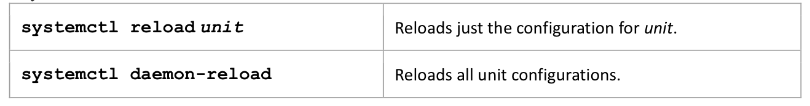

在中systemd我们将激活，关闭，和重启单元称为任务（jobs），它们本质上是对单元状态的变更。你可以用以下命令来查看系统中的当前任务：

$ systemctl list-jobs

如果已经运行了一段时间，系统中可能已经没有任何激活的任务，因为所有激活工作应该已经完成。然而，在系统启动时，如果你很快登录系统，你可以看到一些单元正在慢慢被激活。如下所示：

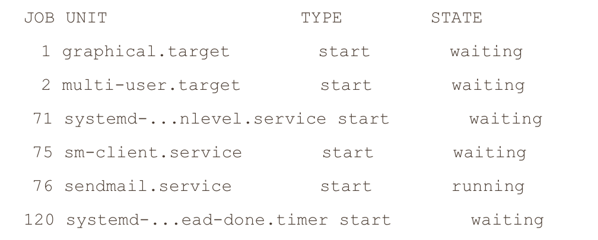

上例中的任务76是sendmail.service单元，它的启动花了很长时间。其他的任务处于等待状态，它们很有可能是在等待任务76.任务76在sendmail.service启动完成时会终止，其余的任务会继续，直到任务列表完全清空。

**注解**

*任务（job）这个词可能不太好理解，特别是我们在本章介绍过的Upstart也使用它来代表systemd中的单元。有一点需要注意，单元能够使用任务来启动，任务完成后会终止。单元，特别是服务单元，在没有任务的情况下也能够被激活和运行。*

我们将在**6.7 关闭系统**中介绍如何关闭和重启系统。

###6.4.5 在systemd中添加单元

在systemd中添加单元涉及创建和激活单元文件，有时候还需要开启。将单元文件放入系统配置目录/etc/systemd/system，这样你就不会将它们与系统自带的配置混淆起来，它们也不会被系统更新覆盖了。

创建一个什么都不做的目标单元很简单，你可以自己试一试。我们来创建两个目标，其中一个依赖于另一个：

1. 创建一个名为test1.target的单元：
2. [Unit]
   Description=test 1
3. 创建test2.target，其依赖于test1.target：
4. [Unit]
5. Description=test 2
   Wants=test1.target
6. 激活test2.target单元（test1.target作为依赖关系也会被激活）：
\# systemctl start test2.target
7. 验证两个单元都被激活：
8. \# systemctl status test1.target test2.target
9. test1.target - test 1
10. Loaded: loaded (/etc/systemd/system/test1.target; static)
11. Active: active since Thu, 12 Nov 2015 15:42:34 -0800; 10s
ago
12.
13. test2.target - test 2
14. Loaded: loaded (/etc/systemd/system/test2.target; static)
Active: active since Thu, 12 Nov 2015 15:42:34 -0800; 10s ago

**注解**

*如果单元文件中包含[Install]区段，你需要在激活前开启（enable）它。*

\# systemctl enable unit

你可以在上例中运行上面这个命令。将依赖关系从test2.target中去掉，在test1.target中加上[Install]区段WantedBy=test2.target。

####删除单元

使用以下步骤来删除单元：
1. 必要时关闭（deactivate）单元：
\# systemctl stop unit
2. 如果单元中包含[Install]区段，则通过关闭单元来删除依赖的符号链接：
\# systemctl disable unit
3. 这时你就可以删除单元文件了。

###6.4.6 systemd进程跟踪和同步

对于启动的进程，systemd需要掌握大量的信息和控制权。最大的问题是可以有多种方法来启动一个服务。可以对服务fork一个新的实例，甚至还可以将其作为守护进程并且从原始进程脱离开。

为了减小开发人员和系统管理员创建单元文件所需的工作量，systemd使用了控制组（control groups, cgroups），它是Linux内核的一个可选特性，提供更好的进程跟踪。如果你接触过Upstart就知道，为了找到一个服务的主进程需要做一些额外的工作。在systemd中，你不需要担心一个进程被fork了多少次，只需要知道它能不能被fork。你可以在服务单元文件中使用Type选项来定义其启动行为。启动行为有两种：

- Type=simple，服务进程不能fork。
- Type=forking，systemd希望原始的服务进程在fork后终止，原始进程终止时，systemd视其为服务准备就绪。

Type=simple选项并不负责服务花多长时间启动，systemd也不知道何时启动该服务的依赖关系。解决这个问题的一个办法是使用延时启动（delayed startup，（参考**6.4.7 systemd的按需和资源并行启动**）。不过我们可以使用Type来让服务就绪时通知systemd：

- Type=notify，服务在就绪时向systemd发送通知（使用sd_notifiy()函数）。
- Type=dbus，服务在就绪时向D-bus（Desktop Bus）注册自己。

另外还有一个服务启动类型是Type=oneshot，其中服务进程在完成任务后会彻底终止。对于这种启动类型，基本上你都需要加上RemainAfterExit=yes选项来确保systemd在服务进程终止后仍然将服务状态视作激活。

最后还有一个类型Type=idle，意思是如果当前没有任何激活任务的情况下，systemd才会激活该服务。这个类型主要是用于等其他服务都启动完成后，再启动制定的服务，这样可以减轻系统负载，还可以避免服务启动过程之间的交叉。（请记住，服务启动后，启动服务的systemd任务即终止）

###6.4.7 systemd的按需和资源并行启动 

systemd的一个最主要的特性是它可以延迟启动单元，直到它们真正被需要为止。配置方式如下：

1. 为系统服务创建一个systemd单元（单元A）。
2. 标识出单元A需要为其服务提供的系统资源，如：网络端口，网络套接字，或者设备。
3. 创建另一个systemd单元（单元R）来表示该资源。它有特殊的单元类型，如：套接字单元，路径单元，和设备单元。

其运行步骤如下：

1. 单元R激活的时候，systemd对其资源进行监控。
2. systemd将阻止所有对该资源的访问，对该资源的输入会被缓冲。
3. systemd激活单元A。
4. 当单元A启动的服务就绪时，其获得对资源的控制，读取缓冲的输入，然后正常运行。

有几个问题需要考虑：

- 必须确保资源单元涵盖了服务提供的所有资源。通常这不是大问题，因为大部分服务只有一个单一的访问点。
- 必须确保资源单元与其代表的服务单元之间的关联。这可以使显示或者是隐式，有些情况下，systemd可以有许多选项使用不同的方式来调用服务单元。
- 并非所有的服务器都能够和systemd提供的单元进行交互。

如果你了解诸如inetd，xinetd，和automount这样的工具，你就知道它们之间有很多相似的地方。事实上这个概念本身没什么新奇之处（实际上systemd包含了对automount单元的支持）。我们将在套接字单元和服务一节中介绍一个套接字的例子。但是首先来让我们看看系统启动过程中资源单元的作用。

####使用辅助单元优化启动

systemd在激活单元时通常会试图简化依赖关系和缩短启动时间。这类似于按需启动，其中辅助单元（Auxiliary Units）代表服务单元所需的资源，不同的地方是systemd在激活辅助单元之后立即启动服务单元。

使用该模式的一个原因是一些关键的服务单元如syslog和dbus需要一些时间来启动，有许多单元依赖于它们。然而，systemd能快速地提供单元所需的重要资源（如套接字单元），因此它不仅能够快速启动这个关键单元，还能够启动依赖于它的其他单元。关键单元就绪后，就能获得其所需资源的控制权。

**图6-2**显示了这一切在传统系统中的如何工作的。在启动时间线上，服务E提供了一个关键资源R。服务A，B，和C依赖于这个资源，必须等待服务E先启动。系统启动时，要启动服务C需要很长一段时间。

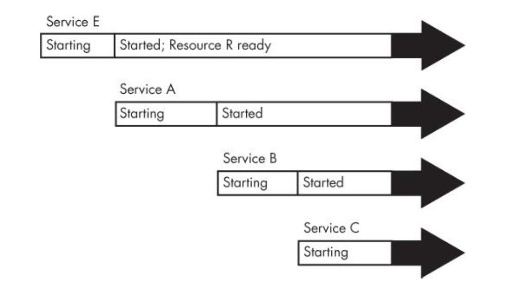

图6-2. 启动时间顺序和资源依赖关系

**图6-3**显示与**图6-2**等同的systemd的启动配置。有服务单元A，B，C，和E，和一个新的单元R代表单元E提供的资源。因为systemd在单元E启动时能够为单元R提供一个接口，单元A，B，C和E能够同时启动。单元E在单元R就绪时接管。（有意思的是，如单元B配置所示，单元A，B，和C并不需要在它们结束启动前显式访问单元R。）

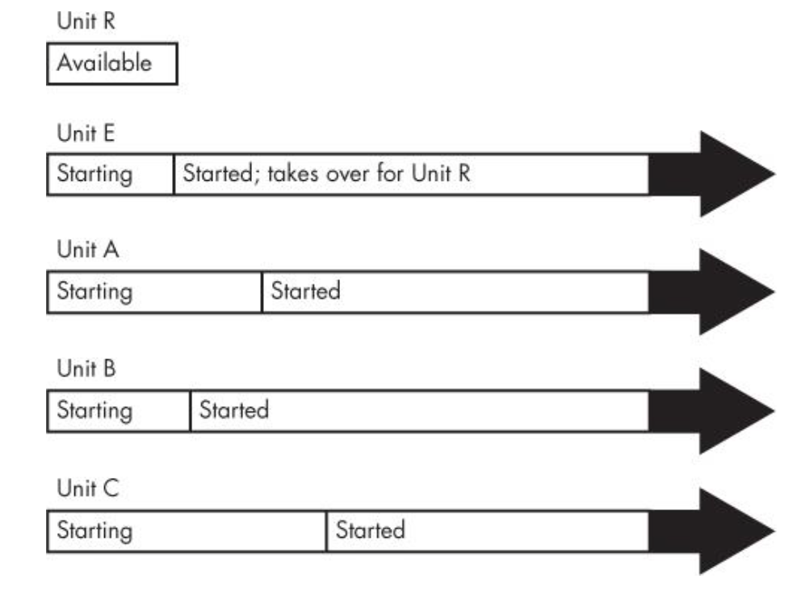

图6-3. systemd启动时间顺序和资源单元

**注解**

*当并行启动时，系统有可能会因为大量单元同时启动而暂时性的变慢。*

本例中虽然并没有创建按需启动的单元，但是仍然用到了按需启动的特性。在日常操作中，你可以在运行systemd的系统中查看syslog和DBus配置单元。它们大都是以这样的方式来并行启动的。

####套接字单元和服务实例

下面我们看一个实例，这是一个简单的网络服务，使用一个套接字单元。本节内容涉及TCP，网络端口，和网络监听，这些内容我们将在第9和第10章中介绍，如果你现在觉得不好理解可以暂时跳过。

本例中服务的功能是，当网络客户端连接服务时，服务将客户端发送的数据原样发送回客户端。服务单元使用TCP端口22222来监听请求。我们将此服务命名为回音服务（echo service），它通过一个套接字单元启动，单元内容如下：

[Unit]
Description=echo socket

[Socket]
ListenStream=22222
Accept=yes

注意在单元文件中并没有提及该套接字支持的服务单元，那么与之相关的服务单元文件在哪里呢？

服务单元文件名是echo@.service，两者是通过命名规范来建立关联的。如果服务单元文件名和套接字单元文件名（echo.socket）的前缀一样，systemd会在套接字单元有请求时激活服务单元。本例中，当echo.socket有请求时，sytemd会创建一个echo@.service的实例。
以下是echo@.service单元文件：

[Unit]
Description=echo service

[Service]
ExecStart=-/bin/cat
StandardInput=socket

**注解**

*如果你不喜欢使用前缀来隐式地激活单元，或者你需要激活有不同前缀单元，你可以在单元中定义使用的资源来显式地激活。例如，在foo.service中加入Socket=bar.socket，让bar.socket为foo.service提供它的套接字资源。*

你可以使用下面的命令来启动服务：

\# systemctl start echo.socket

你可以使用telnet命令连接本地端口22222来测试该服务是否运行，键入任意内容然后回车，服务会将你的输入内容原样输出：

$ telnet localhost 22222 
Trying 127.0.0.1... 
Connected to localhost.
Escape character is '^]'.
Hi there.
Hi there.

按CTRL-]，然后CTRL-D来结束服务，使用以下命令停止套接字单元：

\# systemctl stop echo.socket

####实例和移交

echo@.service单元支持多个实例同时运行，其文件名中含有@（在Notes一节中我们介绍过，@代表参数化）。那么我们为什么需要多个实例呢？因为很可能会有多个网络客户端同时连接到服务，每个连接需要一个专属的实例。

因为echo.socket中的Accpet选项，服务单元必须支持多个实例。该选项告诉systemd在监听端口的同时接受呼入的连接请求，并将连接传递给服务单元，每个连接是一个单独的实例。每个实例将连接作为标准输入，从中读取数据，不过实例并不需要知道数据是来自网络连接。

**注解**

*大多数网络连接除了需要与标准输入输出的简单接口外，还需要更多的灵活性。所以本例中的echo@.service只是一个很简单的例子，实际的网络服务要复杂得多。*

虽然服务单元可以完成接受连接的所有工作，但此时它的文件名中并不包含@。在这种情况下，它会获得对套接字的全部控制权，systemd在服务单元完成任务前不会试图去监听该网络端口。

由于各种资源和选项的差异，我们无法为资源移交给服务单元这个过程总结出一个简单的模式。并且这些选项的文档也分散在帮助手册中的各个地方。关于资源相关单元的文档，你可以查阅systemd.socket(5),systemd.path(5)，和systemd.device(5)。关于服务单元的一个经常被忽略的文档是systemd.exec(5)，它描述了服务单元在激活时如何获得资源的情况。

###6.4.8 systemd的System V兼容性

systemd中有一个特性让其有别于其他的新一代init系统，就是对于System V兼容init脚本启动的服务，systemd会尽量完全地进行监控。它是这样工作的：

1. systemd首先激活runlevel<N>.target，N是runlevel。
2. systemd为/etc/rc<N>.d中的每一个符号链接在/etc/init.d中标识出对应脚本。
3. systemd将脚本名和服务单元关联起来（例如：/etc/init.d/foo对应foo.service）。
4. systemd根据rc<N>.d中的名称，激活服务单元，使用参数start或者stop运行脚本。
5. systemd尝试关联脚本进程和服务单元。

由于systemd根据服务单元来建立关联，你可以使用systemctl来重启服务和查看其状态。不过System V兼容模式仍然按顺序执行init脚本。

###6.4.9 systemd辅助程序

使用systemd的时候你可能会注意到/lib/systemd目录中有大量的程序，它们主要是单元的支持程序。例如，作为systemd的一个组成部分，udevd对应的程序文件是systemd-udevd。此外，程序文件systemd-fsck是作为systemd和fsck的中间人。

这些程序很多都有标准系统工具程序所不具备的消息通知机制。它们通常运行标准系统工具程序，然后将执行结果通知给systemd。（毕竟重新实现systemd中的fsck是不太现实的）

**注解**

*这些程序都是使用C编写的，因为systemd的目的之一就是为了减少系统中脚本文件的数量。这究竟是否是个好主意还有很多争论（毕竟它们中很多都可以使用脚本来实现），不过最重要的是它们能够稳定、安全、和快速地运行，至于用脚本还是C来编写则是次要的。*

如果你在/lib/systemd中看到一个不认识的程序，你可以查阅帮助手册。帮助手册不仅提供该程序的信息，还提供它的单元类型。

如果你的系统中没有Upstart，或者你不感兴趣，你可以跳到**6.6 System V初始化**一节去了解System V的初始化过程。

##6.5 Upstart

init的Upstart版本主要涉及任务（jobs）和事件（events）。任务是启动和运行时Upstart执行的操作（如系统服务和配置），事件是Upstart从自身活着其他进程（如：udevd）接收到的消息。Upstart通过启动任务的方式来响应消息。

为了理解它的工作原理，我们来看看启动udevd守护进程的udev任务。它的配置文件是/etc/init/udev.conf，其中包含下面的内容：

start on virtual-filesystems
stop on runlevel [06]

它们表示Upstart在接收到virtual-filesystems事件时启动udev任务，在接收到带有参数0或者6的runlevel事件后停止。

事件和它们的参数有很多变种。例如，Upstart能响应任务状态触发的消息，如udev任务触发的started udev事件。在详细介绍任务之前，我们介绍一下Upstart大致的工作原理。

###6.5.1 Upstart初始化过程

Upstart的启动步骤如下：

1. 加载自身配置和/etc/init中的任务配置文件。
2. 产生startup事件。
3. 启动那些响应startup事件的任务。
4. 这些任务产生各自的事件，触发更多的任务和事件。

在完成所有正常启动相关的任务之后，Upstart继续监控和响应系统运行时产生的事件。

大多数Upstart的安装步骤如下：

1. 在Upstart响应startup事件所运行的任务中，mountall是最重要的一个。它为系统挂载所有必要的本地和虚拟文件系统，以保障系统其他部分能够运行。
2. mountall任务会产生一些事件，包括filesystem，virtual-filesystems，local-filesystems，remote-filesystems，和all-swaps等等。它们表示这些重要的文件系统已经挂载完毕并准备就绪。
3. 为了响应这些事件，Upstart启动一系列的服务。例如，为virtual-filesystems事件启动udev，为local-filesystems事件启动dbus。
4. 在local-filesystems事件和udevd就绪时，Upstart启动network-interfaces任务。
5. network-interfaces任务产生static-network-up事件。
6. Upstart为响应filesystem和static-network-up事件运行rs-sysinit任务。该任务负责维护系统当前的runlevel，在第一次没有runlevel启动时，它通过产生runlevel事件将系统切换到默认runlevel。
7. 为了响应runlevel事件和新的runlevel，Upstart运行系统中的其他大部分启动任务。

这个过程可能变得很复杂，因为事件产生的源头并不总是很清晰。Upstart本身只产生几个事件，其余的都来自任务。任务配置文件通常都声明了它们会产生的事件，但是产生事件的细节往往不在Upstart任务配置文件中。

通常你需要深入挖掘事情的本质。以static-network-up事件为例，network-interface.conf任务配置文件声明了它会产生该事件，但是没说从哪里产生。我们发现事件来自于ifup命令，其是由该任务使用脚本/etc/network/if-up.d/upstart来初始化网络接口时运行的。

**注解**

*虽然所有的这些过程都有文档（ifup.d目录在帮助手册interfaces(5)中能找到，ifup(8)帮助手册引用了这部分内容），但是光靠阅读文档来理解其整个工作原理并不是一件简单的事。更快的方法是使用grep在配置文件中搜索事件名称来查看相关的内容。*

Upstart的一个问题是没有办法清晰地查看事件的来龙去脉。你可以将它的日志优先级设置为debug，这样你可以看到所有的日志信息（通常在/var/log/syslog中），但是大量的信息会让人难以查找事件相关内容。

###6.5.2 Upstart任务

Upstart的/etc/init配置目录中的每个文件都对应一个任务，每个任务的主配置文件都有.conf后缀。例如，/etc/init/mountall.conf即针对mountall任务。

Upstart任务分两大类：

- Task任务（task jobs），这些任务会在某一时刻结束。例如，mountall就是一个task任务，其在挂载完文件系统后终止。
- Service任务（service jobs），这些任务何时结束未知。象udevd这样的守护服务进程，数据库服务，和Web服务都属于service任务。

还有第三种任务叫抽象任务，可以把它们看做是虚拟的service任务。它们只存在于Upstart中，本身什么都不运行，不过有时候其他任务的管理工具会使用它们产生的事件来启动和停止任务。

####查看任务

你可以使用initctl命令来查看Upstart任务和状态。下面的命令用来查看整个系统的运行状态：

$ initctl list

它输出的内容很多，我们来看两个比较有代表性的任务：

mountall stop/waiting

上面现实mountall task任务状态为stop/waiting，意思是其并未运行。（到本书成书为止，你还不能根据状态信息来确定任务是否已经运行过，stop/waiting状态有可能是任务从来未被运行过）

有关联进程的service任务的状态显示如下：

tty1 start/running, process 1634

表示tty1任务正在运行，与之关联的进程ID为1634。（不是所有的service任务都有关联的进程）

**注解**

*如果你知道任务名称，你可以使用initctl status job直接查看任务状态。*

initctl输出结果中的状态可能会有些不太清楚（例如：stop/waiting）。左边/之前的部分是目标（goal），或者说是任务将要达到的状态，如：start或stop。右边的部分是任务的当前状态，如：waiting或running。例如上面的例子中，tty1任务的状态是start/running，意思是它的目标是start。状态running表示它已经启动成功。（对于service任务来说，状态running只是象征性的。）

mountall则有一些不同，因为task任务不持续运行。状态stop/waiting通常表示任务已经启动并且执行完毕。在执行完毕时，其从目标start切换至stop，等待来自Upstart的后续指令。

之前提到，状态为stop/waiting的任务也可能从未启动过，所以除非你开始调试功能来查看日志，否则从状态上无法分辨任务是已经执行完毕还是从未启动，见6.5.5 Upstart日志。

**注解**

*你无法查看那些通过Upstart的System V兼容特性启动的任务。*

####任务状态转换

任务状态有很多种，但是它们之间的转换方式很固定。例如，通常任务是这样启动的：

1. 所有的任务起始状态为stop/waiting。
2. 当用户或者系统事件触发任务是，任务目标（goal）从stop变为start。
3. Upstart将任务状态从waiting变为starting，从而当前状态为start/starting。
4. Upstart产生starting job事件。
5. 任务执行starting状态的相关操作。
6. Upstart将任务状态从starting变为pre-start，并产生pre-start job事件。
7. 任务经过数次状态转换，最终变为running状态。
8. Upstart产生started job事件。

任务的终止也涉及一系列类似的状态转换和事件。（可以查阅upstart-events(7)帮助手册）

###6.5.3 Upstart配置

我们来看一下这两个配置文件：一个是task任务mountall，另一个是service任务tty1。和所有的Upstart配置文件一样，它们存放在目录/etc/init下，文件名为mountall.conf和tty1.conf。配置文件由更小的stanzas（分行结构）组成。每个stanza开头是一个关键字，诸如：description和start。

首先我们可以打开mountall.conf文件，在第一个stanza中寻找以下内容：

description     "Mount filesystems on boot"

该行包含了对任务的简短描述。

接下来的几个stanzas描述mountall任务如何启动：

start on startup
stop on starting rcS

第一行告诉Upstart在接收到startup事件（Upstart产生的第一个事件）时启动任务。第二行告诉Upstart在接收到rcS事件（此时系统进入单用户模式）时终止任务。

下面两行内容告诉Upstart任务mountall的运行方式：

expect daemon
task

task告诉Upstart它是一个task任务，因此任务会在某一时刻完成。expect有一些复杂，它表示mountall任务会复制一个守护进程，独立于原来的任务脚本运行。Upstart需要知道这些信息，因为它需要知道守护进程何时结束以便发送消息通知mountall任务已经结束。（相关我们将在**进程跟踪和Upstart Stanza**一节详细介绍）

mountall.conf文件中还有一些emits文本行（stanzas），用来说明任务会产生哪些事件：

emits virtual-filesystems
emits local-filesystems
emits remote-filesystems
emits all-swaps
emits filesystem
emits mounting
emits mounted

**注解**

*我们在**6.5.1 Upstart初始化过程**中提到过，这些文本行并不是真正的事件源，你需要在任务脚本中去寻找它们。*

你还可能看到console文本行，它们表示Upstart需要将任务信息输出到哪里：

console output

output参数代表Upstart将mountall的任务信息输出到系统控制台。

接下来你会看到任务的细节，它是一个script文本行：

script
   . /etc/default/rcS
   [ -f /forcefsck ] && force_fsck="--force-fsck"
   [ "$FSCKFIX" = "yes" ] && fsck_fix="-fsck-fix"
\# set $LANG so that messages appearing in plymouth are translated
   if [ -r /etc/default/locale ]; then
       . /etc/default/locale
       export LANG LANGUAGE LC_MESSAGES LC_ALL
   fi
   exec mountall --daemon $force_fsck $fsck_fix
end script

它是一个命令行脚本（参见**第十一章**），主要做一些预备工作，如：设置本地化参数，判断是否需要fsck。其下部的exec mountall命令执行真正的操作。这个命令的功能是挂载文件系统，并且在结束时产生任务需要的事件。

####Service任务tty1

Service任务tty1就简单得多，它控制一个虚拟控制台登录提示符。它的配置文件tty1.conf如下：

start on stopped rc RUNLEVEL=[2345] and (
          not-container or
          container CONTAINER=lxc or
          container CONTAINER=lxc-libvirt)
stop on runlevel [!2345]
respawn
exec /sbin/getty -8 38400 tty1

该任务最复杂的部分在于它的启动，不过现在让我们先来看下面这一行：

start on stopped rc RUNLEVEL=[2345]

它告诉Upstart在接收到stopped rc事件时（由Upstart在rc task任务执行完毕时产生）激活任务。为了满足该条件，rc任务还必须将RUNLEVEL环境变量设置为2~5间的某个值（参考6.5.6 Upstart Runlevels和System V兼容性）。

**注解**

*其他基于runlevel的任务没有这么多条件，例如：*

*start on runlevel [2345]*

*本例和前例的区别是启动时机不同。本例中任务在runlevel被设置时启动，而前例则需要等到System V相关任务结束才启动。*

container部分的作用是因为Upstart不仅仅在硬件系统上的内核上运行，还能够在虚拟环境和容器（container）中运行。一些环境中没有虚拟控制台，没有getty。

停止tty1任务很简单：

stop on runlevel [!2345]

该文本行告诉Upstart当runlevel不是2～5之间的值的时候停止任务（例如：在系统关闭时）。

最底部的exec文本行是这样一个命令：

exec /sbin/getty -8 38400 tty1

它类似于你在mountall任务中见到的script文本行，区别是tty1任务的设置很简单，一行命令足够。该命令在/dev/tty1上运行getty登录提示符程序，它是系统的第一个虚拟控制台（可以在图形界面中按CTRL-ALT-F1打开）。

respawn文本行告诉Upstart任务终止时重新启动tty1任务。当你从虚拟控制台退出时，Upstart启动一个新的getty登录提示符。

以上是基础的Upstart配置。你可以在帮助手册init(5)和在线文档找到更详细的内容。有一个需要特别提及的文本行expect，将在稍后介绍。

####进程跟踪和Upstart的expect Stanza

Upstart能在任务启动后跟踪它们的进程（因此它才能执行终止和重启），它知道与每个任务相关联的进程。在传统的Unix启动方式中，进程从其他进程产生分支（fork）成为守护进程（daemon），任务对应的主进程也许在产生一两个分支后才启动。如果没有一个好的跟踪机制，Upstart很难完成任务的启动，也很容易跟踪到错误的PID。

我们使用expect节来告诉Upstart有关任务执行的细节。有以下4种情况：

- No expect stanza，没有expect节。表示任务的主进程不产生分支，可直接跟踪主进程。
- expect fork，表示进程产生一次分支，跟踪分支进程。
- expect daemon，表示进程产生两次分支，跟踪第二个分支。
- expect stop，任务的主进程会发出SIGSTOP信号，表示其已经准备就绪。（这种情况很少见）

对于Upstart和systemd这些新版本的init而言，最好的是第一种情况（no expect），因为任务的主进程不需要包含关自身启动和关闭的机制。另一方面，它不需要考虑从当前终端产生分支和分离，这些麻烦的东西是Unix开发者很长时间以来都需要处理的。

很多传统的服务守护进程都包含调试选项，让主进程不要产生分支。Secure Shell daemon和选项-D是其中一个例子。/etc/init/ssh.conf的启动一节中包含启动sshd的一个简单配置，它防止了进程过快的再生，并且清除了很多误导人的stderr输出：

respawn
respawn limit 10 5
umask 022
\# 'sshd -D' leaks stderr and confuses things in conjunction with 'console log'
console none --snip--
exec /usr/sbin/sshd -D

对于包含expect节的任务来说，expect fork很常见。例如下面是/etc/init/cron.conf的启动部分：

expect fork
respawn
exec cron

这样简洁的启动配置通常能够产生稳定安全的守护进程。

**注解**

*关于expect节推荐到upstart.ubuntu.com站点阅读更多的文档，因为它和进程生命周期直接相关。比如，你可以使用strace命令来跟踪一个进程和它的系统调用，包括fork()。*

###6.5.4 Upstart操作

除了**6.5.2 Upstart任务**一节中介绍的list和status命令，你还可以用initctl工具来操控Upstart及其任务。建议你阅读帮助手册initctl(8)，现在让我们来看一些基础。

使用initctl start来启动Upstart任务：

\# initctl start job

使用initctl stop来停止任务：

\# initctl stop job

重启任务使用：

\# initctl restart job

如果想向Upstart发出事件，你可以运行：

\# initctl emit event

你还可以通过在event后加上key=value参数来向事件传递环境变量。

**注解**

*你无法单独启动或者停止由Upstart的System V兼容模式启动的服务。参见**6.6.1 System V init: 启动命令顺序**来了解在System V init脚本中怎么做。*

关闭Upstart任务以禁止其启动时运行的方法有很多种，可维护性最高的一种是确定任务配置文件的文件名（通常是/etc/init/<job>.conf），然后创建一个/etc/init/<job>.override文件，仅包含下面一行内容：

manual

这样唯一能够启动任务的方式是运行initctl start job。

这个方法的好处是很容易撤销，如果要在启动时重新开启任务，只需要删除.override文件即可。

###6.5.5 Upstart日志

Upstart中有两种基本的日志类型：service任务日志和由Upstart自己产生的系统诊断信息。Service任务日志记录脚本和运行服务的daemon产生的标准输出和标准错误输出内容。保存在/var/log/upstart中，作为服务产生的syslog日志的一种补充。（我们将在第七章详细介绍）这些日志中的内容很难分类，比较常见的内容是启动和关闭消息，和一些紧急错误消息。很多服务根本不产生日志，因为它们将所有日志记录到syslog或者它们自己的日志中。

Upstart自带的系统诊断信息包含其何时启动和重新加载，还有任务和事件相关信息。该日志使用内核的syslog工具。在Ubuntu上，它们通常保存在/var/log/log/kern.log和/var/log/syslog文件中。

缺省情况下，Upstart仅仅记录很少的日志，你可以更改Upstart日志的优先级来查看更多的信息。缺省优先级是message。可以将优先级设置为info来记录事件和任务信息：

\# initctl log-priority info

需要注意的是该设置会在系统重启后重置。你可以在启动参数中加上--verbose参数，让Upstart在系统启动时记录所有信息，参见**5.5 GRUB介绍**。

###6.5.6 Upstart Runlevel和System V兼容性

到目前为止，我们介绍了Upstart如何支持System V runlevels，也说过它能够将System V启动脚本作为任务来启动。下面是其在Ubuntu上运行的详细情况：

1. rc-sysinit任务运行，通常在接收到filesystem和static-network-up事件后。在其运行之前，runlevel没有设置。
2. rc-sysinit任务决定进入哪一个runlevel。通常是缺省runlevel，也有可能从较老的/etc/inittab文件或者内核参数（/proc/cmdline）中获得runlevel。
3. rc-sysinit任务运行telinit来切换runlevel。该命令产生一个runlevel事件，在RUNLEVEL环境变量中设置runlevel值。
4. Upstart接收到runlevel事件。每个runlevel都配置有一系列的任务来响应runlevel事件，由Upstart负责启动。
5. rc是由runlevel激活的任务之一，它负责运行System V start。和System V init一样，rc运行/etc/init.d/rc（参见**6.6 System V init**）。
6. rc任务停止后，Upstart在接收到stopped rc事件后启动一系列其他任务（如：**Service任务tty1**中介绍过的tty1）。

请注意虽然Upstart将runlevel和其他事件等同对待，但Upstart系统中的很多任务配置文件中涉及runlevel。

系统启动过程中有一个关键点，就是当所有文件系统都挂载完毕，大部分重要系统都初始化后。此时系统准备启动更高级别的系统服务，如图形显示管理和数据库服务。此时产生一个runlevel事件以做标记，你也可以配置Upstart产生其他事件。判断哪些服务作为Upstart任务启动，哪些作为System V link farm（参见6.6.2 The System V init Link Famr）启动不是一件容易的事。比如你的runevel是2，则/etc/rc2.d中的任务都是以System V兼容模式运行。

**注解**

*/etc/init.d文件中的伪脚本比较蛋疼。对于Upstart的service任务，/etc/init.d中可能有一个与之对应的System V脚本，但是它除了表示该服务已经被转换为Upstart任务以外，并没有其他作用。也没有到System V链接目录的符号链接。如果你看到伪脚本，你可以获得Upstart任务名，然后使用initctl来操控该任务。*

##6.6 System V init

Linux上的System V init实现药追溯到Linux的早期版本，它根本目的是为了为系统提供合理的启动顺序，支持不同的runlevel。虽然现在System V已经不太常见，不过在Red Hat Enterprise Linux和一些路由器和电话的Linux嵌入系统中还是能够看到System V init。

System V init安装包含两个主要组件：一个核心配置文件和一组启动脚本以及符号链接集。配置文件/etc/inittab是核心。如果你系统中有System V init的话，你可以从中看到如下内容：

id:5:initdefault:

这表示runlevel为5.

inittab中的内容都有如下格式，四列内容使用分号隔开，分别是：

- 唯一标识符（一串短字符，本例中为id）
- runlevel值（一个或多个）
- init执行的操作（本例中是将runlevel设置为5）
- 执行的命令（可选项）

下面一行内容告诉我们命令如何运行：

l5:5:wait:/etc/rc.d/rc 5

这行内容很重要，它触发大部分的系统配置和服务。wait操作决定System V init何时和怎样运行命令。进入runlevel 5时运行一次/etc/rc.d/rc 5，然后一直等待命令执行完毕。rc 5命令运行/etc/rc5.d中所有以数字开头的命令（按数字的顺序）。

除了initdefault和wait之外，下面是其他inittab的常见操作。

**respawn**

respawn让init在其后的命令结束执行后，再次运行。在inittab文件中你有可能看到以下内容：

1:2345:respawn:/sbin/mingetty tty1

getty程序提供登录提示符。上面的命令时针对第一个虚拟控制台（/dev/tty1），当你按ALT-F1或者CTRL-ALT-F1能够看到（参考3.4.4 终端：/dev/tty*，/dev/pts/*，和/dev/tty）。respawn在你登出系统后重新显示登录提示符。

**ctrlaltdel**

ctrlaltdel是控制当你在虚拟控制台中按CTRL-ALT-DEL键时系统采取的操作。在大部分系统中，这是重启命令，它执行shutdown命令（我们在6.7 关闭系统中介绍过）。

**sysinit**

sysinit是init在启动过程中执行的第一个操作，在进入runlevel之前。

**注解**

*请使用inittab(5)在帮助手册中查看更多的操作。*

###6.6.1 System V init启动命令顺序

现在你可以来了解一下在你登录系统之前，System V init怎样启动系统服务。之前我们介绍过：

l5:5:wait:/etc/rc.d/rc 5

它只是简单的一行指令，但实际触发了很多其他程序。rc是运行命令的简写（run commands），我们在许多脚本、程序、和服务中使用到它。那么运行的命令在哪里？

该行中的5代表runlevel 5。运行的命令多半是在/etc/rc.d/rc5.d或者/etc/rc5.d中。（Runlevel 1使用rc1.d，runlevel 2使用rc2.d，与此类推）你可能在rc5.d目录下找到以下内容：

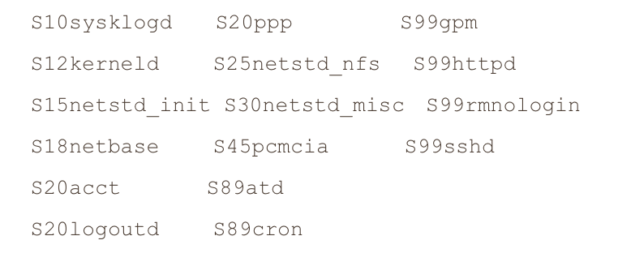

rc 5命令通过执行下面的命令来运行rc5.d目录下的程序：

S10sysklogd start 
S12kerneld start 
S15netstd_init start 
S18netbase start 
--snip--
S99sshd start

请注意每一行中的start参数。命令名中的大写S表示命令应该在start模式中运行，数字00～99决定了rc启动命令的顺序。rc*.d命令通常是命令行脚本，启动/sbin或者/usr/sbin中的程序。

一般情况下，你可以使用less或其他命令查看脚本文件内容来了解命令的功能。

**注解**

*有一些rc*.d目录中有一些以K（代表"kill"，或者stop模式）开头的命令。此时rc使用参数stop而非start运行命令。K开头的命令通常在关闭系统的runlevel中。*

你也可以手动运行这些命令。不过通常你是通过init.d目录而非rc*.d来运行，我们马上会讲到。

###6.6.2 The System V init Link Farm

rc*.d目录实际上包含的是符号链接，指向init.d目录中的文件。如果想运行、添加、删除、或者更改rc*.d目录中服务，你需要了解这些符号链接。下面是rc5.d目录的内容示例：

lrwxrwxrwx . . . S10sysklogd -> ../init.d/sysklogd 
lrwxrwxrwx . . . S12kerneld -> ../init.d/kerneld 
lrwxrwxrwx . . . S15netstd_init -> ../init.d/netstd_init 
lrwxrwxrwx . . . S18netbase -> ../init.d/netbase 
--snip--
lrwxrwxrwx . . . S99httpd -> ../init.d/httpd 
--snip--

子目录中有大量的符号链接，我们称为链接池（link farm）。有了这些链接，Linux可以对不同的runlevel使用相同的启动脚本。虽然不需要严格遵循，但这种方法确实更简洁。

**启动和停止服务**

如果要手动启动和停止服务，可以使用init.d目录中的脚本。比如我们可以使用init.d/httpd start来启动httpd Web服务。类似地使用stop参数来关闭服务（httpd stop）。

**更改启动顺序**

在System V init中更改启动顺序是通过更改链接池来完成。通常涉及禁止init.d目录中的某个命令在某个runlevel中运行。你必须小心操作，如果你想要删除某个rc*.d目录中的某个符号链接，在将来你想恢复的时候，你可能已经忘记了它的链接名。所以一个比较好的办法是在链接名前加下划线（_），如：

\# mv S99httpd _S99httpd

它让rc忽略_S99httpd，因为文件名不以S或K开头，同时我们保留了原始的链接名。

如果要添加服务，我们可以在init.d目录创建一个脚本文件，然后在相应的rc*.d目录中创建指向它的符号链接。最简单的办法是在init.d目录中拷贝和修改你熟悉的脚本（更多命令行脚本的内容请参见**第十一章**）。

在添加服务的时候，需要为其设置适当的启动顺序。如果服务启动过早有可能失败，因为它依赖的其他服务可能还没有就绪。对于那些非关键性服务，大多数系统管理员会为它们设置90以后的序号，以便让系统服务首先启动。

###6.6.3 run-parts

System V init运行init.d脚本的机制在很多Linux系统中被广泛应用，甚至包括那些没有System V init的系统。其中有一个工具我们称为run-parts，它能够按照特定顺序运行指定目录中所有可执行程序。类似用户使用ls命令列出目录中的程序，然后逐一运行。

它默认运行目录中的所有可执行程序，也有可选项用来指定执行或忽略某些指定的程序。在一些Linux系统中，你不太需要控制这些程序如何运行。如Fedora就只包含一个很简单的run-parts版本。

其他一些Linux系统，如：Debian和Ubuntu则包含一个复杂一些的run-parts版本。其功能包括使用正则表达式来选择运行程序（例如，使用S[0-9]{2}来运行/etc/init.d runlevel目录中的所有启动脚本），并且还能够向这些程序传递参数。这些特性能够让我们使用一条简单的命令来完成System V runlevel的启动和停止。

关于run-parts的细节你不需要知道太多，很多人甚至不知道有run-parts这么个东西。只需要知道它能够运行一个目录中的所有程序，在脚本中时不时会出现即可。

###6.6.4 System V init控制

有些时候，你需要手工干预一下init，以便其能够切换runlevel，或者重新加载配置信息，甚至关闭系统。你可以使用telinit来操纵System V init。例如，使用以下命令切换到runlevel 3：

\# telinit 3

runlevel切换时，init会试图终止所有新runlevel的inittab文件中没有包括的进程，所以需要小心操作。

如果你需要添加或者删除任务，或者更改inittab文件，你需要使用telinit命令让init重新加载配置信息：

\# telinit q

可以使用telinit s切换到单用户模式（参见6.9 紧急启动和单用户模式）。

##6.7 关闭系统

init控制系统的启动和关闭。关闭系统的命令在所有init版本中都是一样的。关闭Linux系统最好的方式是使用shutdown命令。

shutdown命令有两种使用方法，一是使用-h可选项关闭系统，并且使其一直保持关闭状态。下面的命令能够立即关闭系统：

\# shutdown -h now

在大部分系统中，-h切断机器电源。另外还可以使用-r来重启系统。

系统的关闭过程会持续几秒钟，在此过程中请不要重置和切断电源。

上例中的now是时间，是一个必须的参数，有很多种设置时间的方法。例如，如果你想让系统在将来某一时间关闭，可以使用+n，n以分钟为单位，系统会在n分钟后执行关闭命令。（可以使用shutdown(8)在帮助手册中查看的更多相关选项）

下面的命令在10分钟后重启系统：

\# shutdown -r +10

Linux会在shutdown运行时通知已经登录系统的用户，不过也仅此而已。如果你将time参数设置为now以外的值，shutdown命令会创建一个文件/etc/nologin。这个文件存在时，系统会禁止超级用户外的任何用户登录。

系统关闭时间到时，shutdown命令通知init开始关闭进程。在Systemd中，这意味着激活shutdown单元。在Upstart中，这意味着产生关闭事件。在System V init中，这意味着将runlevel设置为0或6。无论哪个系统，大致的关闭过程如下：

1. init通知所有进程安全关闭。
2. 如果某个进程没有及时响应，init会先使用TERM信号尝试强行终止它。
3. 如果TERM信号无效，init会使用KILL信号。
4. 锁定系统文件，并且进行其他关闭准备工作。
5. 系统卸载root以外的所有文件系统。
6. 系统以只读模式重新挂载root文件系统。
7. 系统将所有缓冲区中的数据通过sync程序写到文件系统。
8. 最后一步是使用reboot(2)系统调用通知内核重启或者停止。由init或者其他辅助程序reboot，halt或者poweroff来完成。

reboot和halt根据它们被调用的方式不同而行为各异，有时会带来一些困扰。默认情况下，它们使用参数-r或者-h来调用shutdown。但如果系统已经处于halt或者reboot runlevel，程序会通知内核立即关闭自己。如果你想不顾一切快速关闭系统，可以使用-f（force）选项。

##6.8 初始RAM文件系统

Linux启动过程很简单。但是其中的一个组件总是让人一头雾水，那就是initramfs，或称为初始RAM文件系统（initial RAM filesystem）。可以把它看作是一个用户空间的楔子，在用户空间启动前出现。不过首先我们来看看它是用来做什么的。

问题来源于种类各异的存储硬件。不知道你是否还记得，Linux内核从磁盘读取数据时不直接与BIOS和EFI接口通讯，为了挂载root文件系统，它需要底层的驱动程序支持。如果root文件系统存放在一个连接到第三方控制器的磁盘阵列（RAID）上，内核首先就需要这个控制器的驱动程序。因为存储控制器的驱动程序种类繁多，内核不可能把它们都包含进来，所以很多驱动程序都以可加载模块的方式出现。可加载模块是以文件形式来存放，如果内核一开始没有挂载文件系统的话，它就无法加载需要的这些驱动模块了。

解决的办法是将一小部分内核驱动模块和工具打包为一个文档。引导装载程序在内核运行前将该文档载入内存。内核在启动时将文档内容读入一个临时的RAM文件系统（initramfs），然后挂载到/上，将用户模式切换给initramfs上的init。然后使用initramfs中的工具让内核加载root文件系统需要的驱动模块。最后，这些工具挂载真正的root文件系统，启动真正的init。

initramfs的具体实现各有不同，并且还在不断演进。在一些系统中，initramfs的init就是一个简单的命令行脚本，通过udevd来加载启动程序，然后挂载真正的root并在其上执行init。在使用systemd的系统中，你能在其中看到整个的systemd安装，没有单元配置文件，只有一些udevd配置文件。

初始RAM文件系统的一个始终未变的特性是你可以在不需要时跳过它。就是说内核已经有了所有它需要的用来挂载根文件系统的驱动程序时，你可以在你的引导装载程序配置中跳过初始RAM文件系统。跳过该过程能够缩短一两秒钟的启动时间。你可以自己尝试在GRUB菜单编辑器中删除initrd行。（最好不要使用GRUB配置文件来做实验，一旦出错很难恢复）目前来说初始RAM文件系统还是需要的，因为大多数的Linux内核并不包含诸如通过UUID挂载这些特性。

初始RAM文件系统只是通过gzip压缩的cpio归档文件（见帮助手册cpio(1)）。你可以从引导装载程序配置中找到该文件（使用grep在grub.cfg文件中查找initrd）。然后使用cpio将归档文件的内容释放到一个临时目录来查看其内容。如下例所示：

$ mkdir /tmp/myinitrd
$ cd /tmp/myinitrd
$ zcat /boot/initrd.img-3.2.0-34 | cpio -i --no-absolute-filenames 
--snip--

其中有一处地方值得一提，就是init进程末尾的“pivot”部分。它负责清除临时文件系统中的内容以节省内存空间，并且切换到真正的root。

创建初始RAM文件系统的过程很复杂，不过通常我们不需要自己动手。有很多工具可以供我们使用，Linux系统中通常都会自带。dracut和mkinitramfs是最为常用的两个。

**注解**

*初始RAM文件系统（initramfs）是指使用cpio归档文件作为临时文件系统。它的一个较老的版本叫做初始RAM磁盘（initial RAM disk, initrd），其使用磁盘映像文件作为临时文件系统。cpio归档文件的维护更佳简单，不过很多时候initrd也用来代指使用cpio的初始RAM文件系统。如上例所示，文件名和配置文件中都还有出现initrd。*

##6.9 紧急启动和单用户模式

当系统出现问题时，首先采取的措施通常是使用系统安装映像来启动系统，或者使用SystemRescueCd这样可以保存到移动存储设备上的恢复映像。系统修复大致包括以下几方面：

- 系统崩溃后，检查文件系统
- 重置系统管理员密码
- 修复关键的系统文件，如：/etc/fstab和/etc/passwd
- 系统崩溃后，从备份数据恢复系统

除上述措施外，单用户模式能够快速将系统启动到一个可用状态。它将系统启动到root命令行，而不是完整启动所有的服务。在System V init中，runlevel 1通常是单用户模式，你也可以在引导装载程序中使用-s参数来进入此模式，此时可能需要输入root密码。

单用户模式的限制是它提供的服务有限。如：网络，图形界面，和终端通常都不可用。所以我们在系统恢复时通常优先考虑系统安装映像。

------

#第七章 系统配置：日志，系统时间，批处理任务，和用户

当你第一次看到/etc目录时，可能会感觉信息量太大。其中的大多数文件或多或少都对系统运行有影响，有的甚至非常关键。

本章我们介绍一些系统组件，它们使得用户级别工具（参见**第二章**）能够访问系统的基础设施（参见**第四章**）。我们将着重介绍以下内容：

- 系统库为获得服务和用户信息而访问的配置文件
- 系统启动时运行的服务程序（有时称为守护进程，daemon）
- 用来更改服务程序和配置文件的配置工具
- 系统管理工具

本章不涉及网络，因为其是一个相对独立的部分，我们将在**第九章**介绍。

##7.1 /etc目录结构

Linux系统的大部分系统配置文件都存放在/etc目录中。按照惯例，每个程序在这里都有一个或多个配置文件，Unix系统的程序数目很多，所以/etc目录也会越来越庞大。

这样带来了两个问题：一是很难找到想要的配置文件，维护起来也不方便。比如，要更改系统的日志配置，你需要编辑/etc/syslog.conf文件。但是你的更改可能会被随后的系统升级覆盖掉。

目前比较常见的方式是将系统配置文件放到/etc下的子目录，象我们介绍过的启动目录一样（Upstart的是/etc/init，systemd的是/etc/systemd）。虽然/etc目录下仍然会有一些零散的配置文件，如果你运行ls -F /etc查看的话，你会发现大部分配置文件都放到了子目录中。

为了解决配置文件被覆盖的问题，你可以将定制的配置放到子目录里的其他文件中，如：/etc/grub.d。

/etc中到底有哪些类型的配置文件呢？基本规则是针对系统的定制的配置文件在/etc下，如：用户信息（/etc/passwd）和网络配置（/etc/network）。然而，应用程序的细节不放到/etc中，如：系统用户界面的缺省配置。你会发现那些非定制的系统配置文件存放在其他地方，比如预先打包的系统单元文件在/usr/lib/systemd中。

我们已经介绍过一些启动相关的配置文件。下面让我们来看一个具体的系统服务及其配置文件。

##7.2 系统日志

大多数系统程序将它们的日志信息输出到syslog服务。传统的syslogd守护进程等待消息的到来，根据它们的类型将它们输出到文件、屏幕、和其他地方，有的干脆忽略。

###7.2.1 系统日志

系统日志是系统中最重要的部分之一，如果系统出现你不清楚的错误，查看系统日志文件是第一选择。以下是日志文件示例：

 Aug 19 17:59:48 duplex sshd[484]: Server listening on 0.0.0.0 port 22.

大多数Linux系统使用的是syslogd的一个新版本，叫做rsyslogd，它的功能不仅仅限于记录日志信息。比如，你还可以让它加载一个将日志信息写到数据库的模块。不过最简单的方式还是从/var/log目录开始。你看看其中的那些日志文件后，就能够了解它们来自哪里。

 /var/log目录中很多文件都不是由系统日志来维护的。要知道哪些日志属于rsyslogd，需要查看它们的配置文件。

###7.2.2 配置文件

 rsyslog的基础配置文件是/etc/rsyslog.conf，你还会在其他地方发现另外一些配置文件，如：/etc/rsyslog.d。其内容包含传统的规则和rsyslog扩展。其中一条规则是任何以字符$开头的都是扩展。

 传统的规则包括一个选择符（selector）和一个操作（action），说明从哪里获得日志和将它们写到哪里，如下例所示：

例7-1. syslog规则
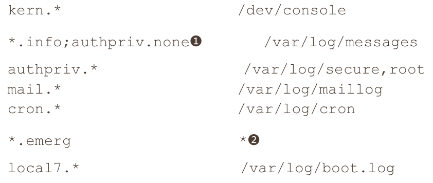

左边是选择符，表示要为哪种信息类型记录日志。右边是操作列表，表示要将日志写到哪里。**例7-1**中大部分的操作都是将日志写入文件，也有一些例外。例如：/dev/console表示系统控制台的一个特殊设备，root表示如果root用户登录的话，将消息发送给他，*代表发送消息给系统中的所有用户。你还可以使用@host将消息发送给网络上的其他主机。

####设施和优先级

选择符用来匹配日志信息的设施和优先级。设施是指消息的大致分类。（使用rsyslog.conf(5)在帮助手册中查看完整的设施列表）

设施的功能很容易通过它们的名称得知。例如，**例7-1**中的配置文件从kern，authpriv，mail，cron和local7这些设施中抓取日志信息。➋处的*号是一个通配符，表示从所有设施中获得输出。

设施后的.后面是优先级。由低到高分别是：debug，info，notice，warning，err，crit，alert和emerge。

**注解**

*要在rsyslog.conf中将日志消息从设施中排除，可以使用none作为优先级，如**例7-1**中➊所示。*

为选择符设置了优先级之后，rsyslogd将该优先级及其以上优先级的消息发送到指定目的地。也就是说，**例7-1中**➊处的*.info将抓取大部分日志消息并将它们写到/var/log/messages，因为info是一个相对较低的优先级。

####扩展语法

之前提到过，rsyslogd的语法扩展了传统的syslogd语法，它们通常以$开头，我们称之为指令。一个比较常用的扩展是让你加载其他的配置文件。rsyslog.conf中就包含这样的指令，让rsyslogd加载/etc/rsyslog.d目录中的所有.conf文件。

$IncludeConfig /etc/rsyslog.d/*.conf

大部分的指令都很好理解。比如以下涉及用户和权限的指令：

$FileOwner syslog
$FileGroup adm
$FileCreateMode 0640
$DirCreateMode 0755
$Umask 0022

**注解**

*还有一些rsyslogd配置文件扩展定义了输出模版和频道，你可以使用rsyslogd(5)来查看完整的帮助手册，不过它的Web文档更全面一些。*

####故障排除

测试系统日志最简单的一个方法是使用logger命令手工发送日志消息，如下所示：

$ logger -p daemon.info something bad just happened

rsyslogd不容易出错。出现问题大都是因为配置文件没有正确配置设施和优先级，因而没有获得想要抓取的日志信息，或者是由于磁盘空间不足。大多数系统会使用logrotate或者类似工具来自动清除/var/log中的文件，不过如果在短时间写入大量日志时还是会出现系统负载增加、磁盘空间用尽的情况。

**注解**

*rsyslogd抓取的日志不仅仅来自于系统各组件。我们在第六章介绍过systemd和Upstart抓取的启动日志消息，除此之外还有很多其他来源，比如Apache Web服务器，通常它有自己的存取和错误日志。你可以查看服务器配置来获得那些日志。*

####日志的过去和将来

syslog服务在不断演进。曾经出现过一个叫klogd的守护进程，负责为syslogd截获内核的日志消息。（这些日志可以使用dmesg命令查看）后来该功能被并入到了rsyslogd中。

毋庸置疑的是，Linux的系统日志功能会随着时间而改变。Unix系统日志从来就没有形成过一个标准，不过这种情况正在慢慢改变。

##7.3 用户管理文件

Unix系统支持多用户。用户对于内核而言只是一些数字（用户ID），因为用户名比数字容易记忆，所以用户一般都是用用户名（usernames或者login names）而非用户ID来管理系统。用户名只存在于用户空间，使用到用户名的应用程序在和内核通迅时，通常需要将用户名映射为用户ID。

###7.3.1 /etc/passwd文件

文本文件/etc/passwd中包含一一对应的用户名和用户ID。如下所示：

例7-2. /etc/passwd中的用户列表
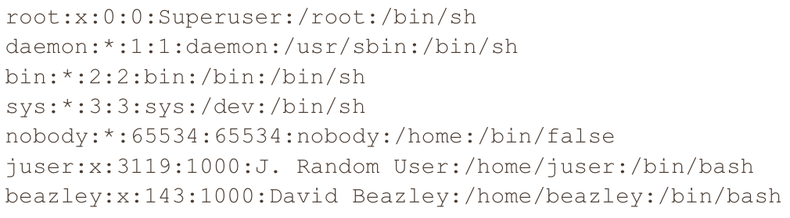

每一行代表一个用户，一共有7列，通过冒号:分隔，它们依次是：

- 用户名
- 经过加密的用户密码。大部分Linux系统都不在passwd中存放实际的用户密码，而是将密码存放在shadow文件中（参见**7.3.3 /etc/shadow文件**）。shadow文件的格式和passwd类似，不过普通用户没有访问权限。passwd和shadow文件中的第2列是经过加密的密码，是一些象d1CVEWiB/oppc这样的字符，读起来很费劲。（Unix不明文存储密码）
第2列中的x代表加密过的密码存放在shadow文件中。*代表用户不能登录，如果为空（象::这样），则表示登录不需要密码。（绝对不要将普通用户的该列设置为空）
- 用户ID（user ID，UID）是用户在内核中的标识。同一个用户ID可以出现在两行中，不过这样做比较容易产生混淆，程序在处理时也需要将它们合并起来。用户ID必须唯一。
- 用户组ID（group ID，GID）是/etc/group文件中的某个ID号。用户组定义了文件权限及其他。该列也称为用户的基本组（primary group）。
- 用户的真实名称（通常称为GECOS列）。有时候其中会有逗号，用来分隔房间和电话号码。
- 用户的根目录（home directory）。
- 用户的命令行（shell），即用户在终端中运行的程序。

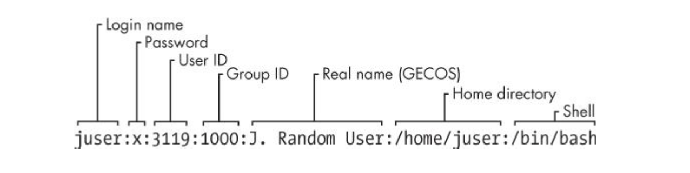

图7-1. passwd文件中的条目

/etc/passwd文件有严格的语法规则，不允许注释和空行。

**注解**

*用户在/etc/passwd中的对应行和其根目录统称为用户账号。*

###7.3.2 特殊用户

在/etc/passwd中有一些特殊用户。超级用户（root）的UID和GID固定为0，如**例7-2**所示。有一些用户如daemon没有登录权限。nobody用户的权限最小。一些进程在nobody名下运行，因为它没有任何写权限。

无法登录的用户我们称为伪用户（pseudo-users）。虽然无法登录系统，但是系统可以使用它们来运行一些进程。nobody这样的伪用户的目的是为了安全方面考虑。

###7.3.3 /etc/shadow文件

Linux中的影子密码文件（/etc/shadow）包含用户验证信息，包括经过加密的密码和密码过期日期，和/etc/passwd文件中的用户相对应。

Shadow文件为密码存储提供了一种更灵活（同时也更安全）的方法。它包括了一些程序库和工具，后来很快被PAM替代（参考**7.10 PAM**）。PAM使用/etc/shadow文件，而非象/etc/login.defs这样的配置文件。

###7.3.4 用户和密码管理

普通用户使用passwd命令来更改密码。passwd不仅可以更改用户密码，你还可以使用-f选项来更改用户名，-s选项来更改shell（/etc/shells中有shell列表）。（你还可以使用chfn和chsh来更改用户名和shell）passwd命令是一个suid-root程序，只有超级用户能够编辑/etc/passwd文件。

####使用超级用户来更改/etc/passwd

/etc/passwd是纯文本文件，超级用户可以使用任何文本编辑器来编辑它。要添加用户，只需加上一行并且为用户创建一个根目录即可，要删除用户则反之。不过通常我们使用vipw来编辑/etc/passwd文件，它更为安全，会在你编辑时备份和锁定文件。你还可以使用vipw -s来编辑/etc/shadow文件（虽然你可能永远不需要用到）。

很多人不愿意直接编辑passwd文件，因为很容易把文件搞乱。使用另外的终端命令或者图形界面（GUI）更为方便和安全。

如可以使用超级用户运行passwd user可以设置用户密码。adduser和userdel可以添加和删除用户。

###7.3.5 用户组

用户组用可以将文件访问权设定给某些用户，而使其他用户无权访问。你可以为某组用户设置读写位，从而排除其他的用户。在多名用户共享一台主机的时候，用户组很有用，然而现在我们很少在主机上共享文件了。

/etc/group文件中包含了用户组ID（类似/etc/passwd文件中的ID）。如**例7-3**所示：

例7-3. /etc/group文件样例

root:*:0:juser
daemon:*:1:
bin:*:2:
sys:*:3:
adm:*:4:
disk:*:6:juser,beazley
nogroup:*:65534:
user:*:1000:

和/etc/passwd文件一样，/etc/group中的每一行有多列，由冒号分隔。从左到右是：

- 用户组名，运行如ls -l这样的命令时可以看到
- 用户组密码，很少也不该被使用（使用sudo替代）。可以设置为*或者其他缺省值。
- 用户组ID（GID），必须是一个唯一的数字。GID出现在/etc/passwd文件的用户组列中。
- 属于该组的用户列表，该列是可选项，passwd文件中的用户组ID列也定义了用户属于哪个用户组。

**图7-2**显示了用户组文件中的各列：

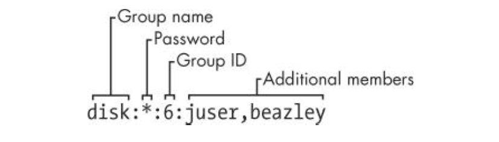

图7-2. group文件中的条目

你可以使用group命令来查看你所属的用户组。

**注解**

*Linux通常会为每个新加入的用户创建一个新的用户组，用户组名和用户名相同。*

##7.4 getty和login

getty连接到终端并且在其上显示登录提示符。大多数Linux系统中的getty程序很简单，仅仅是在虚拟终端上显示提示符。它可以使用在管道命令中，如下所示：

$ ps ao args | grep getty 
/sbin/getty 38400 tty1

本例中38400是波特率。有些getty不需要该设置。（虚拟终端会忽略此设置，这只是为了和连接串行口的那些程序兼容）

输入用户名后，getty调用login程序提示你输入密码。如果输入的密码正确，login调用你的shell（使用exec()）。否则你会得到“登录错误”提示信息。

现在你了解了getty和login，虽然你可能不需要配置和更改它们。实际上你使用它们的机会可能不多，因为现在用户大都通过图形界面（如gdm）或者远程登录（如SSH）。login的用户验证由PAM来处理（参考**7.10 PAM**）。

##7.5 设置时间

Unix系统的运行依赖精确的计时。内核负责维护系统时钟（system clock），你可以使用date命令来查看，还可以用它设置时间，不过并不推荐这样做，因为设置的时间有可能不精准，你的系统时间应该尽可能的精准。

计算机硬件有一个使用电池的时钟（real-time clock，RTC）。RTC并不是最精准的，但是聊胜于无。内核通常在启动时使用RTC来设置时间，你可以使用hwclock命令将系统时间重新设置为硬件系统的当前时间。最好将你的硬件时钟设置为UTC（Universal Coordinated Time），这样可以避免不同时区和夏令时带来的问题。你可以使用以下命令将内核的UTC时钟设置为RTC：

\# hwclock --hctosys --utc

不过内核在计时方面还不如RTC，因为Unix系统启动一次经常持续运行数月甚至数年，所以容易产生时间误差（time drift）。这个误差是指系统时间的实际时间（通常由原子时钟等精确时钟产生）之差。

不要试图使用hwclock来修复时间误差，因为这会影响那些基于时间的系统事件。你可以运行adjtimex来更新系统时钟，不过最好的办法是使用守护进程来使你的系统时间和网络上的时间保持同步（参见**7.5.2 网络时间**）。

###7.5.1 内核时间和时区

内核将当前的系统时间显示为以秒为单位的一串数字，自UTC时间1970年1月1日12:00时起开始。你可以使用以下命令来查看：

$ date +%s

为了易读性，用户空间程序会将这组数字转换为本地时间，并且将夏令时和其他因素都考虑在内（比如印第安纳州时间）。文件/etc/localtime（其是二进制文件）用来控制本地时区。

时区信息在/usr/share/zoneinfo文件中，其中包含了时区及其别名等信息。如果要手工设置时区，可以将/usr/share/zoneinfo中的某个文件拷贝到/etc/localtime（或者创建一个符号链接），或者使用系统自带的时区工具。（你可以使用tzselect命令寻找时区文件）

如果要为shell会话设置时区，可以将TZ环境变量设置为/usr/share/zoneinfo中的某个文件名，如下所示：

$ export TZ=US/Central 
$ date

和其他环境变量一样，你也可以只为某条命令执行时设置时区，如下：

$ TZ=US/Central date

###7.5.2 网络时间

如果你的主机连接到Internet，你可以运行网络时间协议（Network Time Protocol, NTP）守护进程来更新时间。很多Linux系统自带NTP守护进程，但是不一定默认开启。你可以安装ntpd包来运行它。

如果你想做一些手工配置，可以参考NTP网站 [http://www.ntp.org](http://www.ntp.org/)，如果你想偷点懒也没关系，下面是简要的步骤：

1. 从你的ISP或者ntp.org获得离你最近的NTP服务器。
2. 将该服务器加入/etc/ntpd.conf文件。
3. 在启动时运行ntpdate server。
4. 在ntpdate命令之后运行ntpd。

如果你的主机没有Internet连接，你可以使用chronyd守护进程在离线状态下维护系统时间。

在系统重启时，你还可以根据网络时间来设置系统的硬件时钟。（很多Linux系统会自动这样做）使用ntpdate（或者ntpd）从网络设置系统时间，然后运行我们在前面注释中介绍过的命令：

\# hwclock --systohc –-utc

##7.6 使用cron来安排日常任务

Unix的cron服务能够按照日程安排来重复运行任务。cron对多数富有经验的系统管理员来说非常重要，它可以完成很多自动化的系统维护工作。比如，它运行日志文件的替换工具来确保旧的日志文件被删除以腾出磁盘空间。建议你要掌握cron的使用方法，这对你会很有帮助。

你可以使用cron在任何时间运行任何程序。通过cron运行的程序我们称为cron任务。要添加一个cron任务，可以在crontab文件中加入一行，通常通过crontab来完成。例如，你要将/home/juser/bin/spmake命令安排在每天的9:15AM运行，可以加入以下一行：

15 09 * * * /home/juser/bin/spmake

最开始的5列用空格分隔，设定任务运行的时间（参见**图7-3**），它们分别是：

- 分钟（0～59），上例中是15。
- 小时（0～23），上例中是9。
- 天（1～31）。
- 月（1～12）。
- 星期（0～7），0和7代表周日。

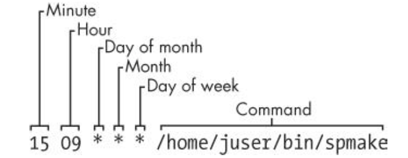

图7-3. crontab文件中的条目

表示匹配所有值。上例中spmake每天都运行，因为天、月、星期等列的值都是*，代表每天，每月，一周内的每一天。

如果只想在每个月的14号运行，可以使用下面这行设置：

15 09 14 * * /home/juser/bin/spmake

每一列可以有多个值。例如，要在每月5号和14号运行程序，可以将第三列设置为5,14：

15 09 5,14 * * /home/juser/bin/spmake

**注解**

*如果cron任务产生标准输出、错误、或者非正常退出，你会收到一封邮件通知。如果你觉得邮件太麻烦，可以将输出结果重定向到/dev/null或者日志文件中。*

帮助手册crontab(5)为我们提供了有关crontab的详细信息。

###7.6.1 安装Crontab文件

每个用户可以用自己的crontab文件，所以系统中经常会有很多个crontab，通常保存在/var/spool/cron/crontabs目录中。普通用户对该目录没有写权限，crontab命令负责安装、查看、编辑和删除用户的crontab。

安装crontab最简便的方法是将crontab条目放入一个文件（如：file），然后运行crontab file命令将该文件安装为你的crontab。crontab命令会检查文件的格式，确保没有错误。你可以使用crontab -l列出你的cron任务。使用crontab -r删除crontab文件。

然而当你第一次创建了crontab文件后，后续使用临时文件来进行更改会比较麻烦。你可以使用crontab -e命令来更改并安装的crontab。如果有错误，crontab命令会提示是否重新编辑。

###7.6.2 系统crontab文件

Linux系统通常使用/etc/crontab文件来安排系统任务的运行，而不是使用超级用户的crontab。不要使用crontab命令来编辑该文件，因为它有一个额外的列来设置运行任务的用户。例如下面这一行设置，任务在6:42AM由root（➊处）用户运行：

42 6 * * * root➊ /usr/local/bin/cleansystem > /dev/null 2>&1

**注解**

*一些系统将系统crontab文件存放在/etc/cron.d目录中。它们的文件名也许不同，不过内容格式和/etc/crontab一样。*

###7.6.3 cron的未来

cron工具是Linux系统中历史最长的组件之一，大约有几十年了，甚至在Linux出现之前就已经存在，它的文件格式一直以来基本上没有改变。由于它实在是太过于老旧，人们正在想办法替换它。

它的替代者实际上是新版本的init的一部分。对于systemd来说是计时器单元（timer units）。对于Upstart来说是重复产生事件来触发任务。总之它们都可能够以任何用户的名义运行任务，并且支持诸如定制日志这样的便利。

然而实际上目前的systemd和Upstart都还不具备cron的全部功能。而且，就算它们具备和所有功能，还要考虑向后兼容性，要能够支持那些依赖于cron的系统。从这个意义上说，cron还不会这么快被替代。

##7.7 使用at进行一次性任务调度

要在将来的某一时刻一次性运行任务，如果不使用cron的话，可以使用at服务。例如要在10:30PM运行myjob，可以使用以下命令：

$ at 22:30 
at> myjob

使用CTRL-D结束输入。（at从标准输入读取命令）

要检查任务是否已经被设定，可以使用atq。要删除任务，使用atrm。你还可以使用这样的日期DD.MM.YY格式将任务设置为将来某一时刻运行，如：at 22:30 30.09.15。

关于at命令差不多就这么些内容。虽然它不太常用，不过在某些场景下比较有用，比如让系统在将来某个时刻关闭。

##7.8 了解用户ID和用户切换

我们已经介绍过，sudo和su这样的setuid程序允许你切换用户，login这样的系统组件负责控制用户访问。你或许想了解它们的工作原理，以及内核在用户切换中所起的作用。

更改用户ID有两种方式，均由内核负责完成。第一种是运行setuid程序，我们在**2.17 文件模式和权限**一节中介绍过。第二种是通过setuid()系统调用，该系统调用有很多不同版本，用来处理和进程关联的所有用户ID，我们将在**7.8.1 进程归属，有效UID，实际UID，和已保存UID**一节中详细介绍。

内核负责为进程制订规则，规定哪些能做和不能做，下面是三个基本规则：

- 以root（userid 0）身份运行的进程可以调用setuid()来切换为任何用户。
- 没有以root身份运行的进程在调用setuid()时有一些限制，大多数情况下不能调用setuid()。
- 任何进程，只要有足够的文件访问权限，都可以运行setuid程序。

**注解**

*用户切换并不涉及用户名和用户密码。这是用户空间的概念，我们在7.3.1 /etc/passwd文件一节中介绍过。我们将在**7.9.1 为用户信息使用库**一节中详细介绍。*

###7.8.1 进程归属，有效UID，实际UID，和已保存UID

到目前为止我们有关用户ID的内容都是简化过的。实际上每个进程都有超过一个用户ID。我们提到过的有效UID（effective user ID, euid）设定了进程的访问权限。另外还有一个UID时实际UID（real user ID, ruid），是实际启动进程的UID。当你运行setuid程序时，Linux将有效UID设置为程序文件的拥有者，同时将实际UID设置为你的UID。

有效UID和实际UID之间的区别很模糊，以至于很多文档中有关进程归属的内容都是不正确的。

我们可以将有效UID看作执行者（actor），实际UID看作所有者（owner）。实际UID是可以于进程进行交互的那个用户，可以终止进程，向进程发送信号。例如，如果用户A以用户B的名义启动了一个新进程（基于setuid权限），用户A仍然是该进程的所有者，并且可以终止该进程。

在Linux系统中，大多数进程的有效UID和实际UID是相同的。ps和其他系统诊断命令默认显示有效UID。可以使用以下命令来查看有效UID和实际UID：

$ ps -eo pid,euser,ruser,comm

如果想要两者有不同的值，可以为sleep命令创建一个setuid拷贝，运行一段时间，在其结束前使用ps命令在另一个终端窗口查看它的信息。

除了有效UID和实际UID外，还有一个已保存UID（saved user ID）。进程在运行过程中可以从有效UID切换到实际UID和已保存UID。（实际上Linux还有另外一个UID：文件系统UID，file system user ID，fsuid，很少用到，代表访问文件系统的用户）

####Setuid程序

实际UID可能会和我们以往的理解有冲突。我们也许会有疑问，为什么要经常和不同的用户打交道？举个例子，我们使用sudo启动了一个进程，如果要终止它，我们仍然需要sudo，而无法使用其他用户。这时候实际UID却是你，如果你对该程序文件有所有权的话。

因此sudo和其他setuid程序会使用setuid()这样的系统调用来显式地更改有效UID和实际UID。这样做是为了避免一些由于各UID不匹配导致的副作用和权限问题。

**注解**

*如果你对用户ID切换的细节和规则感兴趣，可以使用setuid(2)查看帮助手册，还可以参考SEE ALSO部分列出的其他帮助手册。该主题涉及很多针对不同情况的系统调用。*

许多程序不喜欢它们的实际UID是root。要防止sudo更改实际UID，可以将下面一行加入你的/etc/sudoers文件（请注意使用root运行程序可能带来的副作用）：

Defaults     stay_setuid

####相关安全性

因为Linux内核通过setuid程序和相关系统调用来处理用户切换（以及相关的文件存取权限），系统管理员和开发人员必须特别注意以下两点：

- 有setuid权限的程序
- 这些程序所执行的功能

如果你创建了一个bash shell的拷贝，setuid为root，普通用户就可以运行它来获得整个系统的控制权。就这么简单，就这么任性。另外，setuid为root的程序中的bug也有可能为系统带来风险。攻击Linux系统的常见方式之一就是利用那些以root名义运行的程序的漏斗，这样的例子数不胜数。

由于手段繁多，防止系统攻击是一个复杂的主题，涉及很多方面。其中最有效的方式之一是强制使用用户名和密码进行验证。

##7.9 用户标识和认证

多用户系统必须支持基本的用户标识（identification）和认证（authentication）。用户标识判定用户的身份，即是哪一位用户。用户认证让用户来证明自己就是其声称的那位用户。用户授权（authorization）限定用户的权限。

对于用户标识，Linux内核通过用户ID来管理进程和文件的权限。对于用户认证，Linux内核控制如何执行setuid，以及如何让用户ID执行setuid()系统调用来切换用户。然而内核对于运行在用户空间中的所有用户认证相关事宜却一无所知，比如：用户名和用户密码等等。

我们在**7.3.1 /etc/passwd文件**一节中介绍过用户ID和密码的对应关系，现在我们来介绍用户进程如何使用这些对应关系。我们先看一个简化的例子，用户进程需要知道它的用户名（即其有效UID对应的用户名）。在传统的Unix系统中，进程通过以下步骤获得用户名：

1. 进程使用geteuid()系统调用从内核处获得它的有效UID。
2. 进程打开并浏览/etc/passwd文件。
3. 进程从/etc/passwd文件中逐行读取内容。如果没有可读取的内容，则整个过程失败。
4. 进程将整行内容解析为字段（就是用冒号分隔的列）。第三列即是用户ID。
5. 进程将第4步中获得的用户ID和第1步中的用户ID进行匹配，如果匹配成功，则该行的第1列即为要找的用户名，整个过程结束。
6. 否则进程返回第3步继续。

实际上上述过程复杂得多。

###7.9.1 为用户信息使用库

如果上述过程要让每个有此需求的开发人员自己实现的话，整个系统会变得支离破碎，错误百出，难以维护。万幸的是，一旦你从geteuid()获得用户ID，你需要做的只是调用象getpwuid()这样的标准库函数来获得用户名。（详细使用方法可参考帮助手册）

有了共享的标准库，你可以自己对需要的功能做一系列的加工而不会影响到其他程序。比如，你可以不用/etc/passwd，而是使用LDAP这样的网络服务来获得用户名。

上述方法对于通过用户ID得到对应的用户名来说行得通，但是对于密码来说就不行了。**7.3.1 /etc/passwd文件**一节中介绍过，一般来说/etc/passwd中的是经过加密的密码，如果你要验证用户输入的密码，你需要将用户输入的密码加密，然后和/etc/passwd文件中的密码进行比对。

这样的方式有下面几个局限：

- 系统对于加密协议并没有一个统一标准
- 前提是你需要有对加密密码的访问权限
- 前提是每当用户需要访问资源的时候，你都要让用户输入用名和密码（这会让人抓狂）。
- 前提是你使用密码。如果你使用的是一次性token，智能卡，生物识别技术，活着其他形式的验证，你需要自己加入对它们的支持。

由于上述的一些局限，也促成了影子密码机制开发，我们在**7.3.3 /etc/shadow文件**一节中介绍过，它就是用来建立系统层面的密码配置标准。不过上述大部分的问题促成了PAM解决方案的出现。

##7.10 PAM

为了提高用户验证的灵活性，Sun Microsystems公司在1995年提出了一个新的标准，可插入验证模块（Pluggable Authentiation Modules，PAM），它是一个共享的验证库（Open Source Software Foundation RFC 86.0, October 1995）。进行用户验证的时候，用户被提交给PAM来处理。这样比较容易加入新的验证方式和技术，比如：两段式验证（two-factor）和物理钥匙。除了对验证机制的支持，PAM还提供一些有限的验证控制服务（如可以为某些用户禁止cron这样的服务）。

因为用户验证的应用场景很多，PAM使用了一系列可以动态加载的验证模块。每个模块负责一个具体的任务，比如：pam_unix.so模块负责检查用户密码。

这样的任务很不简单。编程接口都很复杂，PAM看起来也没有能够解决所有的问题。无论怎样，Linux系统中涉及用户验证的程序基本上都是使用PAM，大部分Linux系统也是使用PAM。因为PAM是基于Unix现有的验证API，所以在集成PAM支持的时候只需少量的额外工作即可。

###7.10.1 PAM配置

我们将通过PAM的配置来了解PAM的工作原理。PAM配置文件通畅存放在/etc/pam.d目录（在较老的系统中有可能是/etc/pam.conf文件）。目录中文件很多，可能会让人抓不着头绪。一些文件名应该会包含一些你熟知的系统名称，比如cron和passwd。

由于这些配置文件在不同的Linux系统上各异，我们很难找到一个通用的例子。我们以chsh（change shell）的配置文件中的一行为例：

auth requisite pam_shells.so

该行表示用户的shell必须在/etc/shells中，以便能够与chsh进行验证。配置文件中每一行有三列：功能类型，控制参数和模块。以下是它们代表的意思：

- 功能类型，指定用户应用程序请求PAM执行的任务。本例中是auth，即用户验证。
- 控制参数，指定PAM在成功执行任务或者任务执行失败后的操作（本例中为requisite），我们稍后详细介绍。
- 模块，指定运行的验证模块。本例中pam_shells.so模块检查用户shell是否在/etc/shells中。

####功能类型

PAM能够执行以下四类功能：

- auth，用户验证（验证用户身份）。
- account，检查用户账号状态（例如用户是否对某一操作有权限）。
- session，仅在用户当前进程内执行（例如显示当日的消息）。
- password，更改用户密码和其他验证信息。

功能类型和模块用来定义PAM执行的操作。模块可以有多个功能类型，当我们查看配置行时，需要结合功能类型和模块来确定该行的功能。比如，pam_unix.so模块在执行auth时检查密码，但是在执行password时却是设置密码。

####控制参数和入栈规则

PAM的一个重要特性是它的配置行中使用stack定义的规则，你可以为执行的操作定义一些规则。这也凸显了控制参数的重要性，某一行任务执行的成败会影响到后面的行甚至整个任务执行的成败。

控制参数有两类：简单语法和高级语法。简单语法的控制参数主要是以下三种：

- sufficient，如果规则执行成功，用户验证即成功，PAM忽略其他规则。如果规则执行失败，PAM继续执行其他规则。
- requisite，如果规则执行成功，PAM继续执行其他规则。如果规则执行失败，用户验证即失败，PAM忽略其他规则。
- required，如果规则执行陈功，PAM继续执行其他规则。如果规则执行失败，PAM继续其他规则，但是无论其他规则执行结果如何，最终的验证将失败。

让我们继续上例，下面是chsh验证的一个堆栈实例：

auth sufficient pam_rootok.so 
auth requisite pam_shells.so
auth sufficient pam_unix.so 
auth required pam_deny.so

当chsh请求PAM执行用户验证时，根据以上配置，PAM执行以下步骤（见**图7-4**）：

1. pam_rootok.so模块检查进行验证的用户是否是root。如果是的话则立即验证通过并且忽略其他后续验证。这是因为控制参数sufficient，表示当前操作执行成功即可，PAM立即通知chsh验证成功。否则继续执行步骤2。
2. pam_shell.so模块检查用户的shell是否在/etc/shells中。如果不是的话，模块返回失败，requisite控制参数表示PAM应立即通知chsh验证失败，并忽略其他后续验证。如果shell在/etc/shells中，模块返回验证成功，并且根据控制参数required继续执行步骤3。
3. pam_unix.so模块要求用户输入密码并检查。控制参数为sufficient，意思是该模块验证通过后PAM即向chsh报告验证成功，如果输入密码不正确，PAM继续步骤4。
4. pam_deny.so模块总是返回失败，由于控制参数为required，PAM向chsh返回验证失败。在没有其他规则的情况下，这是默认的操作。（请注意required控制参数并不导致PAM立即失败，其还会继续后续的操作，但是最终还是返回验证失败）

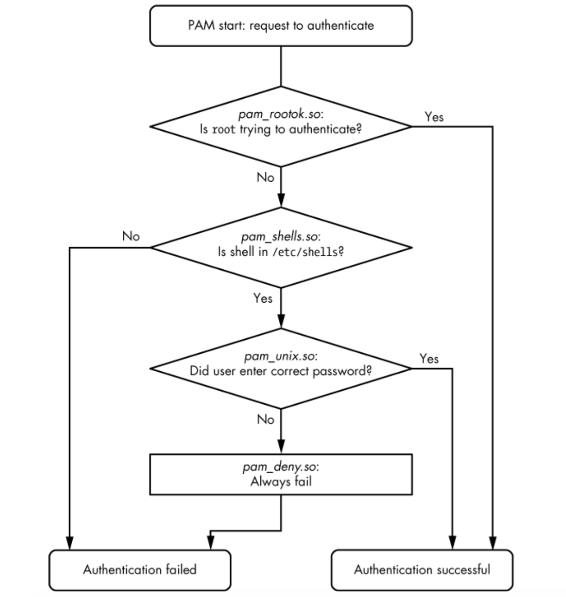

图7-4. PAM规则执行流程

**注解**

*在讨论PAM的时候，不要将功能（function）和操作（action）混淆起来。功能是广义上的目标，即用户请求PAM执行的操作（诸如用户验证）。操作是PAM为了达到目标执行的某个具体任务。你只需要记住，用户应用程序首先执行功能，然后PAM负责执行相关操作。*

高级语法的控制参数使用方括号（[]）表示，让你能够根据模块的返回值（不仅仅是成功和失败两种）手动定义相应的操作。详情可以查看pam.conf(5)帮助文档，了解了简单语法控制参数后，高级语法控制参数就不是问题了。

####模块参数

PAM模块能够在模块名后带参数。在pam_unix.so模块中你经常能够看到类似下面的内容：

auth sufficient pam_unix.so nullok

参数nullok表示用户可以不需要密码（默认值是用户如果没有密码则验证失败）。

###7.10.2 关于PAM的一些注解

由于控制流和模块参数语法，使得PAM配置语法具备了编程语言的某些特征和功能。目前我们仅仅是介绍了皮毛，下面是更多关于PAM的介绍：

- 可以使用man -k pam_(请注意此处的下划线)来列出系统中的PAM模块。要查看这些模块的存放位置可能会很难，你可以用locate unix_pam.so命令试试运气。
- 帮助手册中有每个模块相关功能和参数的详细信息。
- 很多Linux系统会自动生成一些PAM配置文件，所以尽量不要在/etc/pam.d目录中直接对它们进行更改。在做更改之前请阅读/etc/pam.d文件中的注释信息，如果它们是由系统生成的文件，注释中会对来源加以说明。
- /etc/pam.d/other配置文件中包含默认配置，用于那些没有自己的配置文件的应用程序。默认配置往往是拒绝所有的验证。
- 在PAM配置文件中包含其他配置文件的方法有很多种。@include语法加载整个配置文件，你也可以使用控制参数来加载配置文件的特定功能。不同的系统方式不同。
- PAM配置不以模块参数结束。一些模块可以访问/etc/security中的其他文件，通常用来配置针对某个用户的特定限制。

###7.10.3 PAM和密码

由于Linux密码校验近年来的不断发展，留下了很多密码配置包，有些时候容易产生混淆。首先是/etc/login.defs这个文件，它是最初影子密码的配置文件。其中包含了加密算法的信息，不过使用PAM的新版本系统很少使用它了，因为PAM配置中自己包含了这些信息。所以，/etc/login.defs中的加密算法必须和PAM配置中的相匹配，以防万一有的应用程序不支持PAM。

PAM是从哪里获得密码加密信息呢？PAM处理密码的方式有两种：通过auth功能（用来校验密码）和password功能（用来设置密码）。查看密码设置参数很容易，最简单的方式是使用grep，如下所示：

$ grep password.*unix /etc/pam.d/*

匹配的行中会包含pam_unix.so，象下面这样：

password sufficient pam_unix.so obscure sha512

参数obscure和sha512告诉PAM在设置密码时执行什么操作。首先，PAM检查密码是否足够复杂（也就是说，新密码不能和老密码太过相似，后者太常用），然后PAM使用SHA512算法来加密新密码。

这支在用户设置密码时生效，而不是在PAM校验密码时。PAM是怎样知道在用户验证时使用哪个算法呢？配置信息中没有这方面的信息，对于pam_unix.so的auth功能来说，没有针对加密信息的参数，帮助手册里也没有。

看起来pam_unix.so仅仅是靠猜测，通常是通过libcrypt库来尝试找出使用的那个算法。所以你通常不用太担心密码校验加密算法。

##7.11 前瞻

至此我们已经到达的全书的一半，介绍了Linux系统的很多关键组成部分。特别是关于日志和用户的内容，让你了解到Linux系统是如何将服务和任务分解为小而独立的部分并且仍然能够在上下文中相互交互。

本章主要是用户空间方面的内容，我们需要对用户空间进程和它们消耗资源有一个新的认识，因此让我们进入**第八章**来看看内核。

#第八章 深入进程和资源配置

本章我们将深入介绍进程之间的关系，内核和系统资源。计算机硬件资源主要有三种：CPU，内存，和I/O。进程为获得这些资源相互竞争，内核则负责公平地分配资源。内核本身也是一种软件资源，进程通过它来创建新的进程，以及和其他进程通讯。

本章介绍的工具当中，有很多涉及性能监控，在你试图找出系统变慢的原因时会非常有帮助。然而我们不需要过多关注系统性能，优化已经工作良好的系统经常是浪费时间。我们应该更多地了解这些工具的功能，同时在此过程中我们会对内核有更深入的了解。

##8.1 进程跟踪

我们在**2.16 查看和操纵进程**一节中介绍过如何使用ps命令查看系统中运行的进程。ps命令列出当前运行的进程，但是无法提供进程随时间变化的情况。因而你无法得知哪个进程使用了过多的CPU时间和内存。

在这方面top命令比ps命令更有用些，因为它能够显示系统的当前状态，还有ps命令显示的一些信息，并且每秒更新一次信息。最重要的是top命令将系统中最活跃的进程（即当前消耗CPU时间最多的那些进程）显示在最上方。

你可以向top命令发送键盘命令。下面是一些比较重要的命令：
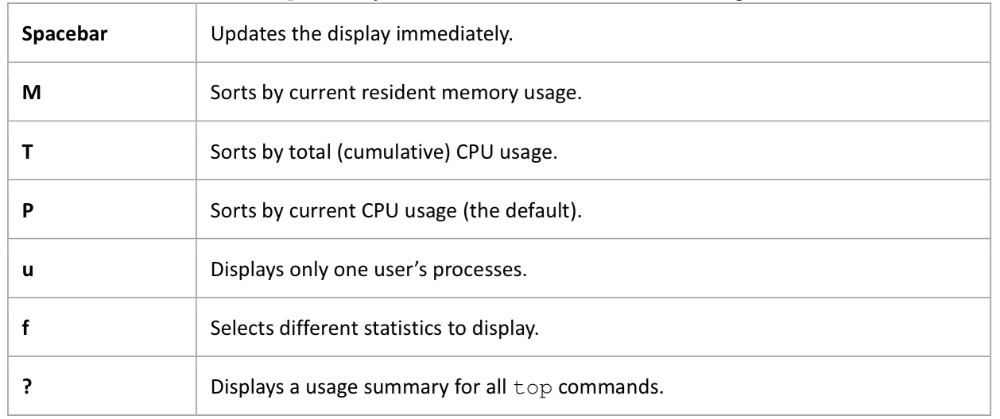

Linux中另外还有两个类似于top的工具，提供更详细的信息和更丰富的功能，它们是atop和htop。还有另外一些工具提供额外的功能，比如htop命令包含一些lsof命令的功能，lsof我们将在下节介绍。

##8.2 使用lsof查看打开的文件

lsof命令列出打开的文件以及使用它们的进程。由于Unix系统中大量使用文件，所以lsof在系统排错方面是最有用的命令之一。lsof不仅仅显示常规文件，还显示网络资源，动态库，管道等等。

###8.2.1 lsof输出

lsof的输出结果通常信息量很大，见下面的例子，其中有init和vi打开的文件：

$ lsof
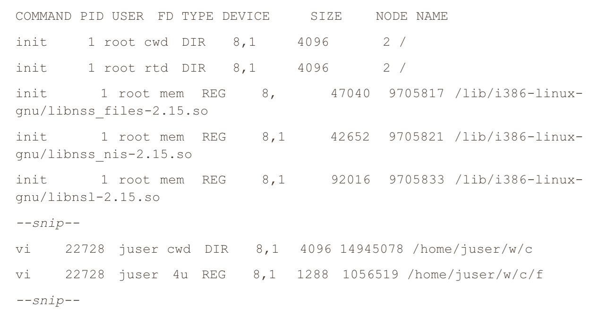

其中包含以下几列：

- COMMAND，打开文件的进程对应的命令名。
- PIM，进程ID。
- USER，运行进程的用户。
- FD，该列包含两种元素。本例中FD列显示文件的作用。该列还能够显示打开文件的描述符，文件描述符是一个数字，进程通过它使用系统库和内核来进行文件标识和操作。
- TYPE，文件类型（如：常规文件，目录，套接字等）。
- DEVICE，包含该文件的设备的最大最小代码。
- SIZE，文件大小。
- NODE，文件的inode编号。
- NAME，文件名。

以上各列所有可能的值可以在帮助手册lsof(1)可以找到，不过输出结果应该很清楚了。例如，FD列中使用加粗字体标出cwd的那些行，它们显示当前进程的工作目录。另一个例子是最后一行，它显示用户正在使用vi编辑的文件。

###8.2.2 lsof的使用

运行lsof有两种基本方式：
- 输出完整的结果，然后将输出结果通过管道用命令less显示，然后在其中搜索你想要的内容。由于输出结果信息量很大，该方法可能会花点时间。
- 使用命令行选项来过滤lsof的输出结果。

你可以使用命令行选项将文件名作为参数，让lsof只显示和参数匹配的条目。例如，下面的命令显示/usr目录中的所有打开文件：

$ lsof /usr

根据进程ID列出打开文件，使用以下命令：

$ lsof -p pid

你可以运行lsof -h查看所有的选项。大部分选项和输出格式有关。（请参考**第十章**中关于lsof网络特性的介绍）

**注解**

*lsof和内核信息密切相关。如果你升级内核时没有按常规升级系统的其他部分，你可能需要升级lsof。如果你同时升级了内核和lsof，新的lsof可能需要你重新启动新内核以后才能够正常工作。*

##8.3 跟踪程序执行和系统调用

到目前为止我们介绍的工具都是针对运行中的进程。然而有时候你的程序可能在系统启动后马上就终止了，这时你可能会一头雾水，lsof命令也不管用了。实际上使用lsof查看执行失败的进程非常困难。

strace（trace系统调用）和ltrace（trace系统库）命令能够帮助你了解程序试图执行哪些操作。它们的输出信息量都很大，不过一旦你确定了查找的范围，有很多工具可以帮助你定位需要的信息。

###8.3.1 strace

之前介绍过，系统调用是用户空间请求内存执行的经过授权的操作，诸如打开文件读取数据等等。strace能够显示进程涉及的所有系统调用。可以通过下面的命令查看：

$ strace cat /dev/null

在**第一章**中我们介绍过，进程调用fork()系统调用来从自身创建出一个新的进程分支（即自己的一个拷贝），然后新的进程调用exec()系统调用集来启动和运行新的程序。strace命令在fork()系统调用之后开始监控新创建的进程（源进程的拷贝）。因而该命令输出结果的一开始几行应该显示execve()的执行情况，随后是内存初始化系统调用brk()，如下所示：

execve("/bin/cat", ["cat", "/dev/null"], [/* 58 vars */]) = 0 brk(0) = 0x9b65000

输出的后续部分涉及共享库的加载。除非你想要知道加载共享库的细节，否则你可以忽略这些信息。

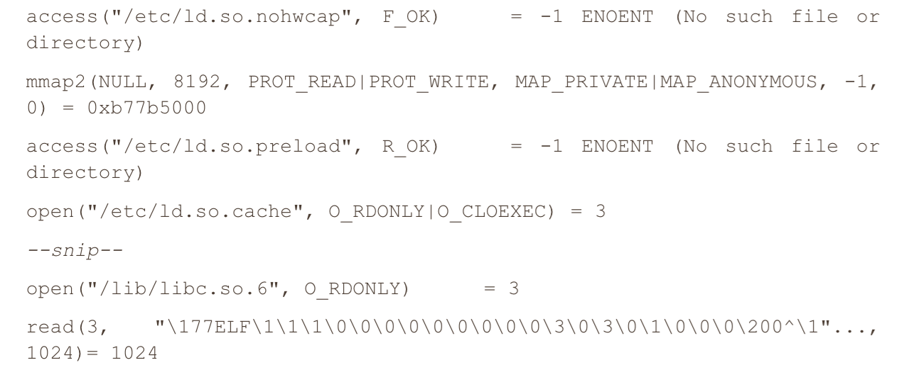

除此之外，你可以跳过输出结果中的mmap，直到下面的部分：

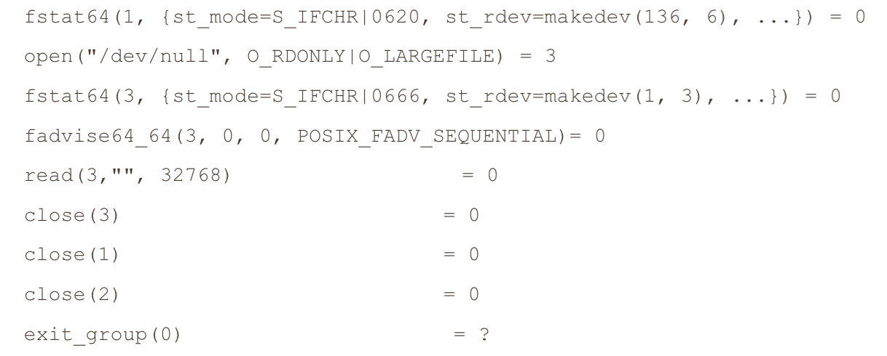

这部分内容显示正在运行中的命令。首先我们来看看open()，它用来打开文件。返回值3代表执行成功（3是内核成功打开文件后返回的文件描述符）。在它后面，你可以看到cat从/dev/null（read()中也包含文件描述符3）读取数据。在读取完所有数据后，程序关闭文件描述符，调用exit_group()退出。

如果过程中发生错误会出现什么情况？你可以使用strace cat not_a_file命令来检查open()的执行情况：

open("not_a_file", O_RDONLY|O_LARGEFILE) = -1 ENOENT (No such file or
directory)

上面显示open()无法打开文件，它返回-1代表出错。你可以看到，strace显示确切的错误代码和错误信息。

Unix上的程序经常会遇到无法找到文件的情况，如果系统日志和其他日志无法提供有帮助的信息时，你可以使用strace。strace甚至还可以用于那些已经和源进程分离的daemon程序，如：

$ strace -o crummyd_strace -ff crummyd

上面的-o选项为所有由crummyd产生的子进程记录日志，并保存到crummyd.strace.pid文件中，其中pid是子进程的PID。

###8.3.2 ltrace

ltrace命令跟踪对共享库的调用。它的输出结果和strace类似，所以我们在这里提一下，但是它不跟踪内核级的内容。请记住对共享库的调用比系统调用数量多得多。所以你有必要过滤ltrace命令的输出结果，ltrace命令有很多选项可以帮到你。

**注解**

*有关共享库的细节可参考15.1.4 共享库。ltrace命令对静态连接二进制库无效。*

##8.4 线程

在Linux中，一些进程被细分为更小的部分，我们称为线程（threads）。线程和进程很类似，它有一个标识符（线程ID或TID），内核运行线程的方式和进程相同。不同之处在于，进程之间不共享内存和I/O这样的系统资源，而同一个进程中的所有线程则共享该进程占用的系统资源。

###8.4.1 单线程进程和多线程进程

很多进程之有一个线程，叫单线程（single-threaded）进程，有超过一个线程的叫多线程（multithreaded）进程。所有进程最开始都是单线程，起始线程通常称为主线程（main thread）。主线程随后可能会启动新的线程，这样进程就变为多线程，这个过程和进程使用fork()创建新进程类似。

**注解**

*对于单线程的进程来我们很少提及线程。本书中除非是多线程进程，否则我们提及线程。*

多线程的主要优势在于，当进程要做的事情很多时，多个线程可以同时在多个处理器上运行，这样可以加快进程的运行速度。虽然你也可以同时在多个处理器上运行多个进程，线程相对进程来说启动更快，并且线程间通过共享的进程内存来相互通讯，比进程间通过网络和管道相互通讯效率更高。

一些应用程序使用线程来管理多个I/O资源。传统上来说，进程可以使用fork()来创建新的子进程来处理新的输入输出流。线程提供相似的机制，并且没有启动进程的成本。

###8.4.2 查看线程

默认情况下，ps和top命令只显示进程的信息。可以使用m选项来让它们显示线程的信息，如下例所示：

例8-1. 使用ps m查看线程
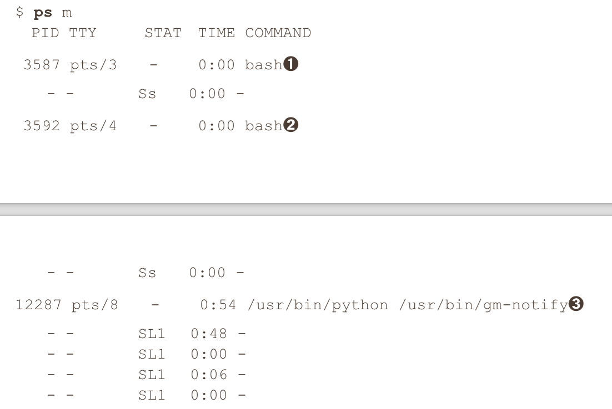

该例显示进程和线程的信息。每一行有一个PID列（在➊，➋，➌处），代表一个进程，和一般的ps输出一样。PID列为-的那些行代表进程中的线程。本例中进程➊和➋只有一个线程，进程➌（PID为12287）有四个线程。

如果想要使用ps查看线程ID，需要使用自定义的输出格式。下面的例子显示进程ID，线程ID，以及相关命令。

例8-2. 使用ps m查看进程和线程ID
$ ps m -o pid,tid,command
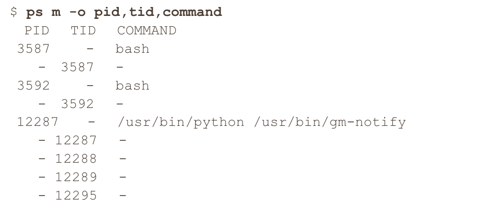

**例8-2**中显示的线程和*例8-1**中的相对应。请注意单线程进程中的线程ID和进程ID相同，即主线程。对于多线程进程12287，线程12287是主线程。

**注解**

*和进程不同，通常你不会和线程进行交互。要和多线程应用中的线程打交道，你需要对该应用的具体实现非常了解，即使这样也不推荐这种方式。*

就资源监控而言，线程可能会带来一些困惑，因为在多线程进程中，多个线程可能同时访问资源。例如，top默认情况下不显示线程，你需要按H键来显示线程。我们马上将要介绍很多资源监控工具，它们需要一些额外的步骤来打开线程显示功能。

##8.5 资源监控简介

我们来介绍一下资源监控，包括处理器（CPU）时间，内存和磁盘I/O。我们将从系统和进程两个层面来了解。

很多人为了提高性能去深入了解Linux内核。然而，大部分Linux系统在缺省配置下性能都不错，可能浪费很多时间优化你也无法达到期望的效果，特别是在你对系统没有足够了解的时候更是如此。所以与其使用各种工具来尝试性能优化，不如来看看内核如何在进程之间分配资源。

##8.6 测量CPU时间

如果要监控进程，可以使用top命令加-p选项，如下：

$ top -p pid1 [-p pid2 ...]

使用time命令可以查看命令整个执行过程中占用的CPU时间。大部分shell提供的shell命令只显示一些基本信息，所以你可能需要运行/usr/bin/time。例如，如果要查看ls命令占用的CPU时间，可以运行：

$ /usr/bin/time ls

time在ls结束后会显示象下面这样的结果，关键的部分我们使用粗体字标出：

0.05user 0.09system 0:00.44elapsed 31%CPU (0avgtext+0avgdata 0maxresident)k
0inputs+0outputs (125major+51minor)pagefaults 0swaps

- 用户时间，CPU用来运行程序代码的时间，以秒为单位。在现在的处理器中，命令的运行速度很快，有些执行不超过一秒，time命令会将它们四舍五入为0.
- 系统时间，CPU用来执行进程任务的时间（例如读取文件和目录）。
- 消耗时间，进程从开始到结束所用的时间，包括CPU执行其他任务的时间。这个数字在检测性能方面不是很有帮助，不过将消耗时间减去用户时间和系统时间所剩余的时间，能够让你得知进程等待系统资源所消耗的时间。

剩下的有关内存和I/O使用的内容，我们将在**8.9 内存**一节中介绍。

##8.7 调整进程优先级

你可以调整内核对进程的安排，从而安排增加或减少安排给进程的CPU时间。内核按照它自己的优先级来运行进程，这些优先级用-20和20之间的数字表示，-20是最高的优先级。（有点晕是不是？）

ps -l命令显示当前进程的优先级，不过使用top命令更容易一点，如下所示：

$ top
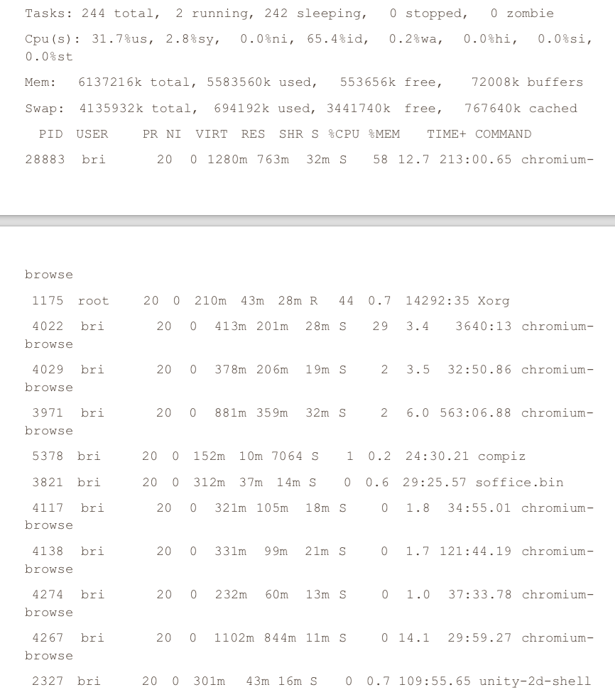

上面的输出结果中，PR（priority）列显示内核当前赋予进程的优先级。这个数字越大，内核调用该进程的几率越小。决定内核分配给进程CPU时间的不仅仅是优先级，并且优先级在进程执行过程中也会根据其消耗的CPU时间经常改变。

优先级列旁边是nice value（NI）列，显示有关内核进程调度的一点信息，如果你想干预内核的进程调度，这个信息对你会有用。内核使用nice value来决定进程下一次在什么时间运行。

Nice value默认值是0。比如说你在后台运行一个计算量很大的进程，不希望影响到前台的交互。你希望在其他进程空闲的时候再运行该进程，就可以使用renice命令将nice value设置为20（pid是你要设置的进程的ID）：

$ renice 20 pid

如果你是超级用户，你可以将nice value设置为一个负数，不过这样系统级进程也许无法获得足够的CPU时间。因为Linux系统大多时候是单个用户在使用，所以没有太多竞争，你可能也不需要自己设置nice value。（从前多用户使用系统的时候，nice value就重要得多。）

##8.8 平均负载

CPU的性能比较容易来衡量。平均负载（Load average）是准备就绪可执行的进程的平均数。也就是某一时刻可以使用CPU的进程数一个估计值。系统中大多数进程通常把时间花在等待输入上（从键盘，鼠标，网络等），这意味着这些进程没有准备就绪可执行，所以并不计入平均负载。只有那些真正在运行的进程才计入平均负载。

###8.8.1 uptime的使用

Uptime命令显示三个平均负载值，还有内核已经运行的时长：

$ uptime
... up 91 days, ... load average: 0.08, 0.03, 0.01

以上三个粗体数字分别代表过去1分钟，5分钟和15分钟的平均负载值。如你所见，系统并不恨繁忙：过去15分钟只有平均数目为0.01的进程在运行。也就是说，如果你只有一个处理器，它过去15分钟只运行了用户空间应用的1%。（一般来说，大部分桌面系统的平均负载为1%，除非你在编译程序或者玩游戏。平均负载为0通常是一个好迹象，说明CPU不是很忙，系统很省电）

**注解**

*目前桌面系统的用户界面组件比以往使用更多的CPU。例如Linux，Web浏览器的Flash插件可能消耗很多资源，一些蹩脚的Flash应用动辄占用大量的CPU和内存。*

如果平均负载值达到1，说明某个进程可能完全占用了CPU。这是可以使用top命令来查看，通常就是出现在列表最上方的那个。

现在很多系统有多核（处理器），它们使得进程能够同时运行。如果你有两个核并且平均负载为1，这意味着只有其中一个处于活跃状态，如果平均负载为2，说明两个都处于忙状态。

###8.8.2 高负载

平均负载值高并不一定表示系统出现了问题。系统如果有足够的内存和I/O资源可以运行许多进程。如果平均负载值高的同时系统响应速度还很快，就不需要太担心，这说明系统中有很多进程在共享CPU。进城间需要相互竞争CPU时间，如果它们放任其他进程长时间占有CPU，它们自身的运行时间就会大大增长。对于Web服务器来说，高平均负载值也是正常现象，因为进程启动和结束得很快，以至于平均负载检测机制无法获得有效的数据。

然而，如果平均负载值高并且系统响应速度很慢的话，可能意味着内存性能问题。当系统出现内存不足的时候，内核会开始thrash，或者在磁盘和内存间交换（swap）进程数据。此时很多进程会处于执行准备就绪状态，但是可能没有足够内存，因而它们会保持这个状态（计入平均负载）比正常情况更久一些。

##8.9 内存

查看系统内存状态最简单的方法之一是使用free命令，或者查看/proc/meminfo文件来了解系统内存被作为缓存（cache）和缓冲区（buffer）的使用情况。我们前面介绍过，内存不足可能导致性能问题。如果没有足够内存用作缓存和缓冲区（被其他程序占用）的话，也许你需要考虑增加内存。不过人们总是拿内存不足来解释性能方面的问题。

###8.9.1 内存工作原理

我们在**第一章**介绍过CPU有一个内存管理单元（MMU）用来将进程使用的虚拟地址转换为实际的内存地址。内核帮助MMU把进程使用的内存划分为更小的区域，我们成为页面（pages）。内核负责维护一个数据结构，我们称为页面表（page table），其中包含从虚拟页面地址到实际内存地址的映射关系。当进程访问内存时，MMU根据此表将进程使用的虚拟地址转换为实际的内存地址。

进程执行时并不需要立即加载它所有的内存页面。内核通常在进程需要的时候加载和分配内存页面，我们称为按需内存分页（on-demand paging或者demand paging）。要了解它的工作原理，让我们来看一看进程是如何启动的运行的：

1. 内核将程序的指令代码的开始部分加载到内存页面内。
2. 内核可能还会为新进程分配一些内存页面供其运行使用。
3. 进程执行过程中，可能代码中的下一个指令在已加载的内存页面中不存在。这时内核接管控制，加载需要的内存页面，然后让程序恢复运行。
4. 同样地，如果进程需要使用更多的内存，内核接管控制，并且获得空闲的内存空间（或者腾出一些内存空间）分配给进程。

###8.9.2 内存页面错误

如果内存页面在进程想要使用时没有准备就绪，进程会产生内存页面错误（page fault）。错误产生时，内核从进程接管CPU的控制权，然后使内存页面准备就绪。内存页面错误有两种：轻微错误和严重错误。

####轻微内存页面错误

进程需要的内存页面在主内存中但是MMU无法找到时，会产生轻微内存页面错误。通常时进程需要更多内存，然而MMU没有内存空间来存放所有的页面。这时内核会通知MMU并且让进程继续执行。轻微内存页面错误不是很严重，在进程执行过程中可能会出现。通常你不需要对此太在意，除非是那些对性能和内存要求很高的应用。

####严重内存页面错误

严重内存页面错误发生在进程需要的内存页面在主内存中不存在时，意味着内核需要从磁盘或者其他存储媒介中加载。太多此类错误会影响系统性能，因为内核必须做大量的工作来为进程加载内存页面，占用大量CPU时间，妨碍其他进程的运行。

####查看内存页面错误

你可以使用ps，top和time命令为某个进程的内存页面错误查找原因。下面是一个例子，说明time命令提供的内存页面错误信息。（cal命令的输出可以忽略，我们将其重定向到/dev/null）

$ /usr/bin/time cal > /dev/null
0.00user 0.00system 0:00.06elapsed 0%CPU (0avgtext+0avgdata
3328maxresident)k
648inputs+0outputs (2major+254minor)pagefaults 0swaps

从以上加粗的信息可以看出，程序运行过程中产生了2个严重内存页面错误和254个轻微内存页面错误。严重内存页面错误发生在当内核最开始从磁盘加载程序的时候。如果再次运行该程序，你可能不会再碰到严重内存页面错误，因为内核可能已经将从磁盘加载的内存页面放入缓存了。

如果你想在进程运行过程中查看产生的内存页面错误，可以使用top或者ps命令。可以使用top命令加f选项设置显示的列，u选项显示严重内存页面错误的数目。（结果会显示在一个新的列,nFLT中，轻微内存页面错误不显示）

使用ps命令时，你可以使用自定义输出格式来查看某个进程产生的内存页面错误。下面是进程20365的一个例子：

$ ps -o pid,min_flt,maj_flt 20365 
PID     MINFL   MAJFL
20365   834182  23

MINFL和MAJFL列显示轻微和严重内存页面错误数目。在此基础上你还可以加入其他的进程选择参数，请参见帮助手册ps(1)。

查看内存也看错误能够帮助你定位出现问题的组建。如果你对整个系统的性能感兴趣，你需要汇总所有进程的CPU和内存相关信息。

###8.10 使用vmstat监控CPU和内存性能

在众多系统性能监控工具中，vmstat命令是最陈旧的一个之一，但运行开销也最小。你可以使用它来了解内核交换内存页面的频率，CPU的繁忙程度，以及IO的使用情况。

通过查看vmstat的输出结果能够获得很多有用的信息。下面是vmstat 2命令的输出结果，其每2秒刷新一次统计信息：

$ vmstat 2
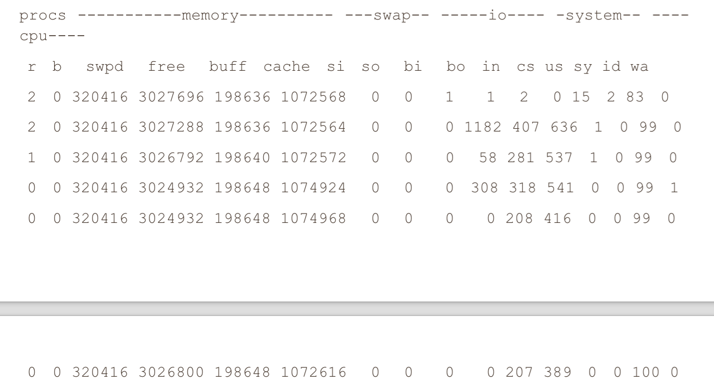

输出结果可以归位这几类：procs（进程），memory（内存使用），swap（内存页面交换），io（磁盘使用），system（内核切换到内核代码的次数），cpu（系统各组件使用CPU的时间）。

上例中的系统负载并不大。通常我们从第二行看起，第一行是系统整个运行时期的平均值。例如上例中，系统有320416KB内存被交换到磁盘（swpd），有大约3025000KB（3GB）空闲内存。虽然有一部分交换空间正在被占用，但是si（换入，swap-in）和so（换出，swåap-out）列仍显示内核没有在交换内存。Buff列显示内核用于磁盘缓冲区的内存（可参考**4.2.5 磁盘缓冲，缓存，和文件系统**）。

在最右边的CPU列，你可以看到CPU时间被分为us，sy，id和wa列。它们依次代表用户任务，系统（内核）任务，空闲时间和I/O等待时间等占用的CPU时间的百分比。上例中运行的用户进程不多（只占用了最多1%的CPU时间），而内核基本上是空闲的，CPU在99%的时间内均为空闲。

现在让我们来看看一个庞大的程序启动后会发生什么情况（前两行显示的是命令运行后的状态）：

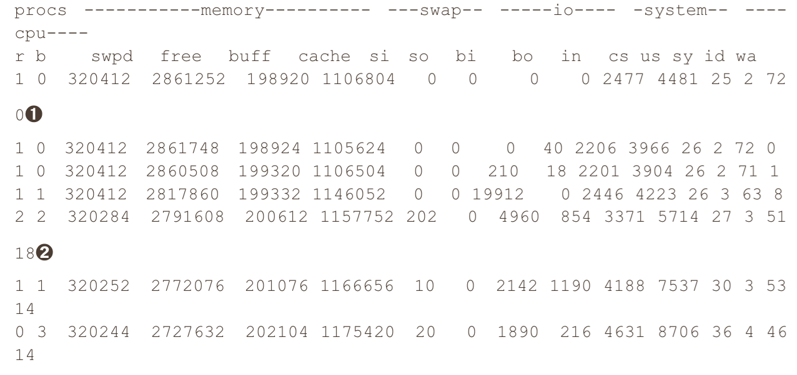

例8-3. 内存活动

**例8-3**中的➊显示，CPU在一段时间内开始出现一定的使用量，特别是针对用户进程。因为可用内存充足，在内核越来越多使用磁盘的时候，缓存和缓冲的使用量开始增大，

随后我们看到一个有趣的现象：➋显示内核将一些被交换出（si列）磁盘的内存页面加载到内存中。这表示刚刚运行的程序有可能使用了一些和其他进程共享的内存页面。这种情况很常见，很多进程在启动时会使用到一些共享库代码。

请注意在b列中有一些进程在等待内存页面时状态为blocked（阻塞无法运行）。简单说就是可用内存在减少，但是还未耗尽。上例中还有一些磁盘相关的进程，从bi（blocks in）和bo（blocks out）列不断增大的数字可以看出。

在内存耗尽的时候，输出结果则大为不同。内存耗尽时，因为内核需要为用户进程分配内存，缓冲区和缓存空间开始减少。一旦内存耗尽，内核开始将内存页面交换到磁盘，在so（swap out）列中会开始出现进程，此时其他列的信息会相应变更。系统时间值会变大，数据交换更频繁，更多的进程处于阻塞状态，因为它们所需的内存不可用（已经被交换出磁盘）。

我们还未介绍完vmstat的所有列。你可以使用vmstat(8)查看帮助手册获得更详细的文档，不过推荐先从《Operating System Concepts》， 9th Edition（Wiley，2012）这类书，或者其他渠道学习内核内存管理方面的知识。

##8.11 I/O监控

vmstat显示常用的I/O统计信息。你可以使用vmstat -d获得各列详细的资源使用情况，有时信息过多也让人抓狂。我们可以从专门针对I/O的命令iostat看起。

###8.11.1 使用iostat

和vmstat类似，iostat在不带任何参数时显示系统的当前uptime信息：

$ iostat
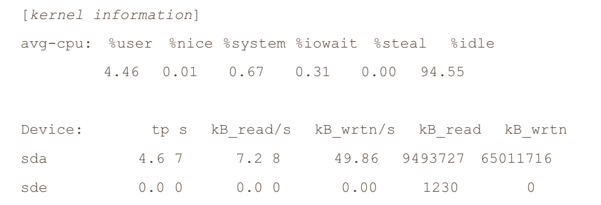

上面avg-cpu部分和本章介绍的其他工具一样，显示的是CPU的使用信息，往下是各个设备的情况，如下所示：

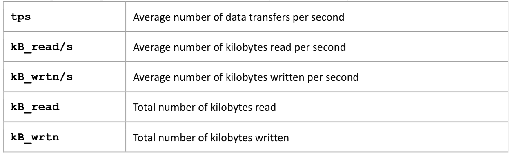

iostat和vmstat的另一个相似之处是你可以设定一个间隔选项，如：iostat 2，这样可以每隔2秒更新一次信息。间隔参数可以和-d选项配合使用（如：iostat -d 2）。

默认情况下，iostat的输出结果不包含分区信息。可以使用-p ALL选项来显示分区信息。因为系统上的分区数量可能会很多，所以输出的信息量也会很大。下面是部分输出示例：

$ iostat -p ALL --snip
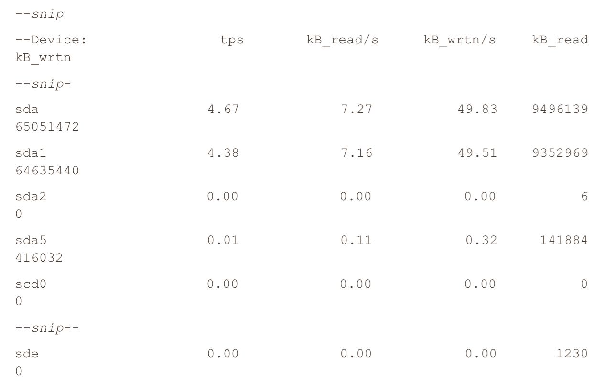

上例中，sda1，sda2和sda5均为sda磁盘上的分区，因而读和写两列的信息可能会有重叠。然而各分区的总和并不一定等于磁盘的总容量。sda1的读同时也是sda的读，请注意从sda直接读取数据是可能的，比如读取分区表数据。

###8.11.2 使用iotop查看进程的I/O使用和监控

如果想要更深入地了解各个进程对I/O资源的使用情况，可以使用iotop工具。使用方法和top一样。它会持续显示使用I/O最多的进程，最顶端是汇总数据：

\# iotop
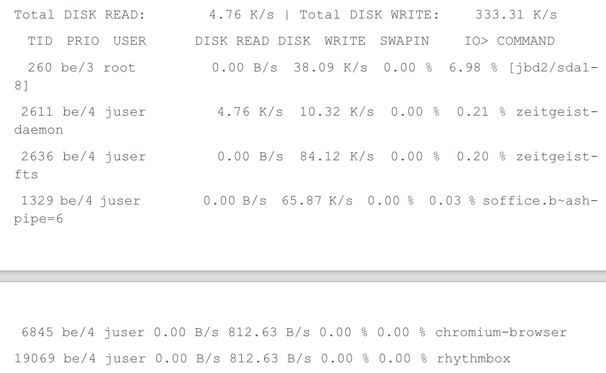

请注意除了user，command，read/write列之外，还有一列叫TID（线程ID，thread ID），而非进程ID。iotop是为数不多的显示线程而非进程的工具。

PRIO（priority）列表示I/O的优先级。它类似于我们介绍过的CPU优先级，它决定了内核为进程执行I/O读写操作分配多长时间。如果优先级为be/4，be代表scheduling class，数字则代表优先级别。和CPU优先级一样，数字越小优先级越高。比如内核会为be/3的进程分配比be/4的进程更多的时间。

内核使用日程安排类（scheduling class）为I/O日程安排加入更多控制。iotop中有三种scheduling class：

- be，best-effort。内核尽其所能为其公平地安排I/O时间。大部分进程在归为此类。
- rt，real-time。内核优先安排real-time类I/O。
- idel，空闲类。内核只在没有其他I/O工作的时候安排此类I/O工作。此类工作不具备优先级。

你可以使用ionice工具来查看和更改进程的I/O优先级，详情请参考ionice(1)帮助手册。一般情况下你不用关心I/O优先级。

##8.12 使用pidstat监控进程

我们已经介绍过如何使用top和iotop来监控进程。它们都会不断刷新输出结果，旧的输出被新的覆盖。工具pidstat能够让你使用vmstat的方式来查看进程的资源使用情况。下面是进程1329的例子，每秒刷新一次：

$ pidstat -p 1329 1
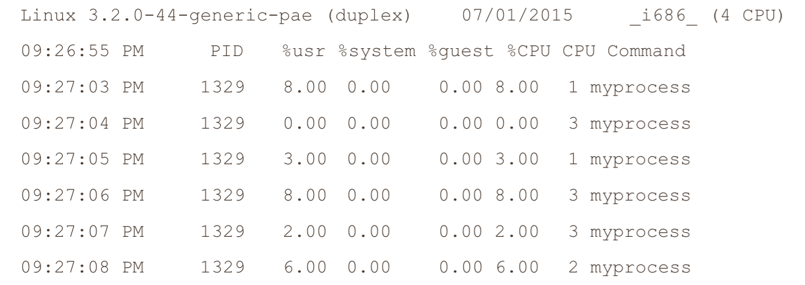

该命令在默认情况下显示用户时间和系统时间的百分比，以及综合的CPU时间百分比，还显示进程在哪一个CPU上运行。（列%guest有一点奇怪，是进程运行在虚拟机上的时间的百分比，除非你运行在虚拟机上，否则可以忽略它）

虽然pidstat缺省显示CPU的使用情况，它还有其他很多功能。例如我们可以使用-r选项来监控内存，-d选项来监控磁盘。你可以自己尝试运行一下，更多针对线程，上下文切换和其他本章介绍的方面的选项可以参考pidstat(1)帮助手册。

##8.13 更深入的主题

针对资源监控有很多的工具，其中一个原因是资源的种类很多，不同资源的使用方式不同。本章我们介绍了进程如何使用CPU,内存，和I/O等系统资源，以及进程中的线程和内核。

另外一个原因是系统的资源是有限的，考虑到性能，系统中的各个组件都需要尽可能地少消耗资源。过去很多用户共享一台计算机，所以需要保证每个用户公平地获得资源。现在的桌面系统都是单人使用，但是其中的进程仍然相互竞争以获取资源。并且高性能的网络服务器对系统资源监控的要求更高。

更深入的有关资源监控和性能分析的主题有：

- sar（系统活动报告，System Activity Reporter），sar包含很多vmstat的持续监控功能，另外还记录系统资源一直以来的使用情况。sar让你能够查看过去某一时刻的系统状态，这在你需要查看已发生的系统事件时非常有用。
- acct（Process accounting），acct能够记录进程以及它们使用资源的情况。
- Quotas，你可以将某些系统资源限制给某个进程和用户使用。可以到/etc/security/limits.conf中查看一些CPU和内存选项，帮助手册中也有limits.conf(5)文档。这是PAM的一个特性，只适用于哪些通过PAM启动的进程（如login shell）。你还可以使用quota来限制用户可以使用的磁盘空间。

如果你对系统性能调优感兴趣，《Systems Performance: Enterprise and the Cloud》，作者Brendan Gregg（Prentice Hall，2013）一书中有详细的介绍。

关于网络监控和资源使用，我们还有很多工具未介绍。在使用这些工具之前，你需要先了解网络的工作原理，我们将在下章介绍。

